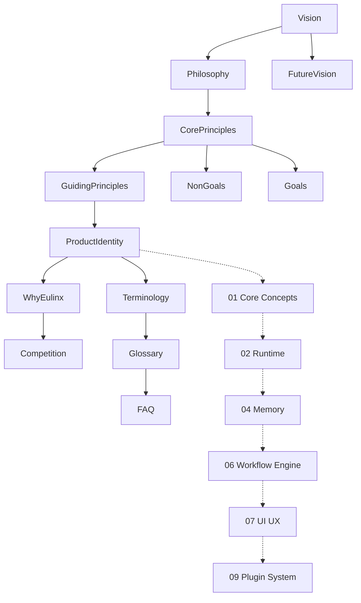

---
title: 00 Introduction
status: draft
version: 1.0
tags:
  - introduction
  - Eulinx
  - overview
  - flow:P00-DOCS
related:
  - "[[Vision]]"
  - "[[Philosophy]]"
  - "[[CorePrinciples]]"
  - "[[01-core-concepts/README]]"
  - "[[04-memory/README]]"
---

# 00 Introduction

## Purpose

The `00-introduction` folder is the front door to the Eulinx documentation vault.

It explains what Eulinx is, why it exists, the principles that govern every later decision, and the language used throughout the rest of the specs. Nothing here is implementation. Everything here is the "why" that the other sections (core concepts, runtime, memory, workflows, UI, plugins, AI system, and so on) turn into "how".

A reader who finishes this folder should understand Eulinx's identity, its non-negotiable principles, and its boundaries before reading a single line of architecture.

## Folder Structure

```text
00-introduction/
  README.md
  Vision.md
  Philosophy.md
  ProductIdentity.md
  CorePrinciples.md
  Goals.md
  NonGoals.md
  GuidingPrinciples.md
  WhyEulinx.md
  Competition.md
  FutureVision.md
  Terminology.md
  Glossary.md
  FAQ.md
```

## Topic Responsibilities

### Vision

What Eulinx intends to become: a local-first AI operating system for knowledge work where a user supervises an intelligent runtime that creates, coordinates, and manages teams of AI workers executing inside real terminal sessions.

### Philosophy

The beliefs behind the design: small tasks over big bangs, backend truth over frontend guesses, fail-closed over fail-open, trust boundaries over trust.

### ProductIdentity

The product's positioning, voice, and the problem it solves for its users.

### CorePrinciples

The small set of invariants every other section must respect.

### Goals

What the project is trying to achieve in this iteration.

### NonGoals

What the project explicitly will not become, so later sections do not drift.

### GuidingPrinciples

The practical rules that translate the philosophy into day-to-day decisions.

### WhyEulinx

The motivation: why another AI tool, and why this architecture (Tauri v2 + React/TypeScript with a thin Rust backend, SQLite, React Flow, xterm.js, LanceDB, Tantivy).

### Competition

How Eulinx compares to n8n, Cursor, Docker Desktop, LangGraph, and similar tools.

### FutureVision

Where the product may go after the current roadmap.

### Terminology

Precise definitions of the core nouns (Worker, Orchestrator, Artifact, RunContext, Session, and so on).

### Glossary

A reader-friendly reference of every term used in the vault.

### FAQ

Answers to the questions a new reader or a new AI coding agent is most likely to ask.

## Global Introduction Principles

The introduction MUST state intent before mechanism. A reader learns what Eulinx is before how it is built.

The introduction MUST define terms before they are used elsewhere. Every later section relies on `Terminology` and `Glossary`.

The introduction MUST declare NonGoals. A bounded product is buildable; an unbounded one is not.

The introduction MUST NOT contain runnable code. It is context, not specification.

The introduction SHOULD be the first thing any AI coding agent reads, via `[[99-ai-context/README_FOR_AI]]`.

## Architecture Overview



## AI Notes

Do not skip this folder when onboarding an AI coding agent. The principles here are the reason later specs say "fail closed" or "the UI renders backend truth". Without them, the rest of the vault looks arbitrary.

Do not treat the philosophy as decoration. When two later specs appear to conflict, the principles in this folder are the tie-breaker.

Do not add implementation detail here. If a statement needs a code path, it belongs in the section that owns that component.

## Related Documents

- [[Vision]]
- [[Philosophy]]
- [[CorePrinciples]]
- [[ProductIdentity]]
- [[Goals]]
- [[NonGoals]]
- [[GuidingPrinciples]]
- [[WhyEulinx]]
- [[Competition]]
- [[FutureVision]]
- [[Terminology]]
- [[Glossary]]
- [[FAQ]]
- [[01-core-concepts/README]]
- [[04-memory/README]]
- [[99-ai-context/README_FOR_AI]]

