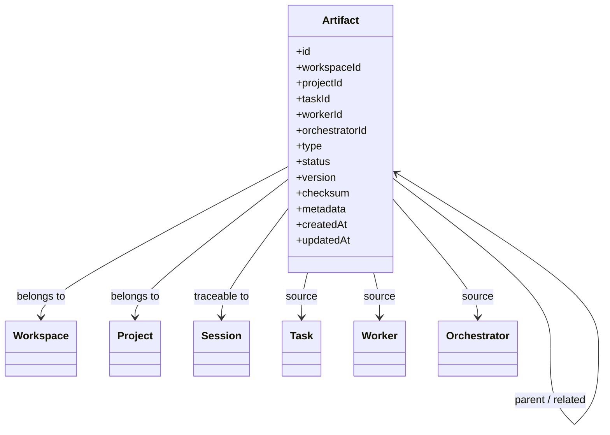
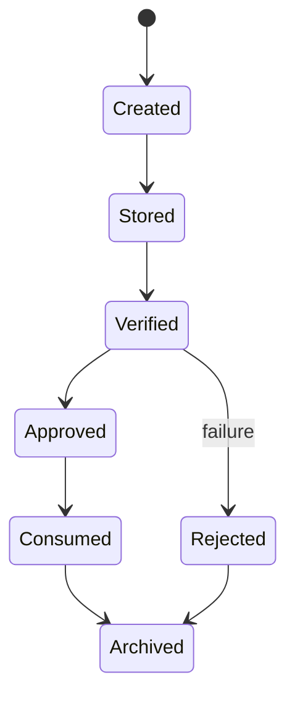
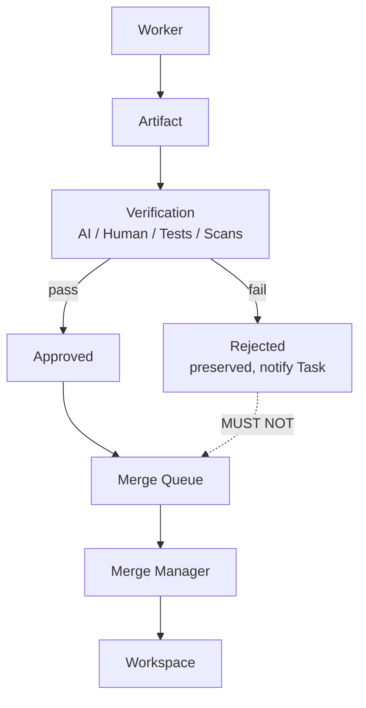

# Artifact Diagrams







```text
Artifact model (ownership & traceability)
  Workspace -+
  Project   -+- belongs to / traceable to
  Session   -¦
  Task      -¦ source
  Worker    -¦ source
  Orchestrator + source
  version: immutable, new change = new version
  checksum: integrity / provenance

Lifecycle
  Created ? Stored ? Verified ? Approved ? Consumed ? Archived
                                  ?
                                Rejected (MUST NOT enter Merge Queue)

Merge pipeline
  Artifact ? Verification ? Approval ? Merge Queue ? Merge Manager ? Workspace
  Only approved artifacts may merge.
```
# Related Documents
- [[Artifact-Part01]]
- [[Artifact-Part02]]
- [[Artifact-Part03]]
- [[Artifact-Part04]]
