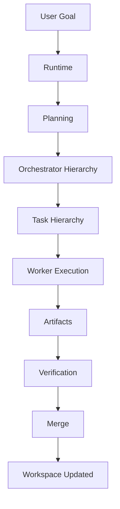
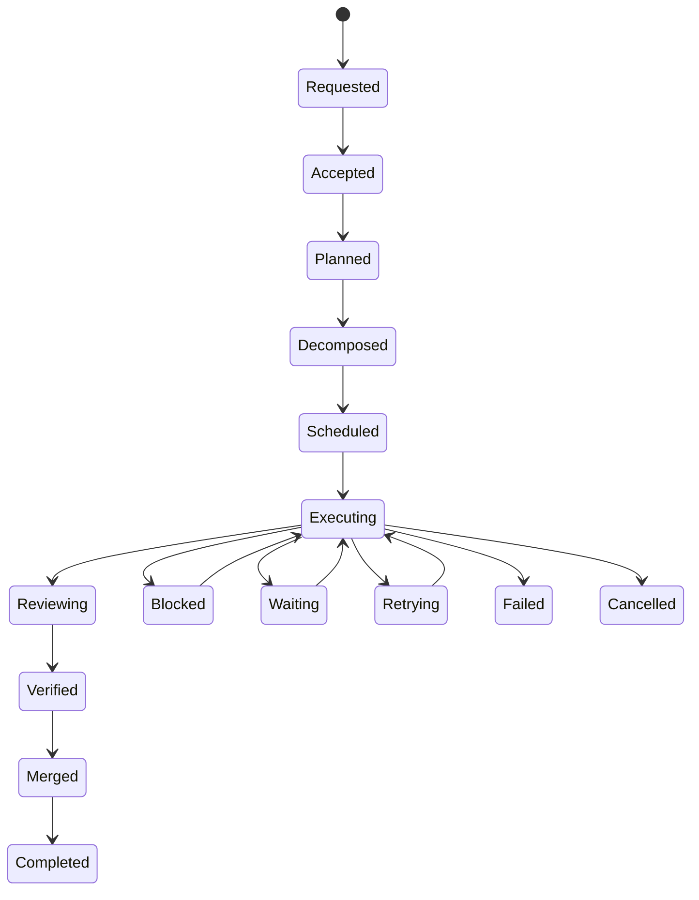
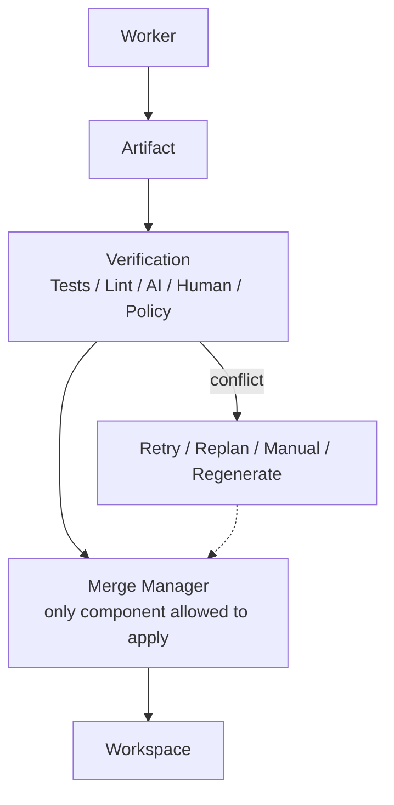

# Execution Diagrams







```text
Core execution model
  User Goal
    ? Runtime (decides HOW)
    ? Planning
    ? Orchestrator Hierarchy
    ? Task Hierarchy
    ? Worker Execution (AI decides HOW to solve)
    ? Artifacts
    ? Verification
    ? Merge
    ? Workspace Updated

Lifecycle states
  Requested ? Accepted ? Planned ? Decomposed ? Scheduled
    ? Executing ? Reviewing ? Verified ? Merged ? Completed
  Alternative: Blocked / Waiting / Retrying / Failed / Cancelled
  - MUST NOT skip verification
  - Only Runtime controls transitions
  - Replanning preserves completed verified work

Decomposition levels
  Goal ? Phases ? Tasks ? Subtasks ? Execution Units

Merge flow
  Worker ? Artifact ? Verification ? Merge Manager ? Workspace
  Merge Manager is the ONLY component allowed to apply verified changes.
```
# Related Documents
- [[Execution-Part01]]
- [[Execution-Part02]]
- [[Execution-Part03]]
- [[Execution-Part04]]
- [[Execution-Part05]]
- [[Execution-Part06]]
- [[Execution-Part07]]
- [[Execution-Part08]]
