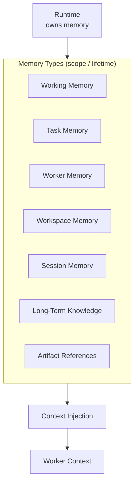
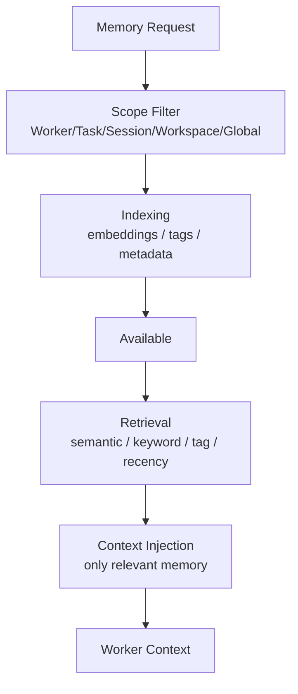
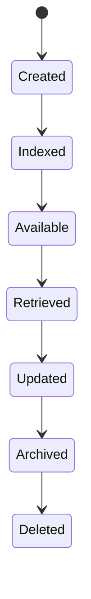

# Memory Diagrams







```text
Memory is owned by the Runtime, not Workers. Workers consume; Runtime manages.

Storage layers
  Working Memory
  Session Memory
  Workspace Memory
  Knowledge Memory
  Artifact References
  Vector Index
  Metadata Store
  (each with its own retention policy)

Scopes (lower expires sooner)
  Worker ? Task ? Session ? Workspace ? Global (system only)

Lifecycle
  Created ? Indexed ? Available ? Retrieved ? Updated ? Archived ? Deleted(optional)

Retrieval selects by: semantic similarity, keywords, tags, scope, recency, relevance.
Runtime MUST avoid unnecessary context expansion.
```
# Related Documents
- [[Memory-Part01]]
- [[Memory-Part02]]
- [[Memory-Part03]]
- [[04-memory/README]]
