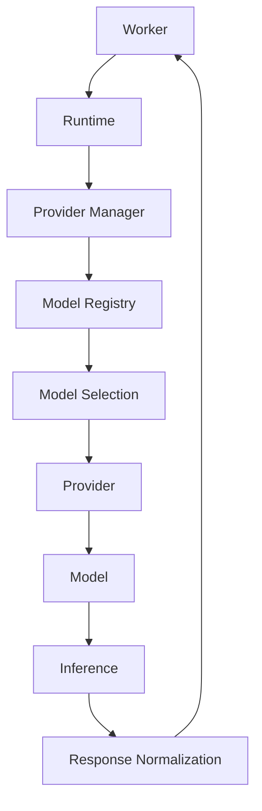
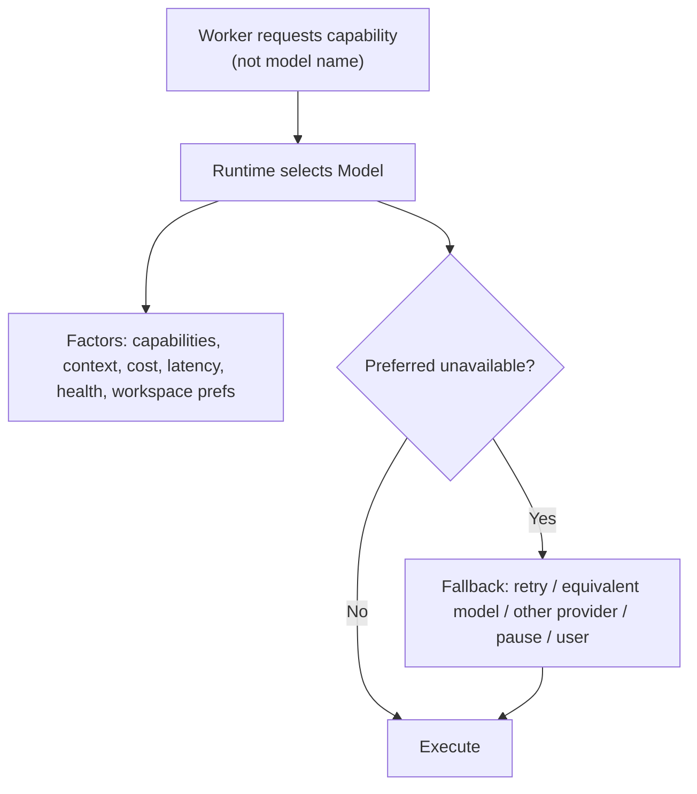

# Model Diagrams



```mermaid
classDiagram
  class Model {
    +id
    +providerId
    +name
    +version
    +contextWindow
    +capabilities
    +pricing
    +limits
    +status
  }
  class Provider
  class Registry {
    +discover()
    +register()
    +validate()
    +trackAvailability()
    +publishCapabilities()
  }
  class Capability
  Provider "1" --> "*" Model
  Registry ..> Model : catalogs
  Model "exposes" Capability
```



```text
Architecture
  Worker ? Runtime ? Provider ? Model ? Inference ? Response
  Workers request capabilities; Runtime selects the Model.
  Workers never invoke Models directly (Runtime owns orchestration).

Model Registry (Runtime's authoritative catalog)
  - discovers/registers models per Provider
  - validates metadata, tracks availability
  - states: Available / Initializing / Busy / Disabled / Deprecated / Unavailable
  - Workers never query the Registry directly

Selection & fallback
  request capability ? Runtime selects by capability/context/cost/latency/health
  fallback preserves required capabilities (retry / equivalent model / other provider / pause / user)

Capability profiles: Fast / Balanced / Deep Reasoning / Coding / Research / Planning
```
# Related Documents
- [[Model-Part01]]
- [[Model-Part02]]
- [[Model-Part03]]
- [[Model-Part04]]
- [[Model-Part05]]
- [[Model-Part06]]
- [[Model-Part07]]
- [[Model-Part08]]
- [[Provider-Part01]]
