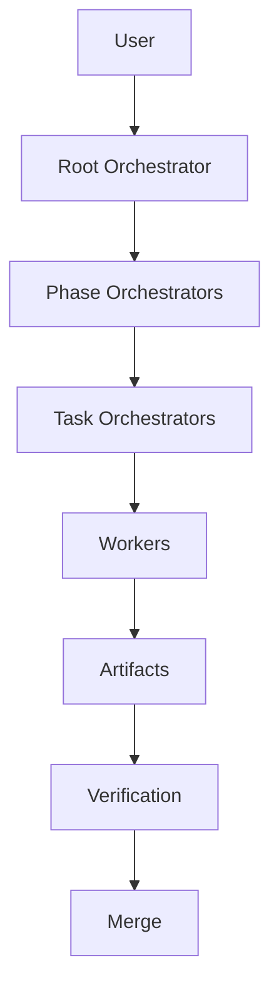
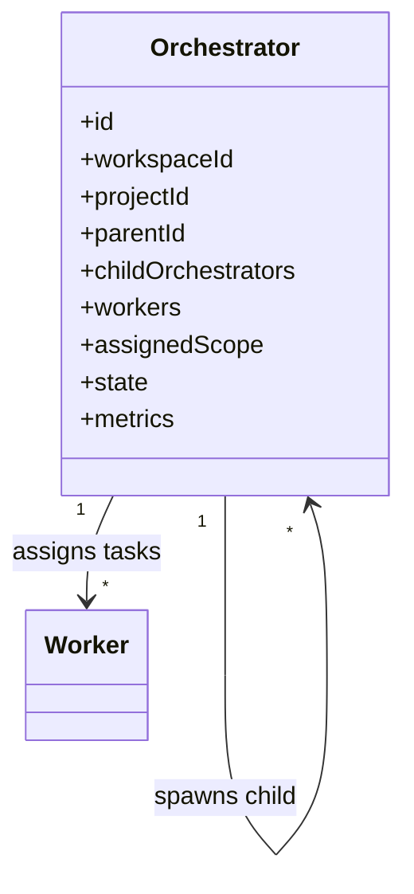
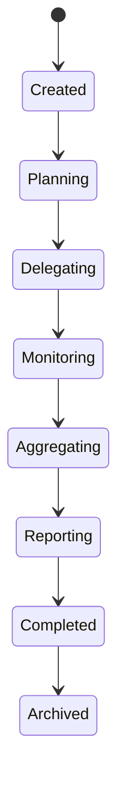
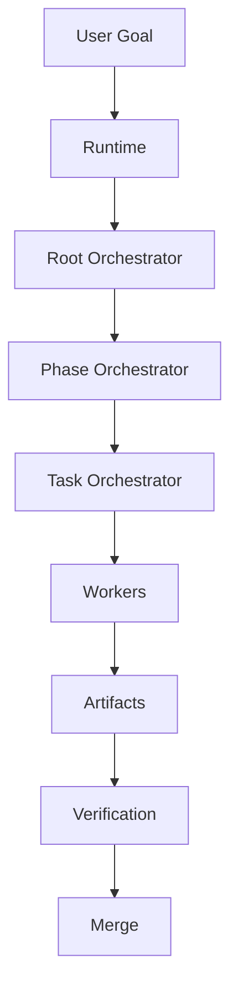

# Orchestrator Diagrams









```text
Hierarchy (acyclic)
  User ? Root Orchestrator ? Phase Orchestrators ? Task Orchestrators ? Workers

Responsibilities
  - receive objectives, create execution plans
  - spawn Workers / child Orchestrators
  - track progress, aggregate results, report upward
  - MUST own assigned scope, delegate (not implement), track child execution
  - MUST NOT modify project files directly, bypass runtime services, ignore failures

Lifecycle
  Created ? Planning ? Delegating ? Monitoring ? Aggregating ? Reporting
    ? Completed ? Archived

Failure handling
  capture details ? save logs ? retry eligibility ? retry/replace Worker ? escalate
```
# Related Documents
- [[Orchestrator-Part01]]
- [[Orchestrator-Part02]]
- [[Orchestrator-Part03]]
- [[Orchestrator-Part04]]
- [[Execution-Part01]]
- [[Worker-Part01]]
