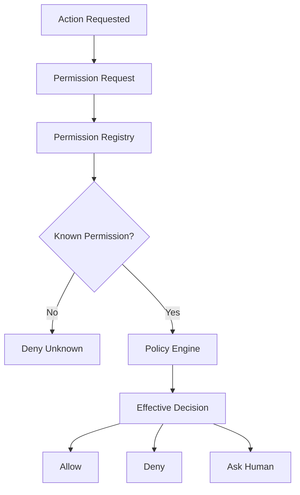
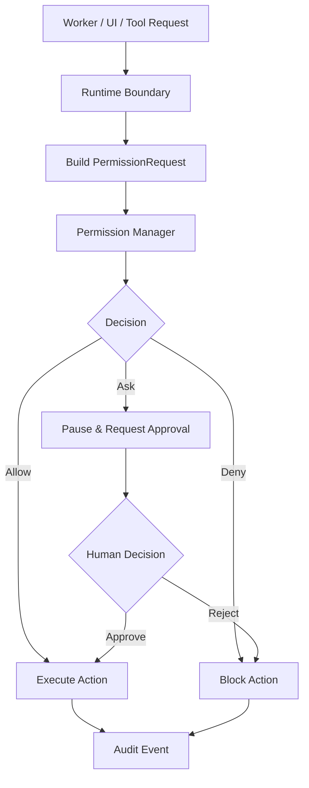
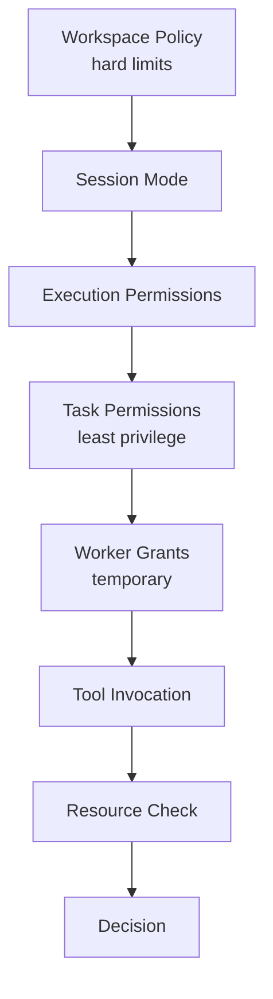

# Permission Diagrams







```text
Core architecture (reasoning ? authorization)
  Worker ? Runtime ? Permission Manager ? Policy Engine ? Allow / Deny / Ask
  Workers request actions; only the Runtime authorizes them.

Scope hierarchy (lower MUST NOT exceed higher hard denial)
  Global ? Application ? Workspace ? Project ? Session ? Execution
    ? Orchestrator ? Task ? Worker ? Tool ? Invocation

Enforcement layers (all fail closed)
  UI / Runtime API / Tool / Terminal-PTY / Filesystem / Network
  / Secret Injection / Artifact Merge / Plugin-MCP / Database
  If permission cannot be checked ? deny.

Policy evaluation order
  1 validate request ? 2 confirm registry ? 3 load policies
  ? 4 hard denials (win) ? 5 constraints ? 6 explicit grants
  ? 7 approval rules ? 8 default (deny) ? 9 record ? 10 emit event

Decision types: allow / deny / ask / defer (ask is NOT allow; never execute before approval)
```
# Related Documents
- [[Permission-Part01]]
- [[Permission-Part02]]
- [[Permission-Part03]]
- [[Permission-Part04]]
- [[Permission-Part05]]
- [[Permission-Part06]]
- [[Permission-Part07]]
- [[Permission-Part08]]
- [[Runtime-Part03]]
- [[Worker-Part03]]
- [[Tool-Part04]]
