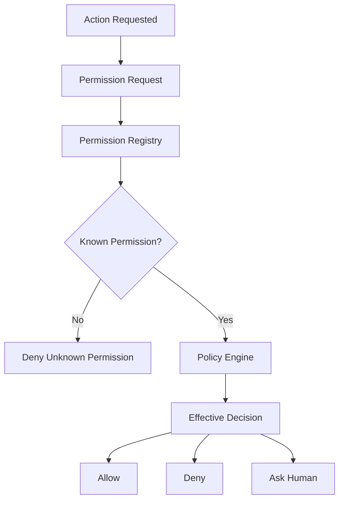

---
title: Permission Specification - Part 02
status: draft
version: 1.0
tags:
  - core-concepts
  - permissions
  - security
  - runtime
related:
  - "[[Permission-Part01]]"
  - "[[Runtime-Part01]]"
  - "[[Worker-Part03]]"
  - "[[Tool-Part04]]"
  - "[[Workspace-Part01]]"
---

# Permission Specification (Part 02)

## Document Index

Part 01 - Purpose, Philosophy, Architecture
Part 02 - Permission Registry & Scopes
Part 03 - Permission Policies
Part 04 - Runtime Enforcement
Part 05 - Worker & Tool Permissions
Part 06 - Sessions, Workspaces & Projects
Part 07 - Auditing & Security
Part 08 - Database, UI & Implementation

This part defines the permission registry, permission naming, scope hierarchy, ownership rules, and how Eulinx represents permissionable actions before they are evaluated by policy.

# Purpose

The Permission Registry is the source of truth for every action that can be controlled by the [[Runtime]].

Eulinx MUST NOT treat permissions as loose strings scattered through the codebase. If a Worker, Tool, Plugin, CLI, Runtime Service, or UI action requires authorization, that authorization MUST map to a registered permission definition.

The registry exists so that the system can answer four questions consistently:

- What action is being requested?
- Who is requesting it?
- Which object or resource is being affected?
- Which scope owns the decision?

# Core Idea

A permission is not just a yes/no flag.

A permission is a structured capability with:

- a stable identifier
- a category
- a scope
- an action
- a target resource type
- a risk level
- optional constraints
- default behavior
- audit requirements
- approval requirements

Example:

```text
permission.id: filesystem.write
category: filesystem
action: write
target: file
risk: high
default: deny
approval: required unless policy allows
audit: always
```

This structure lets Eulinx reason about permissions in a predictable way instead of relying on vague names like "file access" or "terminal access."

# Permission Registry

The Permission Registry is a deterministic runtime component owned by the [[PermissionManager-Part01]].

It stores every permission definition supported by the app and exposes lookup functions to the rest of the Runtime.

## Registry Responsibilities

The registry MUST:

- define all known permission identifiers
- define human-readable permission names
- define permission categories
- define valid actions
- define supported resource targets
- define default risk levels
- define default decision behavior
- define whether approval is required
- define whether the action must be audited
- expose permission metadata to the UI
- expose permission metadata to the Tool Registry
- reject unknown permission identifiers

The registry MUST NOT:

- decide whether a request is allowed
- grant permissions to Workers
- bypass policies
- silently create new permissions at runtime
- accept arbitrary permission strings from AI output

The registry defines what exists. The Policy Engine decides what is allowed.

# Permission Identifier Format

Permission identifiers SHOULD use this format:

```text
category.action
```

Examples:

```text
filesystem.read
filesystem.write
filesystem.delete
terminal.spawn
terminal.input
terminal.kill
network.http
network.websocket
browser.open
browser.navigate
git.status
git.commit
git.push
database.read
database.write
mcp.invoke
secret.read
process.spawn
process.kill
workspace.snapshot
artifact.merge
```

For nested systems, a third segment MAY be used:

```text
category.resource.action
```

Examples:

```text
plugin.install.request
plugin.install.approve
workflow.node.create
workflow.node.delete
worker.spawn.child
worker.spawn.sibling
memory.vector.write
memory.workspace.read
```

## Naming Rules

Permission identifiers MUST be lowercase.

Permission identifiers MUST use dots as separators.

Permission identifiers MUST be stable once released.

Permission identifiers MUST NOT contain spaces.

Permission identifiers MUST NOT be generated by AI models.

Permission identifiers SHOULD describe an action, not a UI label.

Bad examples:

```text
Allow Files
canUseTerminal
adminPower
full_access
Super Mode
```

Good examples:

```text
filesystem.write
terminal.spawn
git.push
secret.read
artifact.merge
```

# Permission Categories

Eulinx should begin with the following top-level categories.

## Filesystem

Controls access to project files, workspace metadata, imported folders, generated artifacts, and external paths.

Examples:

```text
filesystem.read
filesystem.write
filesystem.delete
filesystem.rename
filesystem.copy
filesystem.watch
filesystem.search
```

Filesystem permissions are high-risk because they affect user data.

## Terminal

Controls access to terminal sessions and PTY input/output.

Examples:

```text
terminal.spawn
terminal.input
terminal.read
terminal.kill
terminal.resize
terminal.attach
terminal.detach
```

Terminal permissions are high-risk because terminals can become indirect access to filesystem, network, Git, package managers, and secrets.

## Process

Controls spawning and controlling OS processes outside the terminal abstraction.

Examples:

```text
process.spawn
process.signal
process.kill
process.inspect
```

Process permissions are high-risk and should normally be mediated through Tool or Terminal permissions.

## Network

Controls outbound network actions.

Examples:

```text
network.http
network.websocket
network.download
network.upload
network.dns
```

Network permissions are sensitive because they can leak code, prompts, secrets, file contents, logs, and user identity.

## Browser

Controls browser automation and web interaction.

Examples:

```text
browser.open
browser.navigate
browser.click
browser.type
browser.extract
browser.screenshot
browser.download
```

Browser permissions can overlap with network and filesystem permissions.

## Git

Controls version control actions.

Examples:

```text
git.status
git.diff
git.add
git.commit
git.branch
git.merge
git.push
git.pull
git.reset
```

Git destructive permissions, especially `git.reset`, `git.clean`, force push, and branch deletion, MUST be treated as high-risk.

## Database

Controls access to Eulinx's internal SQLite database and any project databases.

Examples:

```text
database.read
database.write
database.migrate
database.backup
database.restore
database.delete
```

Internal app database permissions should almost never be granted directly to Workers. Workers should use Runtime APIs.

## MCP

Controls invocation of MCP tools and servers.

Examples:

```text
mcp.server.connect
mcp.server.disconnect
mcp.tool.invoke
mcp.resource.read
mcp.prompt.use
```

MCP permissions MUST include the server identity and tool identity as constraints.

## Secrets

Controls access to API keys, tokens, credentials, local environment variables, SSH keys, certificates, and provider credentials.

Examples:

```text
secret.read
secret.write
secret.delete
secret.inject
secret.rotate
```

Secrets are critical risk. Workers SHOULD receive indirect access through scoped runtime injection, never raw secret values unless unavoidable.

## Artifact

Controls artifact creation, modification, verification, and merge.

Examples:

```text
artifact.create
artifact.read
artifact.update
artifact.verify
artifact.merge
artifact.delete
```

Artifacts are safer than direct writes, so Eulinx SHOULD prefer artifact permissions over direct filesystem write permissions.

## Worker

Controls spawning, stopping, messaging, and supervising Workers.

Examples:

```text
worker.spawn.child
worker.spawn.sibling
worker.message
worker.pause
worker.resume
worker.terminate
worker.inspect
```

Worker spawn permissions are important because uncontrolled spawning can waste resources, create loops, or amplify unsafe behavior.

## Workspace

Controls workspace-level actions.

Examples:

```text
workspace.open
workspace.close
workspace.snapshot
workspace.restore
workspace.export
workspace.import
workspace.settings.write
```

Workspace permissions define the isolation boundary for the entire system.

# Permission Scopes

Permission scope defines where a permission applies.

Scopes allow Eulinx to say:

```text
This Worker may read files only inside this project.
This Worker may use network only for documentation sites.
This Tool may access this secret only for this provider call.
This Session may allow YOLO mode only inside a sandbox.
```

## Scope Levels

Eulinx SHOULD support these scope levels:

```text
Global
Application
Workspace
Project
Session
Execution
Orchestrator
Task
Worker
Tool
Resource
Invocation
```

## Scope Hierarchy

```text
Global
  Application
    Workspace
      Project
        Session
          Execution
            Orchestrator
              Task
                Worker
                  Tool
                    Invocation
```

Higher scopes define defaults and limits.

Lower scopes define specific grants.

Lower scopes MUST NOT exceed hard limits defined by higher scopes.

Example:

```text
Workspace policy:
  network.upload = deny

Worker grant:
  network.upload = allow

Effective result:
  deny
```

The Worker grant cannot override the Workspace denial.

# Scope Ownership

Every permission decision MUST have an owner scope.

The owner scope is the scope responsible for the policy that produced the decision.

Examples:

```text
Workspace denies git.push
ownerScope = workspace

Task allows filesystem.read for src/auth/*
ownerScope = task

User approves one network request
ownerScope = invocation
```

Ownership matters for audit logs because it explains why a decision happened.

# Resource Targets

A permission request MUST identify the resource being acted on when a concrete resource exists.

Examples:

```text
filesystem.write -> C:\project\src\auth.ts
git.push -> origin/main
mcp.tool.invoke -> github.create_issue
secret.read -> OPENAI_API_KEY
worker.spawn.child -> parentWorkerId
artifact.merge -> artifactId
```

If a permission request does not include a target, the Permission Manager MUST treat it as broad access and apply stricter rules.

# Constraints

Constraints narrow what a permission allows.

Common constraints:

- path allowlist
- path denylist
- domain allowlist
- domain denylist
- command allowlist
- tool allowlist
- model allowlist
- maximum cost
- maximum tokens
- maximum duration
- maximum spawned workers
- maximum file size
- maximum network payload size
- requires sandbox
- requires artifact output
- requires human approval

Example:

```yaml
permission: filesystem.write
scope: task
constraints:
  paths:
    allow:
      - "src/auth/**"
      - "tests/auth/**"
    deny:
      - ".env"
      - ".git/**"
  max_file_size_mb: 2
  requires_artifact: true
```

# Permission Request Object

Every permission check SHOULD be represented as a structured request.

```ts
type PermissionRequest = {
  id: string;
  permissionId: string;
  requesterType: "worker" | "tool" | "orchestrator" | "runtime_service" | "user" | "plugin";
  requesterId: string;
  workspaceId: string;
  projectId?: string;
  sessionId?: string;
  executionId?: string;
  taskId?: string;
  workerId?: string;
  toolId?: string;
  resourceType?: string;
  resourceId?: string;
  action: string;
  reason?: string;
  inputSummary?: string;
  riskLevel?: "low" | "medium" | "high" | "critical";
  requestedAt: string;
};
```

The `reason` field MAY contain AI-generated text, but it MUST NOT be trusted for authorization. It is useful for human understanding, not policy enforcement.

# Permission Definition Object

```ts
type PermissionDefinition = {
  id: string;
  name: string;
  description: string;
  category: string;
  action: string;
  targetResourceTypes: string[];
  defaultRiskLevel: "low" | "medium" | "high" | "critical";
  defaultDecision: "allow" | "deny" | "ask";
  auditMode: "none" | "summary" | "full";
  approvalRequiredByDefault: boolean;
  supportsConstraints: boolean;
  createdAt: string;
  deprecatedAt?: string;
};
```

# Mermaid Diagram



# ASCII Diagram

```text
Requested action
  |
  v
Permission request
  |
  v
Registry lookup
  |
  +-- unknown permission --> deny
  |
  +-- known permission ----> policy evaluation
                              |
                              +-- allow
                              +-- deny
                              +-- ask
```

# Examples

## Safe Read

```text
Worker wants to inspect src/auth/login.ts.

permissionId: filesystem.read
target: src/auth/login.ts
scope: task
risk: low

Result:
allow if the file is inside project scope and no higher policy denies it.
```

## Risky Write

```text
Worker wants to edit package.json.

permissionId: filesystem.write
target: package.json
scope: worker
risk: high

Result:
ask or deny depending on project policy.
```

## Dangerous Secret Access

```text
Worker asks to read .env directly.

permissionId: secret.read
target: .env
risk: critical

Result:
deny by default.
```

# AI Notes

AI coding assistants implementing Eulinx MUST NOT create ad hoc permission strings inside feature code.

All permission checks should call the Permission Manager using registered permission identifiers.

Workers can ask for permission. Workers cannot decide permission.

The strongest rule:

```text
Reasoning is not authorization.
```

# Related Documents

- [[Permission-Part01]]
- [[Permission-Part03]]
- [[Runtime-Part01]]
- [[Worker-Part03]]
- [[Tool-Part04]]
- [[Workspace-Part01]]
- [[Execution-Part08]]

