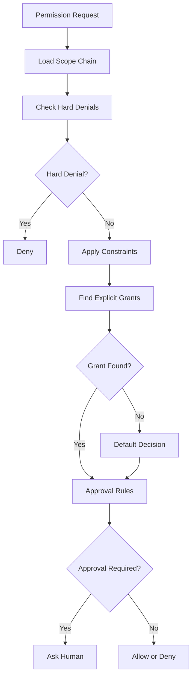
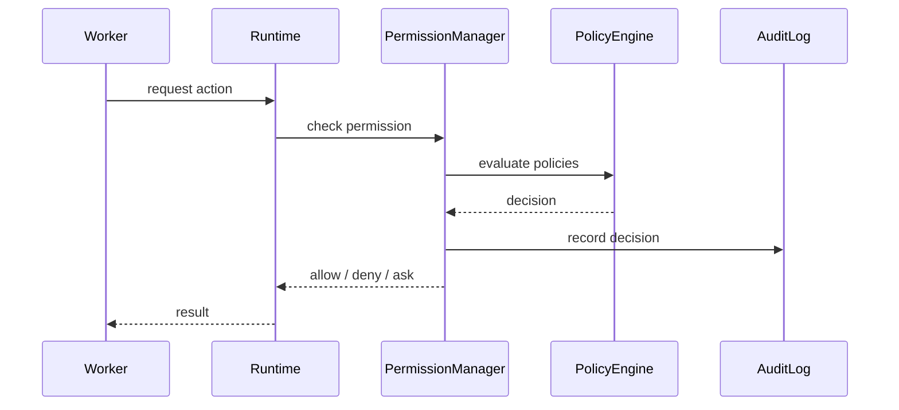

---
title: Permission Specification - Part 03
status: draft
version: 1.0
tags:
  - core-concepts
  - permissions
  - policy
  - authorization
related:
  - "[[Permission-Part02]]"
  - "[[Permission-Part04]]"
  - "[[Runtime-Part03]]"
  - "[[Workspace-Part01]]"
---

# Permission Specification (Part 03)

## Document Index

Part 01 - Purpose, Philosophy, Architecture
Part 02 - Permission Registry & Scopes
Part 03 - Permission Policies
Part 04 - Runtime Enforcement
Part 05 - Worker & Tool Permissions
Part 06 - Sessions, Workspaces & Projects
Part 07 - Auditing & Security
Part 08 - Database, UI & Implementation

This part defines permission policies, policy evaluation, inheritance, decision priority, risk handling, approval rules, and how Eulinx computes the final authorization result for an action.

# Purpose

The policy system decides whether a registered permission request is allowed, denied, or paused for human approval.

The registry answers:

```text
Does this permission exist?
```

The policy engine answers:

```text
Is this requester allowed to use this permission on this resource right now?
```

# Policy Philosophy

Eulinx's permission policy model should be conservative by default.

The system should prefer:

- explicit grants over implicit grants
- narrow scopes over broad scopes
- artifact-based work over direct file modification
- temporary grants over permanent grants
- deny over uncertainty
- human approval over irreversible action
- auditability over convenience

The Permission System exists because Eulinx will run AI-powered terminals that can make mistakes. A useful Worker may still produce a dangerous action. The policy engine is the boundary between "the AI wants to do this" and "the user's machine will actually do this."

# Policy Object

A policy is a rule or set of rules attached to a scope.

```ts
type PermissionPolicy = {
  id: string;
  name: string;
  description?: string;
  scopeType:
    | "global"
    | "application"
    | "workspace"
    | "project"
    | "session"
    | "execution"
    | "orchestrator"
    | "task"
    | "worker"
    | "tool"
    | "invocation";
  scopeId: string;
  rules: PermissionRule[];
  priority: number;
  enabled: boolean;
  createdBy: "system" | "user" | "runtime" | "template" | "plugin";
  createdAt: string;
  updatedAt: string;
};
```

# Rule Object

```ts
type PermissionRule = {
  id: string;
  permissionId: string;
  effect: "allow" | "deny" | "ask";
  resourcePattern?: string;
  requesterPattern?: string;
  constraints?: Record<string, unknown>;
  riskOverride?: "low" | "medium" | "high" | "critical";
  expiresAt?: string;
  reason?: string;
};
```

Rules MUST be deterministic. A rule cannot require model reasoning to decide whether it applies.

# Decision Types

The policy engine produces one of these decisions:

```text
allow
deny
ask
defer
```

## Allow

The action may proceed.

Allow decisions SHOULD include the rule that allowed the action.

## Deny

The action must not proceed.

Deny decisions MUST include a reason and MUST be auditable when the requested action was high-risk.

## Ask

The action is paused until a human approves or rejects it.

Ask is not an allow. The action MUST NOT execute until the approval result is recorded.

## Defer

The current scope does not decide. The evaluator should continue checking parent scopes or fallback defaults.

Defer is useful for default policies that only define some categories.

# Policy Evaluation Order

Policy evaluation SHOULD follow this order:

```text
1. Validate request shape
2. Confirm permission exists in registry
3. Load applicable policies
4. Evaluate hard denials
5. Evaluate scope constraints
6. Evaluate explicit grants
7. Evaluate approval requirements
8. Apply default behavior
9. Record decision
10. Emit event
```

Hard denials always win.

# Scope Inheritance

Policies inherit downward through the scope hierarchy.

```text
Global
  Application
    Workspace
      Project
        Session
          Execution
            Orchestrator
              Task
                Worker
                  Tool
                    Invocation
```

A child scope MAY become stricter than its parent.

A child scope MUST NOT become more permissive than a parent hard denial.

Example:

```text
Workspace:
  git.push = deny

Task:
  git.push = allow

Effective result:
  deny
```

# Hard Denials

A hard denial is a policy rule that cannot be overridden by lower scopes.

Hard denials SHOULD be used for:

- workspace isolation
- external folder boundaries
- secret access
- destructive Git operations
- delete operations
- network uploads
- plugin installation
- running unsigned binaries
- modifying Eulinx's internal database
- changing global app settings

Hard denials MUST be clearly displayed in the UI so users understand why an action cannot be approved from a lower level.

# Explicit Grants

An explicit grant allows a requester to perform a specific action under specific constraints.

Example:

```yaml
permission: filesystem.write
effect: allow
scope: task
constraints:
  paths:
    allow:
      - "src/auth/**"
      - "tests/auth/**"
  requires_artifact: true
  expires_when_task_completes: true
```

Explicit grants SHOULD be narrow.

Eulinx SHOULD avoid broad grants like:

```yaml
permission: filesystem.write
effect: allow
scope: workspace
constraints:
  paths:
    allow:
      - "**/*"
```

If broad grants are enabled, the UI MUST present them as high-risk.

# Default Behavior

Eulinx SHOULD use these defaults:

```text
filesystem.read        ask or allow inside project, deny outside project
filesystem.write       ask by default
filesystem.delete      deny or ask with strong warning
terminal.spawn         ask unless trusted mode is enabled
terminal.input         allow only for owned terminal
network.http           ask unless domain allowlisted
network.upload         ask or deny
browser.navigate       ask or allow by trusted policy
git.status             allow
git.diff               allow
git.commit             ask
git.push               ask with strong warning
secret.read            deny by default
mcp.tool.invoke        ask unless tool allowlisted
artifact.create        allow
artifact.merge         ask or verifier-gated
worker.spawn.child     ask or budget-gated
```

# Risk Levels

Every permission request MUST have an effective risk level.

Risk levels:

```text
low
medium
high
critical
```

## Low Risk

Read-only actions inside the workspace.

Examples:

- reading a project file
- reading Git status
- reading existing artifacts
- viewing Worker logs

## Medium Risk

Actions that modify temporary state or call external systems without exposing sensitive data.

Examples:

- creating an artifact
- running tests in a sandbox
- opening a browser page
- calling an allowlisted documentation URL

## High Risk

Actions that modify project state, run commands, or send data outside the local machine.

Examples:

- writing files
- spawning terminals
- installing packages
- creating commits
- invoking powerful MCP tools
- uploading logs

## Critical Risk

Actions that can cause serious data loss, credential exposure, remote code execution, or irreversible external changes.

Examples:

- deleting files
- reading secrets
- pushing to remote Git
- running SSH commands
- deleting a database
- changing global policies
- installing plugins

# Approval Rules

Approval rules define when the human must be involved.

Approval SHOULD be required for:

- first use of a high-risk permission in a workspace
- critical permissions
- permissions outside the project folder
- any action that exposes secrets
- any action that sends files to the network
- destructive filesystem actions
- Git push
- plugin installation
- tool invocation with unknown schema
- enabling YOLO mode

Approval MAY be skipped when:

- the action is low-risk
- the scope has a trusted policy
- the action is inside a sandbox
- the action creates an artifact instead of modifying files
- the user explicitly configured auto-approval
- the action has already been approved for the same scope and constraints

# YOLO Mode Policy

YOLO mode means the user intentionally allows a Worker or execution scope to skip many approval prompts.

YOLO mode MUST NOT mean unlimited access.

Even in YOLO mode:

- workspace isolation MUST remain enforced
- hard denials MUST remain enforced
- secret access MUST remain protected
- external folders MUST remain protected
- destructive global actions MUST remain protected
- audit logs MUST still be written
- budget and spawn limits MUST still apply

YOLO mode SHOULD be represented as a policy bundle, not a magic bypass.

Example:

```yaml
policy: yolo_coding_sandbox
scope: session
allows:
  - filesystem.write inside sandbox
  - terminal.input inside owned terminal
  - process.spawn inside sandbox
  - artifact.create
asks:
  - git.commit
  - network.upload
denies:
  - secret.read
  - filesystem.delete outside sandbox
  - git.push
```

# Policy Evaluation Result

```ts
type PermissionDecision = {
  id: string;
  requestId: string;
  decision: "allow" | "deny" | "ask";
  effectiveRiskLevel: "low" | "medium" | "high" | "critical";
  matchedPolicyIds: string[];
  matchedRuleIds: string[];
  ownerScopeType: string;
  ownerScopeId: string;
  reason: string;
  constraintsApplied: Record<string, unknown>;
  approvalRequired: boolean;
  expiresAt?: string;
  decidedAt: string;
};
```

# Mermaid Diagram



# Sequence Diagram



# Common Mistakes

## Mistake: Treating UI Approval as Policy

Human approval is one input to policy. It is not the entire permission system.

Even after approval, Eulinx still needs to enforce constraints.

## Mistake: Letting Workers Explain Their Way Into Access

A Worker may provide a convincing reason for a dangerous action. That reason should be displayed to the user, but it MUST NOT override policy.

## Mistake: Giving Tools Permanent Broad Access

Tools should receive per-invocation authorization whenever possible.

# AI Notes

Policy logic should be implemented as deterministic code.

Do not ask an LLM whether an action is safe enough to run. The LLM may help summarize the action for the user, but the final allow/deny/ask decision must come from rules.

The safest default for unknown permission requests is:

```text
deny
```

# Related Documents

- [[Permission-Part02]]
- [[Permission-Part04]]
- [[Runtime-Part03]]
- [[Tool-Part04]]
- [[Execution-Part08]]
- [[Workspace-Part01]]

