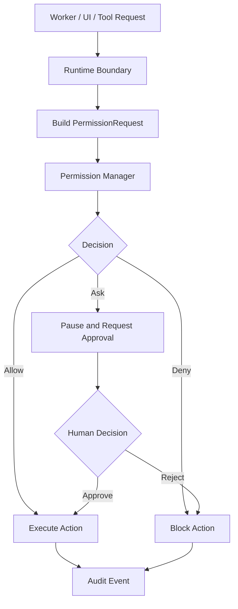

---
title: Permission Specification - Part 04
status: draft
version: 1.0
tags:
  - core-concepts
  - permissions
  - enforcement
  - runtime
related:
  - "[[Permission-Part03]]"
  - "[[Runtime-Part03]]"
  - "[[Execution-Part08]]"
  - "[[Tool-Part03]]"
---

# Permission Specification (Part 04)

## Document Index

Part 01 - Purpose, Philosophy, Architecture
Part 02 - Permission Registry & Scopes
Part 03 - Permission Policies
Part 04 - Runtime Enforcement
Part 05 - Worker & Tool Permissions
Part 06 - Sessions, Workspaces & Projects
Part 07 - Auditing & Security
Part 08 - Database, UI & Implementation

This part defines how permission decisions are enforced at runtime. Policies are only useful if every dangerous action must pass through an enforcement point before it reaches the operating system, filesystem, network, terminal, plugin, MCP server, or database.

# Purpose

Runtime enforcement is the act of making permission decisions real.

The Permission Manager may decide:

```text
filesystem.write = deny
```

But enforcement is the system behavior that prevents the write from happening.

In Eulinx, enforcement must happen before the action reaches the unsafe boundary.

# Enforcement Philosophy

Eulinx's permission system should be designed around this rule:

```text
No unsafe action should have a path around the Runtime.
```

Workers, AI CLIs, Tools, plugins, and MCP servers should not receive raw unrestricted access to the user's machine. They should interact with controlled Runtime services that enforce policies.

This is especially important because Eulinx's Workers are terminal-based. A CLI running inside a terminal can attempt many actions indirectly. The Runtime must therefore enforce permissions at multiple layers, not only at the UI button layer.

# Enforcement Layers

Eulinx SHOULD enforce permissions at these layers:

```text
UI Layer
Runtime API Layer
Tool Invocation Layer
Terminal/PTY Layer
Filesystem Layer
Network Layer
Secret Injection Layer
Artifact Merge Layer
Plugin/MCP Layer
Database Layer
```

No single layer is enough.

## UI Layer

The UI should hide or disable actions the user has not granted.

Examples:

- disable Git Push if workspace policy denies it
- show a lock icon for protected files
- show approval prompts for high-risk actions
- mark Workers running in YOLO mode

UI enforcement improves clarity, but it is not security by itself.

## Runtime API Layer

Every frontend request that affects state must go through a Runtime API that checks permission.

Examples:

- create Worker
- invoke Tool
- merge Artifact
- write setting
- start Terminal
- open external folder

The frontend MUST NOT directly mutate trusted state.

## Tool Invocation Layer

Every Tool call MUST pass through permission evaluation.

Tool calls are especially important because they are how Workers gain capabilities beyond text generation.

Example:

```text
Worker wants to call filesystem.write.
Tool Registry receives invocation.
Tool Registry asks Permission Manager.
Permission Manager evaluates policies.
Only then does the filesystem tool run.
```

## Terminal/PTY Layer

Terminal enforcement is more complex because command text can contain many actions.

Eulinx SHOULD enforce terminal access through:

- terminal ownership
- command approval modes
- sandboxed working directories
- environment filtering
- process limits
- shell profile restrictions
- output monitoring
- explicit dangerous command detection
- filesystem sandboxing where possible

Terminal enforcement cannot be perfect if a shell has broad OS permissions. Therefore Eulinx SHOULD prefer sandboxed terminals for Workers that can modify files.

## Filesystem Layer

Filesystem operations MUST be checked before write, delete, rename, move, copy, and watch operations.

Read access may be less dangerous, but still requires policy because project files can contain secrets.

Path checks MUST use normalized absolute paths.

Path checks MUST prevent traversal attempts such as:

```text
..\..\secret.txt
```

Filesystem permissions MUST respect workspace boundaries.

## Network Layer

Network actions MUST be checked before external requests.

Network policies SHOULD support:

- domain allowlists
- domain denylists
- method restrictions
- upload restrictions
- payload size limits
- content redaction
- proxy routing
- logging level

Network upload is higher-risk than network read.

## Secret Injection Layer

Secrets MUST NOT be exposed as raw text unless necessary.

Preferred pattern:

```text
Worker requests provider call
Runtime performs provider call
Worker receives result
Worker never sees API key
```

If a secret must be injected into a terminal environment, Eulinx MUST record:

- which secret was injected
- into which process
- for which purpose
- for how long
- under which approval

## Artifact Merge Layer

Workers SHOULD produce patch artifacts instead of directly editing project files.

The Merge Manager MUST check permission before applying a patch.

This allows Eulinx to support safer workflows:

```text
Worker creates patch
Verifier checks patch
Permission Manager approves merge
Merge Manager applies patch
```

## Plugin and MCP Layer

Plugins and MCP servers MUST declare capabilities.

Eulinx MUST evaluate permissions before:

- connecting to an MCP server
- invoking an MCP tool
- reading an MCP resource
- installing a plugin
- enabling plugin hooks
- allowing a plugin to register tools

Unknown plugin capabilities SHOULD default to ask or deny.

## Database Layer

Eulinx's internal database is trusted infrastructure.

Workers SHOULD NOT directly write to the internal database.

Runtime services may write database records if their own service-level authorization allows it.

# Enforcement Point Object

An enforcement point is a place in code where permission must be checked before action.

```ts
type EnforcementPoint = {
  id: string;
  name: string;
  layer:
    | "ui"
    | "runtime_api"
    | "tool"
    | "terminal"
    | "filesystem"
    | "network"
    | "secret"
    | "artifact"
    | "plugin"
    | "database";
  permissionIds: string[];
  riskLevel: "low" | "medium" | "high" | "critical";
  failClosed: boolean;
  auditRequired: boolean;
};
```

Every enforcement point SHOULD fail closed.

Fail closed means:

```text
If permission cannot be checked, deny the action.
```

# Runtime Enforcement Flow

```text
Action request
  |
  v
Build PermissionRequest
  |
  v
Validate request
  |
  v
Permission Manager
  |
  v
Policy Engine
  |
  +-- allow --> execute action
  |
  +-- deny  --> block action
  |
  +-- ask   --> pause action and request approval
```

# Approval Pausing

When a decision is `ask`, the Runtime MUST pause the action.

The Runtime MUST NOT:

- execute the action before approval
- continue in the background and ask later
- let the Worker bypass the prompt
- convert approval timeout into approval

Approval timeout SHOULD become denial unless the user configured otherwise.

# Preflight Checks

For complex actions, Eulinx SHOULD run a preflight permission check before execution.

Example:

```text
Worker asks to install npm package.

Preflight checks:
- terminal.input
- process.spawn
- network.http
- filesystem.write package-lock.json
- filesystem.write node_modules
- possible script execution
```

The UI can then show one combined approval request instead of many small prompts.

# Batch Enforcement

Some operations contain multiple permission requests.

Example:

```text
Apply patch artifact:
- read artifact
- check target files
- acquire locks
- write files
- update database history
- emit events
```

Eulinx SHOULD support batch permission evaluation where a compound action is approved or denied as a unit.

Batch approval MUST still list the included permissions in the audit log.

# Enforcement Events

The Permission Manager SHOULD emit events:

```text
permission.requested
permission.allowed
permission.denied
permission.approval_required
permission.approved
permission.rejected
permission.expired
permission.violation_detected
```

Events allow the UI, logs, replay system, and metrics dashboard to show what happened.

# Mermaid Diagram



# Enforcement Examples

## File Write

```text
Worker requests filesystem.write for src/login.ts.
Runtime normalizes path.
Permission Manager evaluates workspace, task, worker, and tool policies.
If allowed, write happens through filesystem service.
If denied, Worker receives a structured denial.
```

## Terminal Command

```text
Worker sends command: npm install package-name.
Runtime detects package installation.
Preflight asks for process, network, and filesystem permissions.
User approves.
Command is sent to owned terminal.
Audit log records approval and command summary.
```

## Artifact Merge

```text
Verifier approves patch artifact.
Merge Manager asks Permission Manager for artifact.merge and filesystem.write.
Locks are acquired.
Patch is applied.
Audit log records final file changes.
```

# Failure Behavior

If enforcement fails due to an internal error, Eulinx MUST deny or pause the action.

Eulinx MUST NOT allow an action because:

- the Permission Manager crashed
- a policy file could not be loaded
- a database lookup failed
- the registry was unavailable
- a plugin returned malformed metadata

The safe failure behavior is:

```text
deny and emit permission.enforcement_failed
```

# AI Notes

Do not implement permission checks only in React components.

Do not trust Worker-generated summaries.

Do not let Tools call operating system APIs directly unless the Runtime has already authorized the call.

Do not treat terminal permissions as simple text input permissions. A terminal is a capability amplifier.

# Related Documents

- [[Permission-Part03]]
- [[Permission-Part05]]
- [[Runtime-Part03]]
- [[Tool-Part03]]
- [[Tool-Part04]]
- [[Execution-Part08]]
- [[Artifact-Part04]]

