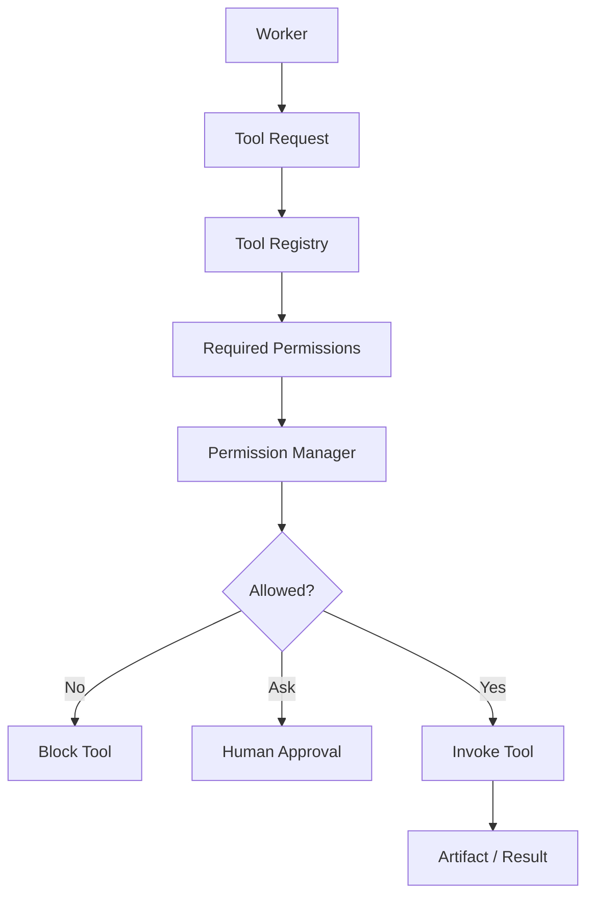

---
title: Permission Specification - Part 05
status: draft
version: 1.0
tags:
  - core-concepts
  - permissions
  - workers
  - tools
related:
  - "[[Worker-Part03]]"
  - "[[Tool-Part04]]"
  - "[[Tool-Part06]]"
  - "[[Permission-Part04]]"
---

# Permission Specification (Part 05)

## Document Index

Part 01 - Purpose, Philosophy, Architecture
Part 02 - Permission Registry & Scopes
Part 03 - Permission Policies
Part 04 - Runtime Enforcement
Part 05 - Worker & Tool Permissions
Part 06 - Sessions, Workspaces & Projects
Part 07 - Auditing & Security
Part 08 - Database, UI & Implementation

This part defines how permissions apply to Workers, Tools, terminals, MCP servers, plugins, and AI-powered CLI sessions.

# Purpose

Eulinx's Workers are not abstract chatbot personalities. A Worker is a live execution unit, usually backed by an AI CLI terminal. That means Worker permissions must control both:

- what the Worker is allowed to ask the Runtime to do
- what the Worker is allowed to do through its terminal, tools, and environment

Tool permissions define what capabilities a Worker may use.

Worker permissions define who may use those capabilities, under what constraints, and for which task.

# Worker Permission Model

A Worker should begin with no dangerous permissions.

When a Worker is created, it receives a permission profile derived from:

- Workspace policy
- Project policy
- Session mode
- Execution plan
- Orchestrator assignment
- Task requirements
- User approval
- Tool capabilities
- Sandbox settings

The Worker does not own these permissions. The Runtime grants them temporarily.

# Worker Permission Profile

```ts
type WorkerPermissionProfile = {
  workerId: string;
  workspaceId: string;
  projectId: string;
  sessionId: string;
  taskId?: string;
  mode: "restricted" | "standard" | "trusted" | "yolo";
  grants: PermissionGrant[];
  hardDenials: PermissionRule[];
  budgetLimits: WorkerPermissionBudget;
  sandboxRequired: boolean;
  approvalMode: "ask_each_time" | "ask_once" | "auto_for_low_risk" | "auto_within_policy";
  createdAt: string;
  expiresAt?: string;
};
```

# Worker Modes

## Restricted

Restricted Workers can read assigned context and produce artifacts but cannot modify project files directly.

Recommended for:

- reviewers
- critics
- planners
- researchers
- judges
- summarizers

Typical permissions:

```text
artifact.create
artifact.read
filesystem.read inside assigned paths
memory.read scoped context
```

## Standard

Standard Workers can use approved tools and may request file changes through artifacts.

Recommended for most coding tasks.

Typical permissions:

```text
filesystem.read project
artifact.create
terminal.spawn sandbox
terminal.input owned terminal
network.http allowlisted domains
```

## Trusted

Trusted Workers can perform broader actions after policy checks.

Recommended only for Workers created by trusted orchestrators or explicit user actions.

Typical permissions:

```text
filesystem.write scoped paths
git.status
git.diff
terminal.input owned terminal
tool.invoke approved tools
```

## YOLO

YOLO Workers can execute many actions without repeated prompts, but only within hard policy boundaries.

YOLO mode MUST still enforce:

- workspace isolation
- sandbox boundaries
- hard denials
- secret protection
- budget limits
- spawn limits
- audit logging

YOLO mode is not "root access."

# Tool Permission Model

Every Tool MUST declare required permissions.

Example:

```ts
type ToolPermissionDeclaration = {
  toolId: string;
  requiredPermissions: string[];
  optionalPermissions?: string[];
  riskLevel: "low" | "medium" | "high" | "critical";
  resourceTypes: string[];
  supportsDryRun: boolean;
  supportsSandbox: boolean;
};
```

Tool invocation requires two checks:

```text
1. Is the Worker allowed to invoke this Tool?
2. Is the Tool allowed to perform this specific action?
```

Both must pass.

# Tool Invocation Flow

```text
Worker
  |
  v
Tool invocation request
  |
  v
Tool Registry
  |
  v
Permission Manager
  |
  v
Tool executes only if allowed
```

# Terminal Permissions

Terminal permissions are special because a terminal can run many commands.

Eulinx SHOULD distinguish:

```text
terminal.spawn
terminal.read
terminal.input
terminal.kill
terminal.attach
terminal.detach
```

The most sensitive permission is `terminal.input` because sending text to a shell can trigger any command available in that shell.

# Terminal Ownership

Every terminal MUST have an owner.

Possible owners:

```text
user
worker
orchestrator
runtime
```

A Worker MAY send input only to terminals it owns or terminals explicitly shared with it.

Workers MUST NOT type into another Worker's terminal unless an explicit collaboration policy allows it.

# Command Risk Classification

Eulinx SHOULD classify terminal commands before execution when possible.

Example categories:

```text
read-only
test
build
package_install
file_modify
file_delete
network
git_commit
git_push
secret_access
process_control
unknown
```

Unknown commands SHOULD be treated as medium or high risk depending on mode.

# CLI Workers

Eulinx may launch CLIs such as Claude Code, OpenCode, Codex CLI, Gemini CLI, or a custom Eulinx CLI.

Each CLI Worker should receive:

- working directory
- task prompt
- allowed tools
- permission mode
- sandbox path
- environment variables
- budget limits
- context package
- artifact output instructions

The CLI should not be trusted simply because it is an AI coding tool.

# MCP Permissions

MCP servers expose tools and resources.

Eulinx MUST evaluate MCP permissions at three levels:

```text
server connection
tool discovery
tool invocation
```

Example:

```text
mcp.server.connect: github
mcp.tool.invoke: github.create_issue
mcp.resource.read: repo.metadata
```

MCP permissions SHOULD include:

- server id
- tool id
- input schema hash
- output schema hash
- allowed requester types
- data exposure risk

# Plugin Permissions

Plugins may extend Eulinx by adding:

- tools
- nodes
- UI panels
- hooks
- providers
- workflow actions

Plugin permissions MUST be declared before enablement.

Plugin hooks are especially sensitive because they may run automatically.

Example plugin permissions:

```text
plugin.install
plugin.enable
plugin.disable
plugin.hook.register
plugin.tool.register
plugin.ui.register
```

# Worker Spawn Permissions

One of Eulinx's unique features is that Workers may create more Workers when allowed.

This requires strict permission controls.

Spawn-related permissions:

```text
worker.spawn.child
worker.spawn.sibling
worker.spawn.orchestrator
worker.assign_task
worker.delegate
```

Spawn requests MUST include:

- parent Worker id
- requested purpose
- task summary
- estimated budget
- requested permissions
- expected outputs
- termination condition

Spawned Workers MUST NOT automatically inherit all parent permissions.

They should inherit only the minimum permissions needed for their assigned task.

# Permission Budgets

Worker permissions should include budgets.

Examples:

```text
max_child_workers: 3
max_terminal_sessions: 1
max_runtime_minutes: 30
max_network_requests: 50
max_file_writes: 25
max_total_cost_usd: 1.00
max_tokens: 100000
```

Budgets prevent runaway execution.

# Mermaid Diagram



# Good Example

```text
Task:
Implement login form validation.

Worker permissions:
- filesystem.read src/auth/**
- filesystem.write only through patch artifact
- terminal.spawn sandbox
- terminal.input owned terminal
- network.http denied
- git.push denied
- secret.read denied

Result:
Worker can do the coding task without broad machine access.
```

# Bad Example

```text
Task:
Review login form validation.

Worker permissions:
- filesystem.write **/*
- terminal.input global terminal
- git.push
- secret.read
- network.upload

Problem:
The Worker has far more power than the task requires.
```

# AI Notes

Do not design Workers as trusted users.

Design Workers as temporary processes with narrowly scoped capabilities.

Do not let a Worker spawn other Workers without budget and permission checks.

Do not let Tools assume they are safe because they are called from an approved Worker. Tool actions still need per-invocation checks.

# Related Documents

- [[Worker-Part03]]
- [[Worker-Part04]]
- [[Tool-Part03]]
- [[Tool-Part04]]
- [[Tool-Part06]]
- [[Permission-Part04]]
- [[Permission-Part06]]

