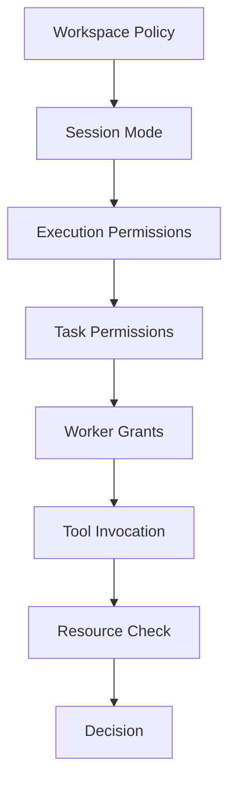

---
title: Permission Specification - Part 06
status: draft
version: 1.0
tags:
  - core-concepts
  - permissions
  - workspace
  - session
related:
  - "[[Workspace-Part01]]"
  - "[[Project-Part01]]"
  - "[[Session-Part01]]"
  - "[[Permission-Part03]]"
---

# Permission Specification (Part 06)

## Document Index

Part 01 - Purpose, Philosophy, Architecture
Part 02 - Permission Registry & Scopes
Part 03 - Permission Policies
Part 04 - Runtime Enforcement
Part 05 - Worker & Tool Permissions
Part 06 - Sessions, Workspaces & Projects
Part 07 - Auditing & Security
Part 08 - Database, UI & Implementation

This part defines how permissions behave across Workspaces, Projects, Sessions, Executions, Orchestrators, Tasks, Workers, Tools, and individual invocations.

# Purpose

Eulinx must keep each Project isolated. A Worker operating in one Workspace must not accidentally or intentionally affect another Workspace.

The Permission System is one of the main systems responsible for maintaining this boundary.

# Workspace Permissions

The Workspace is the highest user-facing isolation boundary.

Workspace permissions define:

- which folders are included
- which folders are excluded
- which external paths are allowed
- which provider credentials may be used
- which models may be used
- which tools may be used
- whether terminals are allowed
- whether network access is allowed
- whether YOLO mode is allowed
- whether plugins are allowed
- whether Workers may spawn other Workers

Workspace policies MUST override lower-level grants.

# Workspace Boundary Rules

Workers MUST NOT read or modify files outside the Workspace unless the user explicitly grants an external path.

External path grants MUST be:

- visible in the UI
- auditable
- revocable
- scoped
- optional
- denied by default

Example:

```text
Workspace root:
C:\Users\User\Projects\App

Worker asks to read:
C:\Users\User\Desktop\passwords.txt

Result:
deny
```

# Project Permissions

A Project is the user's actual work inside a Workspace.

Project permissions define what can happen to the project files and project-specific runtime state.

Examples:

```text
project.files.read
project.files.write
project.dependencies.install
project.tests.run
project.git.commit
project.git.push
project.settings.write
```

Eulinx may support Workspaces with multiple Projects later, but the early architecture should assume one main Project per Workspace unless explicitly designed otherwise.

# Session Permissions

A Session is a single active work period.

Session permissions are temporary and should usually expire when the Session ends.

Session-level settings may include:

- default Worker mode
- default approval mode
- allowed providers
- allowed models
- max active Workers
- max child Workers per Worker
- max terminals
- max total cost
- max runtime duration
- network mode
- YOLO mode
- simulation mode

Session permissions are useful because a user may want one work session to be strict and another to be experimental.

# Execution Permissions

An Execution is a specific run of work.

Examples:

- build this feature
- run this workflow
- verify this artifact
- execute this automation

Execution permissions define what is allowed for that run.

Execution permissions SHOULD be generated from:

- user request
- Root Orchestrator plan
- selected mode
- task graph
- required tools
- Workspace policy

Execution permissions MUST NOT exceed Workspace or Session limits.

# Orchestrator Permissions

Orchestrators coordinate work. They may create tasks, spawn Workers, request verification, and aggregate progress.

Orchestrator permissions should control:

```text
orchestrator.plan.create
orchestrator.phase.create
orchestrator.task.create
orchestrator.worker.spawn
orchestrator.worker.terminate
orchestrator.artifact.route
orchestrator.execution.pause
orchestrator.execution.resume
```

An Orchestrator should not automatically receive direct filesystem write permissions just because it manages Workers.

The safest model is:

```text
Orchestrator plans and delegates.
Workers produce artifacts.
Verifiers validate.
Merge Manager applies changes.
```

# Task Permissions

Tasks define a narrow unit of work.

Task permissions should be narrow and specific.

Example:

```yaml
task: Implement login validation
permissions:
  filesystem.read:
    allow:
      - "src/auth/**"
      - "src/components/LoginForm.tsx"
  filesystem.write:
    allow:
      - "src/auth/**"
      - "src/components/LoginForm.tsx"
  terminal.input:
    allow: owned_terminal_only
  network.http:
    deny: true
```

The Task is one of the best places to apply least privilege.

# Worker Permissions

Worker permissions are derived from Task permissions plus Worker mode.

Workers should not define their own permissions.

The Runtime should calculate effective Worker permissions before Worker start.

Worker permissions SHOULD expire when:

- Worker completes
- Worker fails
- Worker is terminated
- Task is reassigned
- Session ends
- User revokes access
- policy changes invalidate the grant

# Tool Permissions

Tool permissions are evaluated at invocation time.

Even if a Worker has permission to use a Tool, the Tool call still needs resource-specific authorization.

Example:

```text
Worker can use filesystem tool.
Worker asks filesystem tool to write .env.
Permission Manager denies because .env is protected.
```

# Invocation Permissions

Invocation permissions are the narrowest permission scope.

They apply to one specific action.

Example:

```text
Allow this Worker to write this one file once.
```

Invocation grants are ideal for human approvals.

# Grant Expiry

Permission grants SHOULD be temporary by default.

Possible expiry conditions:

- exact timestamp
- Session end
- Execution end
- Task completion
- Worker termination
- one-time use
- budget exhaustion
- policy version change
- Workspace close

Example:

```ts
type PermissionGrantExpiry = {
  mode:
    | "timestamp"
    | "session_end"
    | "execution_end"
    | "task_complete"
    | "worker_terminated"
    | "one_time"
    | "budget_exhausted"
    | "policy_changed";
  value?: string;
};
```

# Revocation

Users and Runtime services must be able to revoke permissions.

Revocation SHOULD immediately:

- block new actions
- cancel pending approval requests
- pause affected Workers if needed
- terminate unsafe Tools if needed
- emit events
- write audit records

Revocation may not be able to undo already completed external actions. The UI must not imply that revocation can reverse the past.

# Permission Modes by Scope

```text
Workspace:
  defines hard limits

Session:
  defines active mode

Execution:
  defines run-specific capabilities

Task:
  defines narrow work boundaries

Worker:
  receives temporary grants

Tool:
  declares required capabilities

Invocation:
  performs final resource check
```

# Mermaid Diagram



# Example: Strict Session

```text
Session mode:
Strict

Result:
- Workers can read assigned files.
- Workers produce artifacts.
- File writes require approval.
- Network requires approval.
- Git push denied.
- Secrets denied.
- Worker spawning requires approval.
```

# Example: YOLO Sandbox Session

```text
Session mode:
YOLO Sandbox

Result:
- Workers can write inside sandbox.
- Workers can run tests.
- Workers can install dependencies inside sandbox.
- Merge still requires verification.
- Secrets are still protected.
- Git push still asks.
```

# AI Notes

Do not treat Session permission as permanent user preference.

Do not let a Worker carry permissions from one Task to another without recalculation.

Do not let permissions cross Workspace boundaries.

Do not let child Workers inherit broad parent permissions by default.

# Related Documents

- [[Workspace-Part01]]
- [[Project-Part01]]
- [[Session-Part01]]
- [[Execution-Part01]]
- [[Task-Part01]]
- [[Worker-Part03]]
- [[Permission-Part07]]

