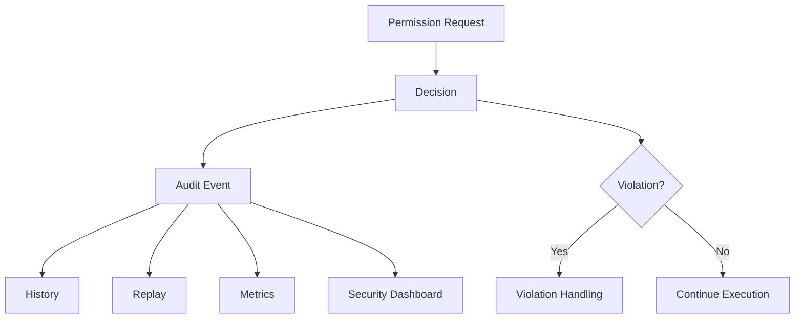

---
title: Permission Specification - Part 07
status: draft
version: 1.0
tags:
  - core-concepts
  - permissions
  - audit
  - security
related:
  - "[[Permission-Part04]]"
  - "[[Permission-Part06]]"
  - "[[Runtime-Part04]]"
  - "[[Execution-Part07]]"
---

# Permission Specification (Part 07)

## Document Index

Part 01 - Purpose, Philosophy, Architecture
Part 02 - Permission Registry & Scopes
Part 03 - Permission Policies
Part 04 - Runtime Enforcement
Part 05 - Worker & Tool Permissions
Part 06 - Sessions, Workspaces & Projects
Part 07 - Auditing & Security
Part 08 - Database, UI & Implementation

This part defines audit logs, security expectations, threat scenarios, violation handling, recovery behavior, and how Permission data supports Replay, debugging, and user trust.

# Purpose

Permissions are not only about blocking actions.

They also answer:

```text
What happened?
Who requested it?
Why was it allowed?
Which policy allowed it?
What resource was affected?
Could this happen again?
Can the user understand it later?
```

The audit system gives Eulinx accountability.

# Audit Philosophy

Eulinx should assume that complex AI executions will sometimes surprise the user.

When that happens, the user should be able to inspect the execution history and understand:

- which Worker requested an action
- what the Worker was trying to do
- which permission was checked
- which policy was applied
- whether the user approved it
- what the Runtime did
- which files or resources changed
- what artifact or task caused the action

If Eulinx cannot explain an action after the fact, the permission system is incomplete.

# Audit Event Object

```ts
type PermissionAuditEvent = {
  id: string;
  workspaceId: string;
  projectId?: string;
  sessionId?: string;
  executionId?: string;
  taskId?: string;
  workerId?: string;
  toolId?: string;
  requestId: string;
  decisionId?: string;
  permissionId: string;
  action: string;
  resourceType?: string;
  resourceId?: string;
  decision: "allow" | "deny" | "ask" | "approved" | "rejected" | "expired" | "failed";
  riskLevel: "low" | "medium" | "high" | "critical";
  policyIds: string[];
  ruleIds: string[];
  userId?: string;
  summary: string;
  details?: Record<string, unknown>;
  createdAt: string;
};
```

# Audit Levels

Eulinx SHOULD support different audit levels.

## None

Used only for harmless internal checks.

Example:

```text
UI asks whether to show disabled button.
```

## Summary

Used for low-risk repeated actions.

Example:

```text
Worker read 14 files inside src/auth.
```

## Full

Used for high-risk and critical actions.

Example:

```text
Worker requested filesystem.write on src/auth/login.ts.
Policy task-auth allowed it.
User approved write scope for task.
Merge Manager applied patch artifact patch_123.
```

Critical actions MUST use full audit.

# Events to Audit

Eulinx SHOULD audit:

- high-risk permission requests
- critical permission requests
- all denials
- all approval prompts
- all approval responses
- all policy changes
- all grant creations
- all grant revocations
- all YOLO mode activations
- all secret-related requests
- all external path grants
- all plugin permission grants
- all MCP server connections
- all artifact merges
- all destructive actions

# Security Threats

## Prompt Injection

A Worker may read malicious text telling it to ignore instructions or exfiltrate files.

Permission defense:

- Workers cannot authorize themselves.
- Network upload requires policy.
- Secret access is denied by default.
- File access is scoped.

## Tool Confusion

A Worker may call the wrong Tool or misunderstand a Tool's effect.

Permission defense:

- Tool schemas declare permissions.
- Each invocation is checked.
- High-risk Tools require approval.

## Overbroad Terminal Access

A terminal may allow commands beyond the intended task.

Permission defense:

- sandboxed working directory
- command classification
- owned terminal rule
- environment filtering
- budget limits
- audit logs

## Secret Leakage

A Worker may try to read, print, upload, or commit secrets.

Permission defense:

- secret.read denied by default
- environment redaction
- output scanning
- Git preflight checks
- network upload approval

## Workspace Escape

A Worker may access files outside the project.

Permission defense:

- normalized absolute path checks
- external path grants
- deny traversal
- Workspace boundary enforcement

## Runaway Worker Spawning

Workers may spawn too many children.

Permission defense:

- spawn permissions
- child budgets
- max active Workers
- max depth
- loop detection
- approval for high fan-out

# Violation Handling

A permission violation occurs when:

- an action is attempted without permission
- a denied action is retried repeatedly
- a Worker attempts to bypass Runtime services
- a Tool performs action outside declared capabilities
- a plugin invokes an undeclared capability
- a terminal command violates active policy

Violation response SHOULD depend on severity.

## Low Severity

Example:

```text
Worker tries to read a file outside assigned task but inside project.
```

Response:

- deny action
- inform Worker
- record audit event

## Medium Severity

Example:

```text
Worker repeatedly requests network access after denial.
```

Response:

- deny action
- warn user
- throttle repeated requests
- notify Orchestrator

## High Severity

Example:

```text
Worker tries to delete project files without permission.
```

Response:

- block action
- pause Worker
- notify user
- record full audit
- require human decision to continue

## Critical Severity

Example:

```text
Worker attempts to read secrets and upload them.
```

Response:

- block action
- terminate or quarantine Worker
- revoke related grants
- stop related Tools
- notify user clearly
- create security incident record

# Replay Integration

The Replay system should use permission audit events to reconstruct the safety story of an execution.

Replay should show:

- permission requests
- decisions
- approvals
- denials
- policy changes
- merges
- security warnings

Replay is not only a debugging tool. It is how the user learns to trust the system.

# Metrics

Eulinx SHOULD track:

- approvals per session
- denials per Worker
- high-risk actions per execution
- most requested permissions
- most denied permissions
- approval latency
- policy violations
- YOLO mode usage
- secret access attempts
- external path access attempts

These metrics can help improve default policies and user experience.

# Mermaid Diagram



# Security Rules

Eulinx MUST NOT store raw secrets in permission logs.

Eulinx MUST redact sensitive paths or values when needed.

Eulinx MUST record enough metadata to debug decisions.

Eulinx MUST make high-risk approvals visible to the user.

Eulinx MUST fail closed if audit storage fails for critical actions.

Eulinx SHOULD allow users to export audit logs for a Workspace.

# AI Notes

Do not make permission audit logs optional for high-risk actions.

Do not log raw API keys, tokens, passwords, private SSH keys, or full environment dumps.

Do not treat repeated denial as harmless. Repeated denial may indicate a bad prompt, confused Worker, or malicious instruction.

Do not hide YOLO actions from history. YOLO mode needs more audit visibility, not less.

# Related Documents

- [[Permission-Part08]]
- [[Runtime-Part04]]
- [[Execution-Part07]]
- [[Session-Part03]]
- [[Memory-Part03]]
- [[Artifact-Part04]]

