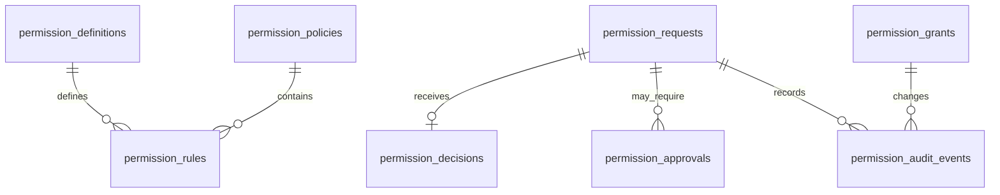

---
title: Permission Specification - Part 08
status: draft
version: 1.0
tags:
  - core-concepts
  - permissions
  - database
  - ui
  - implementation
related:
  - "[[Permission-Part01]]"
  - "[[Permission-Part07]]"
  - "[[Runtime-Part04]]"
  - "[[Tool-Part12]]"
---

# Permission Specification (Part 08)

## Document Index

Part 01 - Purpose, Philosophy, Architecture
Part 02 - Permission Registry & Scopes
Part 03 - Permission Policies
Part 04 - Runtime Enforcement
Part 05 - Worker & Tool Permissions
Part 06 - Sessions, Workspaces & Projects
Part 07 - Auditing & Security
Part 08 - Database, UI & Implementation

This final part defines the database model, UI behavior, runtime API shape, event names, testing strategy, implementation checklist, and future expansion plan for the Permission System.

# Purpose

The previous parts define what permissions mean. This part explains how Eulinx should implement and expose them.

The Permission System must be understandable to:

- the Runtime
- the UI
- the database
- Workers
- Orchestrators
- Tools
- plugins
- users
- AI coding assistants

# Database Tables

Eulinx should store permission state in SQLite.

The exact schema can evolve, but the initial model SHOULD include these tables:

```text
permission_definitions
permission_policies
permission_rules
permission_grants
permission_requests
permission_decisions
permission_approvals
permission_audit_events
permission_violations
```

# permission_definitions

Stores the registry of known permissions.

```sql
CREATE TABLE permission_definitions (
  id TEXT PRIMARY KEY,
  name TEXT NOT NULL,
  description TEXT NOT NULL,
  category TEXT NOT NULL,
  action TEXT NOT NULL,
  default_risk_level TEXT NOT NULL,
  default_decision TEXT NOT NULL,
  audit_mode TEXT NOT NULL,
  approval_required_by_default INTEGER NOT NULL,
  supports_constraints INTEGER NOT NULL,
  deprecated_at TEXT,
  created_at TEXT NOT NULL,
  updated_at TEXT NOT NULL
);
```

# permission_policies

Stores policies attached to scopes.

```sql
CREATE TABLE permission_policies (
  id TEXT PRIMARY KEY,
  workspace_id TEXT,
  name TEXT NOT NULL,
  description TEXT,
  scope_type TEXT NOT NULL,
  scope_id TEXT NOT NULL,
  priority INTEGER NOT NULL,
  enabled INTEGER NOT NULL,
  created_by TEXT NOT NULL,
  created_at TEXT NOT NULL,
  updated_at TEXT NOT NULL
);
```

# permission_rules

Stores individual rules inside policies.

```sql
CREATE TABLE permission_rules (
  id TEXT PRIMARY KEY,
  policy_id TEXT NOT NULL,
  permission_id TEXT NOT NULL,
  effect TEXT NOT NULL,
  resource_pattern TEXT,
  requester_pattern TEXT,
  constraints_json TEXT,
  risk_override TEXT,
  expires_at TEXT,
  reason TEXT,
  created_at TEXT NOT NULL,
  updated_at TEXT NOT NULL
);
```

# permission_grants

Stores temporary grants created for Sessions, Tasks, Workers, Tools, or invocations.

```sql
CREATE TABLE permission_grants (
  id TEXT PRIMARY KEY,
  workspace_id TEXT NOT NULL,
  session_id TEXT,
  execution_id TEXT,
  task_id TEXT,
  worker_id TEXT,
  tool_id TEXT,
  permission_id TEXT NOT NULL,
  scope_type TEXT NOT NULL,
  scope_id TEXT NOT NULL,
  constraints_json TEXT,
  granted_by TEXT NOT NULL,
  grant_reason TEXT,
  expires_at TEXT,
  revoked_at TEXT,
  created_at TEXT NOT NULL
);
```

# permission_requests

Stores permission checks.

```sql
CREATE TABLE permission_requests (
  id TEXT PRIMARY KEY,
  workspace_id TEXT NOT NULL,
  project_id TEXT,
  session_id TEXT,
  execution_id TEXT,
  task_id TEXT,
  worker_id TEXT,
  tool_id TEXT,
  requester_type TEXT NOT NULL,
  requester_id TEXT NOT NULL,
  permission_id TEXT NOT NULL,
  action TEXT NOT NULL,
  resource_type TEXT,
  resource_id TEXT,
  input_summary TEXT,
  reason TEXT,
  requested_at TEXT NOT NULL
);
```

# permission_decisions

Stores the result of evaluation.

```sql
CREATE TABLE permission_decisions (
  id TEXT PRIMARY KEY,
  request_id TEXT NOT NULL,
  decision TEXT NOT NULL,
  effective_risk_level TEXT NOT NULL,
  matched_policy_ids_json TEXT,
  matched_rule_ids_json TEXT,
  owner_scope_type TEXT,
  owner_scope_id TEXT,
  reason TEXT NOT NULL,
  constraints_applied_json TEXT,
  approval_required INTEGER NOT NULL,
  expires_at TEXT,
  decided_at TEXT NOT NULL
);
```

# permission_approvals

Stores human approval results.

```sql
CREATE TABLE permission_approvals (
  id TEXT PRIMARY KEY,
  request_id TEXT NOT NULL,
  decision_id TEXT,
  workspace_id TEXT NOT NULL,
  user_decision TEXT NOT NULL,
  approved_scope_type TEXT,
  approved_scope_id TEXT,
  approval_constraints_json TEXT,
  expires_at TEXT,
  user_note TEXT,
  created_at TEXT NOT NULL
);
```

# permission_audit_events

Stores audit records.

```sql
CREATE TABLE permission_audit_events (
  id TEXT PRIMARY KEY,
  workspace_id TEXT NOT NULL,
  project_id TEXT,
  session_id TEXT,
  execution_id TEXT,
  task_id TEXT,
  worker_id TEXT,
  tool_id TEXT,
  request_id TEXT,
  decision_id TEXT,
  permission_id TEXT NOT NULL,
  action TEXT NOT NULL,
  resource_type TEXT,
  resource_id TEXT,
  decision TEXT NOT NULL,
  risk_level TEXT NOT NULL,
  summary TEXT NOT NULL,
  details_json TEXT,
  created_at TEXT NOT NULL
);
```

# Indexes

Recommended indexes:

```sql
CREATE INDEX idx_permission_requests_workspace ON permission_requests(workspace_id);
CREATE INDEX idx_permission_requests_worker ON permission_requests(worker_id);
CREATE INDEX idx_permission_decisions_request ON permission_decisions(request_id);
CREATE INDEX idx_permission_grants_scope ON permission_grants(scope_type, scope_id);
CREATE INDEX idx_permission_audit_workspace_time ON permission_audit_events(workspace_id, created_at);
CREATE INDEX idx_permission_audit_worker ON permission_audit_events(worker_id);
```

# Runtime API

The Runtime should expose a small set of permission APIs.

```ts
interface PermissionRuntimeApi {
  check(request: PermissionRequest): Promise<PermissionDecision>;
  requestApproval(request: PermissionRequest): Promise<ApprovalRequest>;
  grant(grant: PermissionGrantInput): Promise<PermissionGrant>;
  revoke(grantId: string): Promise<void>;
  listDefinitions(): Promise<PermissionDefinition[]>;
  listPolicies(scope: ScopeRef): Promise<PermissionPolicy[]>;
  listAuditEvents(filter: PermissionAuditFilter): Promise<PermissionAuditEvent[]>;
}
```

Feature code should not bypass this API.

# UI Requirements

The Permission UI should be clear, not scary for no reason.

Users need to understand:

- what action is being requested
- who requested it
- what resource is affected
- why it is needed
- what could go wrong
- whether approval is one-time or persistent
- how to revoke it later

# Approval Dialog

Approval dialogs SHOULD show:

```text
Requester:
Worker 12 - Login Validation

Action:
Write file

Target:
src/auth/login.ts

Reason:
Worker is applying verified patch artifact.

Risk:
High

Options:
- Deny
- Allow once
- Allow for this task
- Allow for this session
```

Critical actions SHOULD avoid broad "always allow" options.

# Permission Dashboard

Eulinx should eventually provide a permission dashboard with:

- active grants
- recent approvals
- denied requests
- policy violations
- Workspace policies
- Session mode
- YOLO mode status
- external path grants
- plugin permissions
- MCP permissions

# Worker Node UI

Worker nodes in the graph should show permission status compactly.

Examples:

```text
Restricted
Standard
Trusted
YOLO
Approval Needed
Blocked by Policy
Security Warning
```

Clicking a Worker should show:

- current grants
- denied permissions
- approval history
- active tools
- terminal access
- budget limits

# Event Names

Recommended events:

```text
permission.definition.registered
permission.policy.created
permission.policy.updated
permission.policy.disabled
permission.requested
permission.allowed
permission.denied
permission.approval_required
permission.approved
permission.rejected
permission.grant.created
permission.grant.revoked
permission.grant.expired
permission.violation.detected
permission.audit.recorded
```

# Testing Strategy

The Permission System needs strong tests because it protects the user.

## Unit Tests

Test:

- registry lookup
- unknown permission denial
- policy matching
- scope inheritance
- hard denial precedence
- constraint matching
- expiry behavior
- revocation behavior

## Integration Tests

Test:

- Worker invokes Tool
- Tool checks Permission Manager
- denied action is blocked
- approval pauses execution
- approved action resumes execution
- audit event is stored

## Security Tests

Test:

- path traversal
- external folder access
- secret read attempts
- network upload attempts
- plugin undeclared capability
- MCP tool with changed schema
- Worker spawn loops

## Replay Tests

Test:

- audit events reconstruct permission timeline
- approvals appear in replay
- denials appear in replay
- policy changes are visible

# Implementation Checklist

```text
[ ] Define PermissionDefinition type
[ ] Define PermissionRequest type
[ ] Define PermissionDecision type
[ ] Define PermissionGrant type
[ ] Create Permission Registry
[ ] Create Policy Engine
[ ] Create Permission Manager
[ ] Add SQLite tables
[ ] Add Runtime API methods
[ ] Add Tool invocation checks
[ ] Add Worker spawn checks
[ ] Add terminal ownership checks
[ ] Add filesystem path checks
[ ] Add secret protection checks
[ ] Add approval dialog UI
[ ] Add permission dashboard UI
[ ] Add audit events
[ ] Add replay integration
[ ] Add tests for denial precedence
[ ] Add tests for approval flow
[ ] Add tests for workspace isolation
```

# Future Expansion

Future Permission features may include:

- policy templates
- organization-level policies
- signed plugin manifests
- permission simulation
- AI-generated policy suggestions
- visual permission graph
- automatic least-privilege recommendations
- per-provider data exposure rules
- remote workspace policies
- team approval workflows
- policy import/export

# Mermaid ER Diagram



# Final AI Notes

The Permission System should be implemented before Eulinx gives Workers broad tool or terminal power.

Do not treat this as a later polish feature. It is foundational infrastructure.

The simplest safe mental model is:

```text
Worker asks.
Runtime checks.
Policy decides.
Human approves when needed.
Runtime enforces.
Audit records.
```

# Related Documents

- [[Permission-Part01]]
- [[Permission-Part02]]
- [[Permission-Part03]]
- [[Permission-Part04]]
- [[Permission-Part05]]
- [[Permission-Part06]]
- [[Permission-Part07]]
- [[Runtime-Part04]]
- [[Tool-Part12]]
- [[Execution-Part08]]

