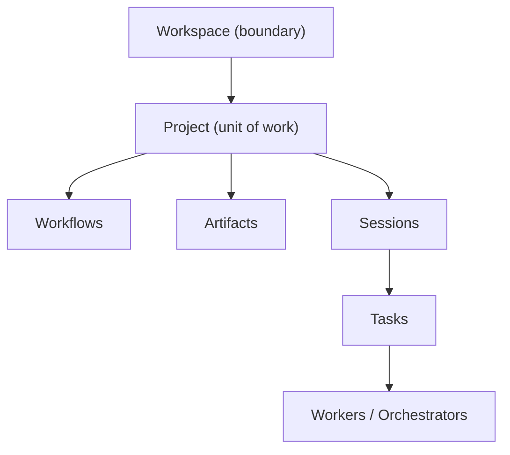
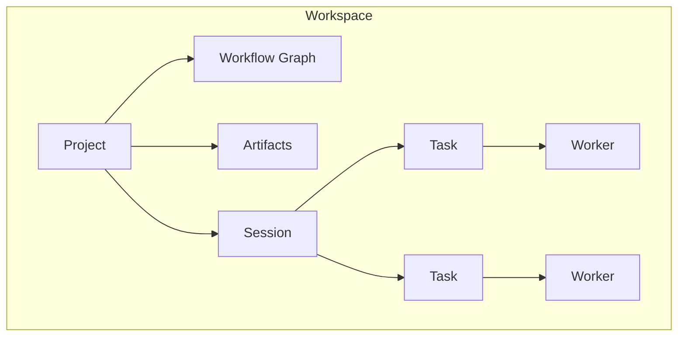

# Project Diagrams





```text
Project contains:
  Workflows   - how work moves (graphs of Nodes and Edges)
  Artifacts   - structured outputs (patches, summaries, tests, reviews)
  Sessions    - execution timelines that advance the work
      |
      +-- Tasks        (units of execution)
            |
            +-- Workers / Orchestrators (live execution units)

A Project is always inside exactly one Workspace.
The Workspace owns the boundary, files, memory, permissions, and agents.
The Project organizes the work that uses them.
```

```text
Nesting:
  Workspace
    +-- Project A
    |     +-- Workflows, Artifacts, Sessions -> Tasks -> Workers
    +-- Project B
          +-- Workflows, Artifacts, Sessions -> Tasks -> Workers

No Project crosses into another Workspace.
No Project defines its own isolation boundary.
```

# Related Documents

- [[Project-Part01]]
- [[Project-Part02]]
- [[Project-Part03]]
- [[01-core-concepts/README]]
- [[Workspace-Part01]]
- [[Workflow-Part01]]
- [[Artifact-Part01]]
- [[Session-Part01]]
- [[Task-Part01]]
- [[Worker-Part01]]
