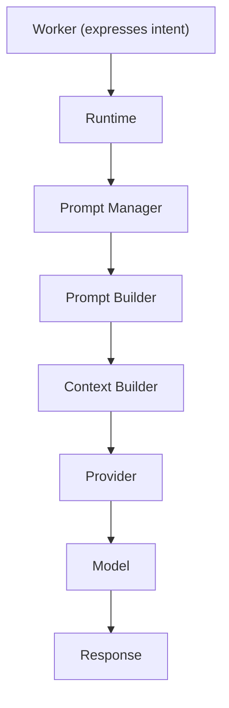
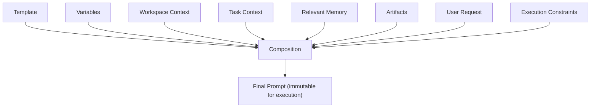
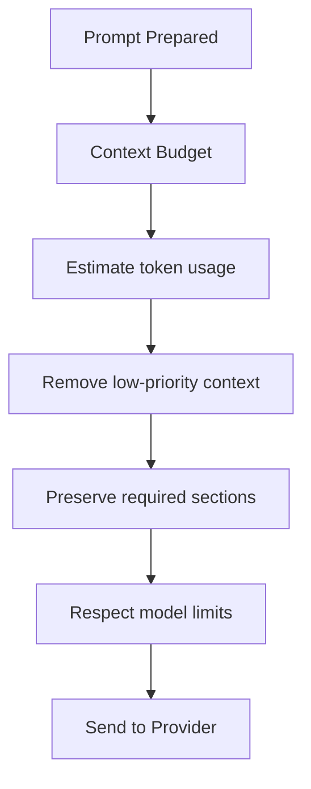

# Prompt Diagrams







```text
Philosophy: Worker expresses intent; Runtime builds prompts; Models consume them.
  Workers MUST NOT manually concatenate prompt fragments.

Composition order (Runtime sole assembler)
  System Instructions ? Workspace Context ? Task Context ? Relevant Memory
    ? Artifacts ? User Request ? Execution Constraints

Object model
  Prompt: id, name, version, template, variables, profile, tags, metadata
  Prompt Profile separates behavior from content (Architecture/Coding/Reviewer/...)

Runtime integration
  Worker ? Runtime ? Prompt Manager ? Prompt Builder ? Context Builder
    ? Provider ? Model ? Response
  Every response links back to: Prompt version, profile, session, task, worker, model, provider.

Context budget
  estimate tokens ? remove low priority ? preserve required ? respect limits
Security: validate, sanitize (strip secrets, redact paths), defend injection, audit.
```
# Related Documents
- [[Prompt-Part01]]
- [[Prompt-Part02]]
- [[Prompt-Part03]]
- [[Prompt-Part04]]
- [[Prompt-Part05]]
- [[Prompt-Part06]]
- [[Prompt-Part07]]
- [[Prompt-Part08]]
- [[Model-Part01]]
- [[Memory-Part01]]
