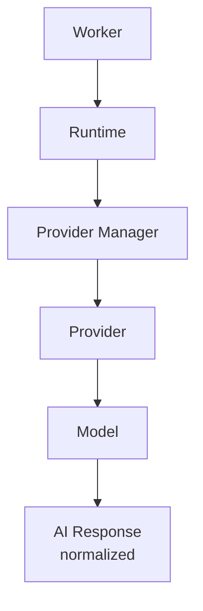
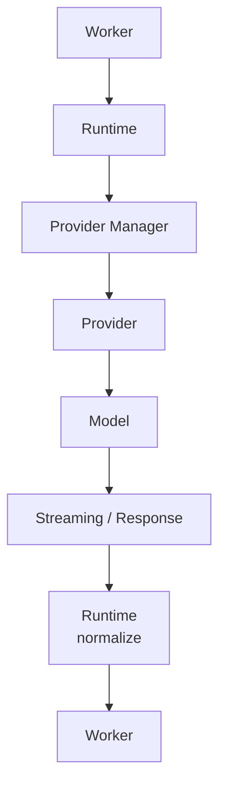
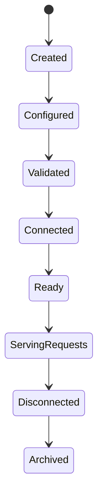
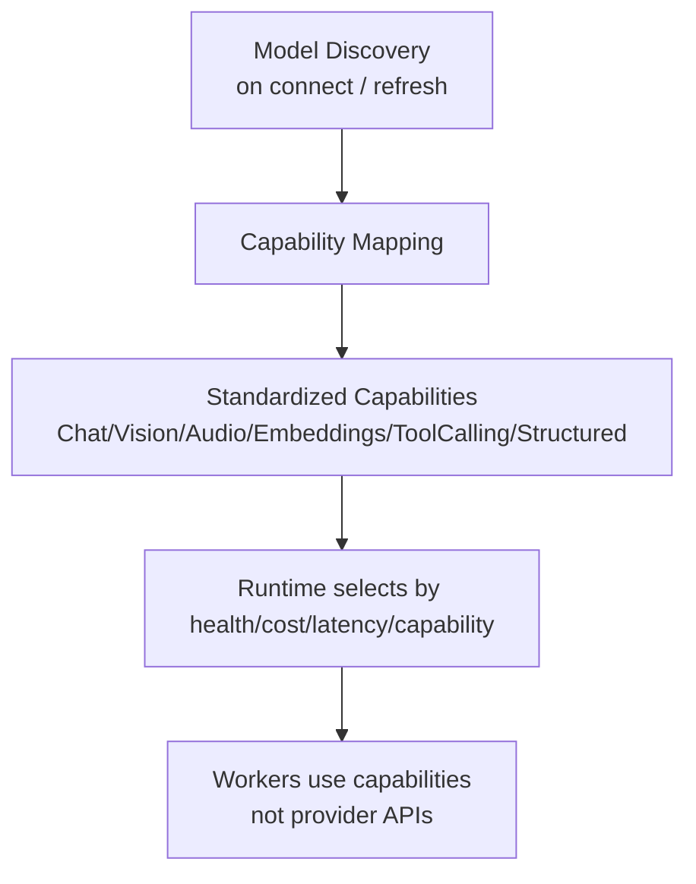

# Provider Diagrams









```text
Architecture (Workers never talk to providers directly)
  Worker ? Runtime ? Provider Manager ? Provider ? Model ? AI Response
  Guarantees: consistent behavior, centralized auth, unified errors, deterministic logs, interchangeability.

Provider lifecycle
  Created ? Configured ? Validated ? Connected ? Ready ? Serving Requests
    ? Disconnected ? Archived
  Unhealthy providers removed from scheduling until recovery.

Request pipeline
  select model ? prepare prompt/context/tools/temp/max-tokens/format/safety
  ? normalize provider fields ? stream/respond ? normalize output (message, tool calls, usage, finish reason)
  Workers never parse provider-specific payloads.

Cost & limits (Runtime concern)
  rate limits, quotas, cost tracking aggregated by worker/task/session/workspace/project.
  Credentials: encrypted at rest, scoped, never exposed to Workers or prompts.
```
# Related Documents
- [[Provider-Part01]]
- [[Provider-Part02]]
- [[Provider-Part03]]
- [[Provider-Part04]]
- [[Provider-Part05]]
- [[Provider-Part06]]
- [[Provider-Part07]]
- [[Provider-Part08]]
- [[Model-Part01]]
- [[Runtime-Part01]]
