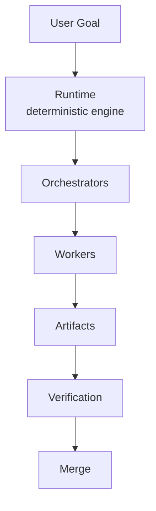
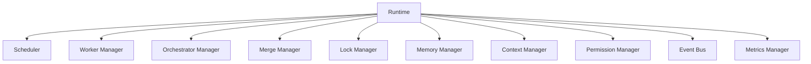
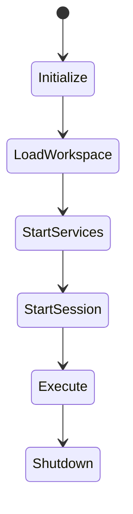

# Runtime Diagrams







```text
Runtime = deterministic execution engine. Coordinates execution; does NOT do AI reasoning.

Runtime Services (single responsibility, talk via Event Bus)
  Scheduler, Worker Manager, Orchestrator Manager, Merge Manager, Lock Manager,
  Memory Manager, Context Manager, Permission Manager, Event Bus, Metrics Manager

Execution flow (owns the truth)
  User Goal ? Runtime ? Orchestrators ? Workers ? Artifacts ? Verification ? Merge

Rules
  MUST: remain deterministic, own execution lifecycle, enforce workspace isolation,
        start services before Workers, persist critical state, shutdown gracefully.
  MUST NOT: replace AI reasoning, modify projects outside verified artifact flow.
  No Worker/Orchestrator may bypass Runtime enforcement (security model = enforcement layer).

Recovery: emit event ? record diagnostics ? preserve workspace state ? restart service
  ? notify dependents; if impossible: pause, prevent writes, preserve artifacts/logs.
```
# Related Documents
- [[Runtime-Part01]]
- [[Runtime-Part02]]
- [[Runtime-Part03]]
- [[Runtime-Part04]]
- [[Execution-Part01]]
- [[Session-Part01]]
- [[Permission-Part01]]
