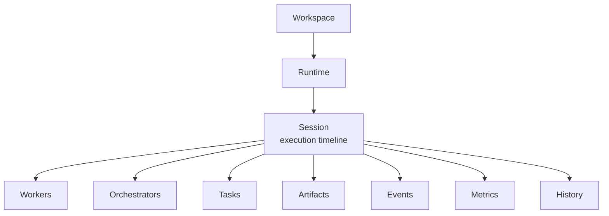
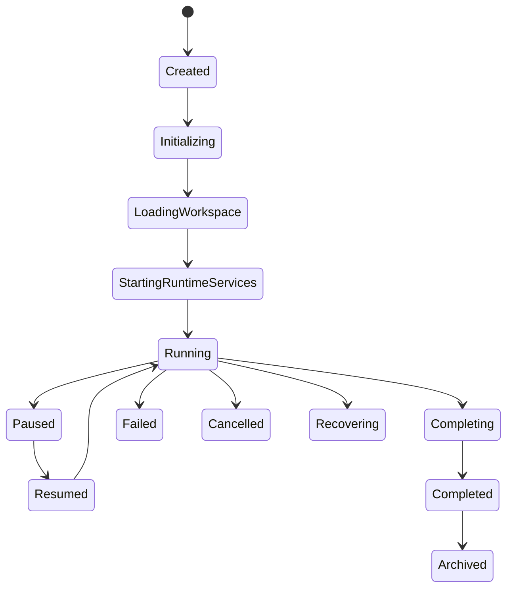

---
title: Session Diagrams
status: draft
version: 1.0
tags:
  - core-concepts
  - diagrams
related:
  - "[[Session-Part01]]"
---

# Session Diagrams





```text
A Session is one continuous execution instance of a Workspace.
  NOT the Workspace, NOT the Runtime � one execution timeline inside a Workspace.
  Only one Session active per Workspace at a time.

Architecture / ownership
  Workspace ? Runtime ? Session
    +- Workers   (execution ownership = Session)
    +- Orchestrators
    +- Tasks
    +- Artifacts
    +- Events
    +- Metrics
    +- History
  Long-term ownership belongs to Workspace; execution ownership belongs to Session.

Lifecycle (Runtime-exclusive transitions)
  Created ? Initializing ? Loading Workspace ? Starting Runtime Services
    ? Running ? Paused/Resumed ? Completing ? Completed ? Archived
  Alternative: Failed / Cancelled / Recovering
  Workers/Orchestrators MUST NOT modify Session state directly.

Recovery: restore runtime state, tasks, worker hierarchy, artifacts; resume safely.
  MUST NOT replay completed merges.
Replay: timeline, worker/orchestrator hierarchy, task progression, artifacts, events � read-only.
```
# Related Documents
- [[Session-Part01]]
- [[Session-Part02]]
- [[Session-Part03]]
- [[Session-Part04]]
- [[Runtime-Part01]]
- [[Workspace-Part01]]
