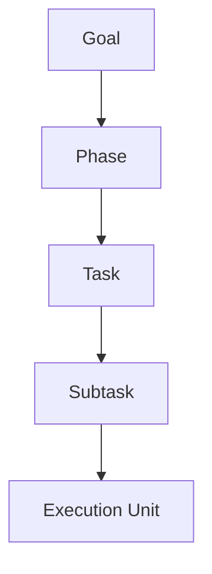
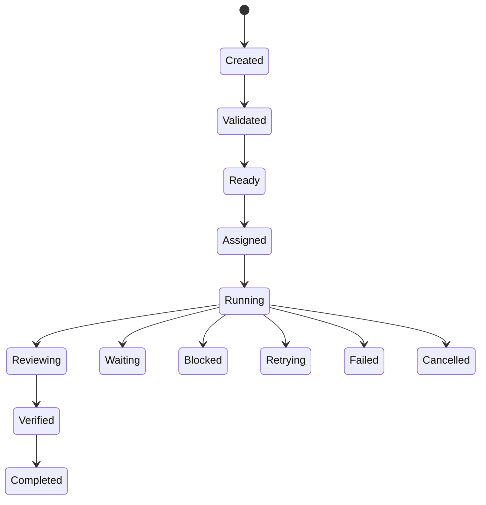
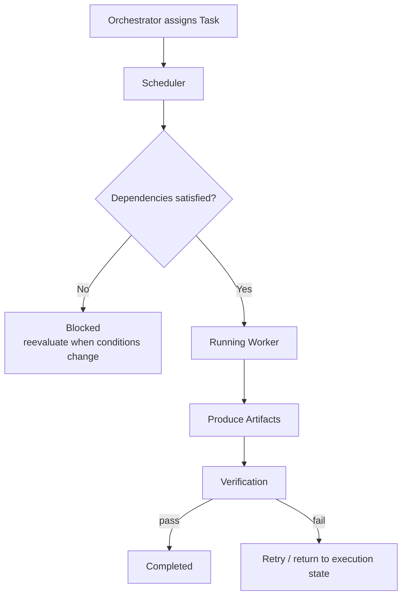

# Task Diagrams







```text
A Task is the smallest logical unit of planned work.
  Orchestrator assigns; Worker executes; Runtime schedules.
  Task describes WHAT; Worker decides HOW.

Hierarchy
  Goal ? Phase ? Task ? Subtask ? Execution Unit

Lifecycle
  Created ? Validated ? Ready ? Assigned ? Running ? Reviewing
    ? Verified ? Completed
  Alternative: Waiting / Blocked / Retrying / Failed / Cancelled

Object model
  id, workspaceId, projectId, parentTaskId, childTaskIds, orchestratorId,
  assignedWorkerId, priority, status, dependencies, successCriteria, artifactIds

Dependencies: other Tasks, Artifacts, external tools, human approvals.
  Runtime MUST prevent execution until mandatory dependencies satisfied.
Blocking conditions: incomplete dependency, denied permission, unavailable tool,
  pending approval, policy prevents execution.
Completion requires: work done, success criteria met, artifacts exist, verification passes, event recorded.
```
# Related Documents
- [[Task-Part01]]
- [[Task-Part02]]
- [[Task-Part03]]
- [[Task-Part04]]
- [[Task-Part05]]
- [[Orchestrator-Part01]]
- [[Worker-Part01]]
- [[Artifact-Part01]]
