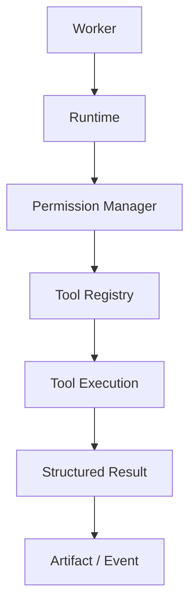
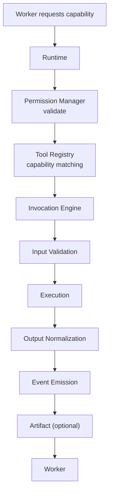
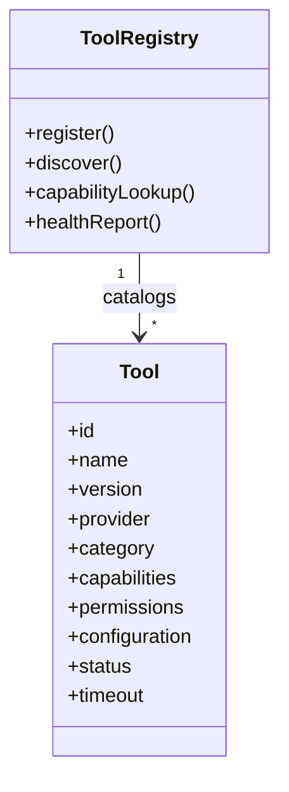

# Tool Diagrams







```text
A Tool is a deterministic capability extending the Runtime beyond language generation.
  Workers never invoke Tools directly; Runtime owns every Tool.

Discovery (Workers request capabilities; Runtime resolves)
  Worker ? Runtime ? Tool Registry ? Capability Matching ? Selected Tool
  Categories: Filesystem, Terminal, Browser, Git, MCP, Database, Network,
    Search, Build, Testing, Deployment, Utilities

Invocation pipeline
  1 capability request ? 2 permission validation ? 3 tool selection
  ? 4 input validation ? 5 execution ? 6 output normalization
  ? 7 event emission ? 8 artifact generation (optional)
  Output: status, structured output, logs, exit code, duration, resource usage, diagnostics.

Permissions (enforced by Runtime, not prompts)
  Evaluate: workspace policy ? user policy ? worker permissions ? tool requirements
    ? runtime security policy. Any fail = deny. Each invocation traceable to a decision.
```
# Related Documents
- [[Tool-Part01]]
- [[Tool-Part02]]
- [[Tool-Part03]]
- [[Tool-Part04]]
- [[Tool-Part12]]
- [[Permission-Part04]]
- [[Worker-Part03]]
- [[Runtime-Part01]]
