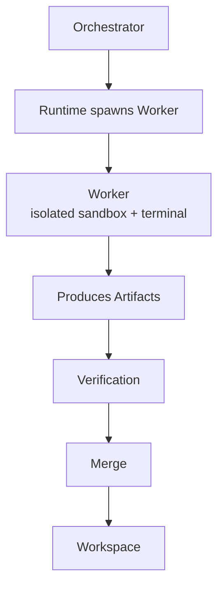
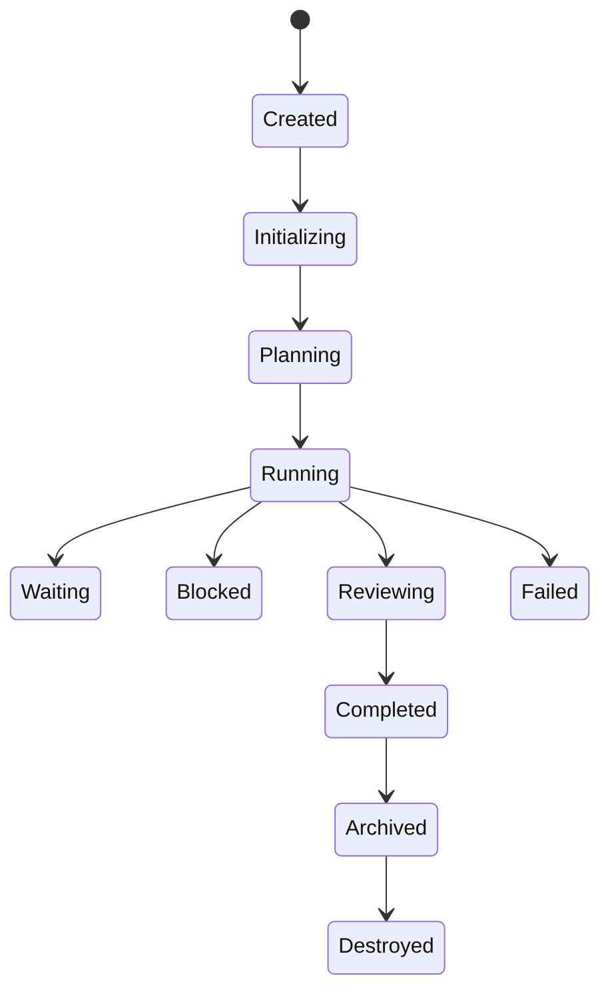
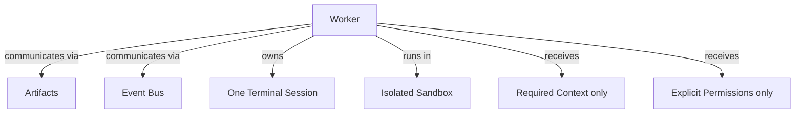

# Worker Diagrams







```text
A Worker is the smallest autonomous execution unit. Executes work, not conversations.
  Belongs to one Workspace + one Project; executes one active objective; produces artifacts; reports progress.

Hierarchy / ownership
  Orchestrator ? (Runtime spawns) ? Worker ? Terminal / Sandbox / Context / Permissions

Object model
  id, workspaceId, projectId, parentWorkerId, childWorkerIds, orchestratorId,
  taskId, terminalId, provider, model, prompt, context, permissions,
  memoryId, artifactIds, metrics, state

States
  Created ? Initializing ? Planning ? Running ? (Waiting / Blocked / Reviewing)
    ? Completed ? Archived ? Destroyed

Communication
  - through Artifacts and Events (never unrestricted conversation)
  - owns ONE terminal session; runs in isolated sandbox
  - receives only required context and explicit permissions
  - MUST respect workspace boundaries, permission scopes; never bypass verification
    or write outside authorized locations
```
# Related Documents
- [[Worker-Part01]]
- [[Worker-Part02]]
- [[Worker-Part03]]
- [[Worker-Part04]]
- [[Worker-Part05]]
- [[Worker-Part06]]
- [[Orchestrator-Part01]]
- [[Artifact-Part01]]
- [[Runtime-Part01]]
