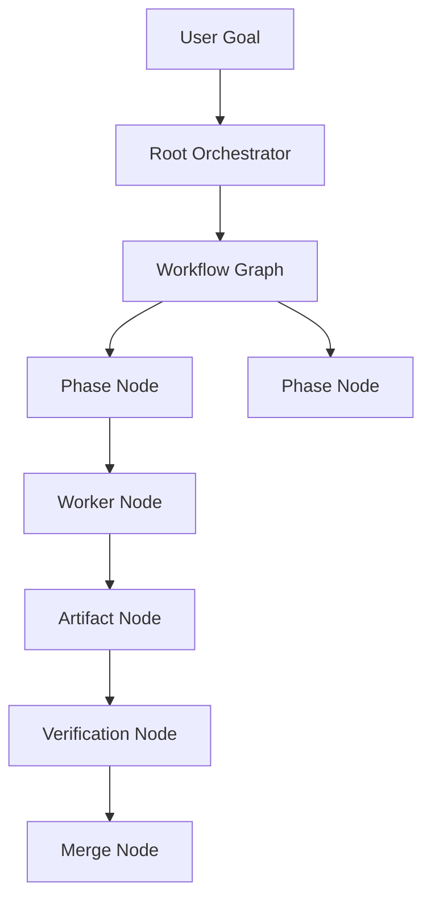
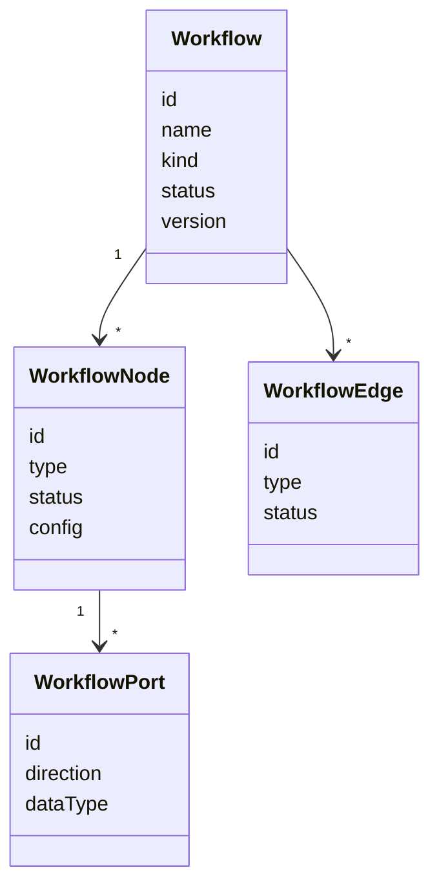
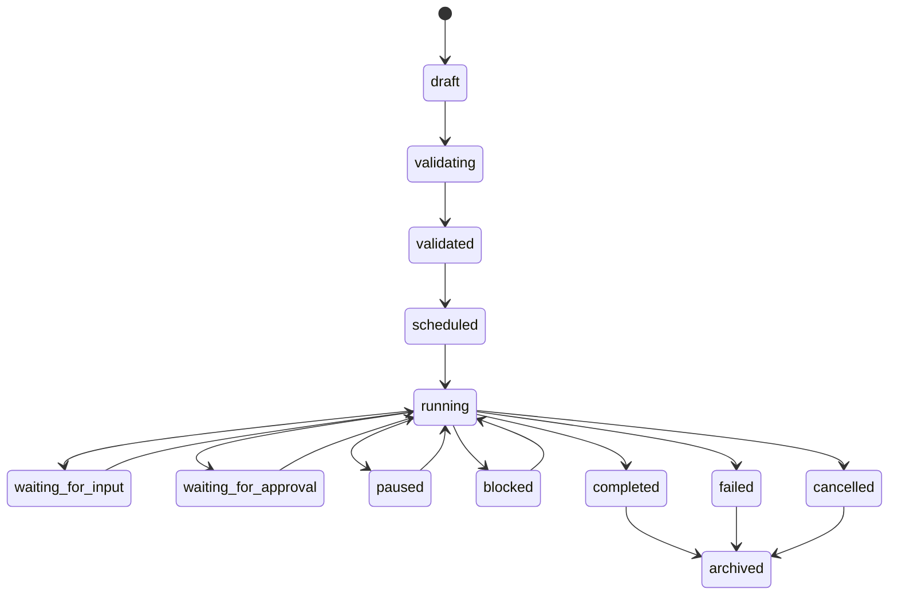

# Workflow Diagrams







```text
A Workflow is a directed graph of Nodes and Edges: relationships, execution order,
  data movement, control flow, permissions, runtime state. Both design & runtime artifact.

Core model
  Workflow
    +- Nodes: Worker / Orchestrator / Tool / Artifact / Memory
    ¦          / Condition / Loop / Approval / Verification
    +- Edges: Control / Data / Artifact / Dependency / Communication
    +- Runtime State, Layout State, Version History, Execution History

Node types reference Runtime objects (worker, orchestrator, task, artifact, memory, tool...)
  via RuntimeObjectRef — graph stores graph metadata, not duplicated runtime data.
Ports (input/output, typed: artifact/task/message/memory/event/...) enable pre-execution validation.

Lifecycle (Runtime records every transition; MUST NOT draft?running directly)
  draft ? validating ? validated ? scheduled ? running
    ? (waiting_for_input | waiting_for_approval | paused | blocked)
    ? completed | failed | cancelled ? archived
  Workflow status is aggregated from node status.

Invariants: every edge has valid src/tgt; required inputs satisfied before exec;
  every Worker node maps to =1 active Worker; every merge path includes verification/approval.
```
# Related Documents
- [[Workflow-Part01]]
- [[Workflow-Part02]]
- [[Workflow-Part03]]
- [[Workflow-Part04]]
- [[Workflow-Part05]]
- [[Execution-Part01]]
- [[Task-Part01]]
- [[Worker-Part01]]
- [[Orchestrator-Part01]]
- [[Artifact-Part01]]
- [[06-workflow-engine/README]]
