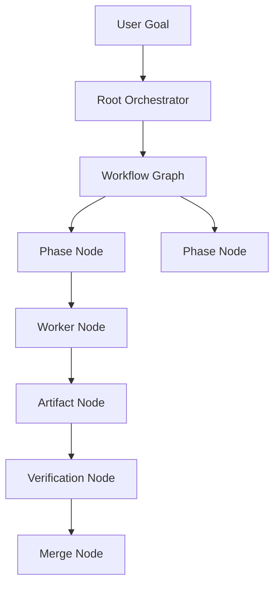

---
title: Workflow Specification - Part 01
status: draft
version: 1.0
tags:
  - core-concepts
  - workflow
  - graph
  - execution
related:
  - "[[Execution-Part01]]"
  - "[[Task-Part01]]"
  - "[[Worker-Part01]]"
  - "[[Orchestrator-Part01]]"
  - "[[Artifact-Part01]]"
---

# Workflow Specification (Part 01)

## Document Index

Part 01 - Purpose, Philosophy, and Core Model
Part 02 - Workflow Object Model and Graph Structure
Part 03 - Node Types and Node Contracts
Part 04 - Edge Types, Dependencies, and Data Flow
Part 05 - Workflow Lifecycle and State Machine
Part 06 - Execution Semantics and Scheduling
Part 07 - Dynamic Graphs, Worker Spawning, and Replanning
Part 08 - Artifacts, Memory, and Context Flow
Part 09 - Permissions, Safety, and Human Approval
Part 10 - UI, Canvas, and User Interaction
Part 11 - Events, Persistence, Versioning, and Replay
Part 12 - Implementation Checklist, Examples, and Future Expansion

This part defines what a Workflow is in Eulinx and why it exists.

# Purpose

A Workflow is a structured graph that describes how work should move through Eulinx.

It can represent:

- a human-designed automation
- a generated execution plan
- a live runtime graph
- a reusable template
- an orchestrator hierarchy
- a chain of Workers
- a verification loop
- a tool pipeline
- an artifact review process
- a hybrid of all of the above

Eulinx's Workflow system is not only an n8n-style static automation builder. It must support live AI execution where the graph can grow, change, pause, recover, and explain itself while work is happening.

# Core Philosophy

Eulinx should treat workflows as living execution maps.

Traditional automation systems often assume:

```text
User designs graph.
Graph runs exactly as drawn.
Execution ends.
```

Eulinx needs something richer:

```text
User gives goal.
Root Orchestrator creates plan.
Workflow graph appears.
Workers execute tasks.
Workers and orchestrators may spawn new nodes.
Artifacts flow through verification.
Runtime safely merges results.
Graph records what happened.
User can replay, inspect, and reuse it.
```

This means a Eulinx Workflow is both a design artifact and a runtime artifact.

# Definition

A Workflow is a directed graph of Nodes and Edges that describes relationships, execution order, data movement, control flow, permissions, and runtime state.

In Eulinx, a Workflow MAY be:

- static
- dynamic
- generated
- user-authored
- imported
- templated
- partially executed
- currently running
- replayed from history

The Workflow is the visual and logical bridge between the user, the Runtime, Orchestrators, Workers, Tools, Memory, and Artifacts.

# What Workflows Are Not

A Workflow is not merely a visual UI canvas.

A Workflow is not merely a list of steps.

A Workflow is not a replacement for the Runtime.

A Workflow is not allowed to bypass permissions.

A Workflow is not necessarily fully known before execution starts.

A Workflow is not required to contain only AI nodes.

# Workflow Responsibilities

The Workflow system MUST:

- represent executable structure
- represent visual graph layout
- support node and edge metadata
- support static and dynamic nodes
- support generated and user-created nodes
- support Worker nodes
- support Orchestrator nodes
- support Tool nodes
- support Artifact nodes
- support Memory nodes
- support condition and loop nodes
- support approval nodes
- support verification nodes
- support scheduling information
- support execution state
- support replay and history
- support versioning
- support permissions
- support graph validation

The Workflow system MUST NOT:

- execute unsafe actions directly
- bypass the Runtime
- bypass the Permission Manager
- directly modify project files without Artifact/Merge flow
- allow AI-generated graph changes without validation
- confuse visual layout with execution correctness

# Workflow Types

## Manual Workflow

A user-created graph used for repeatable automation.

Example:

```text
Webhook Trigger -> Research Worker -> Summary Artifact -> Human Approval -> Publish
```

## Generated Workflow

A graph created by the Root Orchestrator or another Orchestrator from a user goal.

Example:

```text
Build SaaS app -> Plan Phases -> Backend Phase -> Frontend Phase -> Testing Phase
```

## Runtime Workflow

A live graph created or modified while work is running.

Example:

```text
Frontend Worker discovers missing design tokens.
It requests a child Worker.
Runtime adds Design Token Worker node.
```

## Template Workflow

A reusable graph saved for future use.

Example:

```text
Code Review Template
Bug Fix Template
Documentation Generation Template
Release Checklist Template
```

## Replay Workflow

A historical graph reconstructed from events, artifacts, and audit logs.

Example:

```text
Show exactly how this feature was built yesterday.
```

# Core Workflow Model

```text
Workflow
  |
  +-- Nodes
  |     +-- Worker Node
  |     +-- Orchestrator Node
  |     +-- Tool Node
  |     +-- Artifact Node
  |     +-- Memory Node
  |     +-- Condition Node
  |     +-- Loop Node
  |     +-- Approval Node
  |     +-- Verification Node
  |
  +-- Edges
  |     +-- Control Edge
  |     +-- Data Edge
  |     +-- Artifact Edge
  |     +-- Dependency Edge
  |     +-- Communication Edge
  |
  +-- Runtime State
  +-- Layout State
  +-- Version History
  +-- Execution History
```

# Relationship to Execution

[[Execution-Part01]] defines the lifecycle of work.

Workflow defines the shape of that work.

Execution answers:

```text
What is happening right now?
```

Workflow answers:

```text
What is connected to what, and how should work move?
```

The Runtime uses both.

# Relationship to Workers

Workers are live execution units.

Workflow nodes may represent Workers, but the node is not the Worker itself.

The node is the graph representation. The Worker is the runtime process.

This distinction matters because a Worker may terminate while the node remains in the graph as history.

# Relationship to Orchestrators

Orchestrators may create, modify, or supervise Workflows.

A Root Orchestrator may generate the first Workflow from a user goal.

A Phase Orchestrator may expand one node into a subgraph.

A Task Orchestrator may spawn Worker nodes inside a phase.

Orchestrators MUST NOT mutate graph structure without Runtime validation.

# Relationship to Artifacts

Artifacts are structured outputs.

Workflow edges should carry Artifacts instead of raw conversation history whenever possible.

Example:

```text
Research Worker -> Research Summary Artifact -> Builder Worker
```

This reduces token usage and improves traceability.

# Mermaid Diagram



# AI Notes

Do not implement Workflow as only a React Flow UI state object.

The Workflow must exist as a persistent domain object that the Runtime can validate, execute, replay, and audit.

Visual graph layout is important, but it is not the source of execution truth by itself.

# Related Documents

- [[Workflow-Part02]]
- [[Execution-Part01]]
- [[Task-Part01]]
- [[Worker-Part01]]
- [[Orchestrator-Part01]]
- [[Artifact-Part01]]

