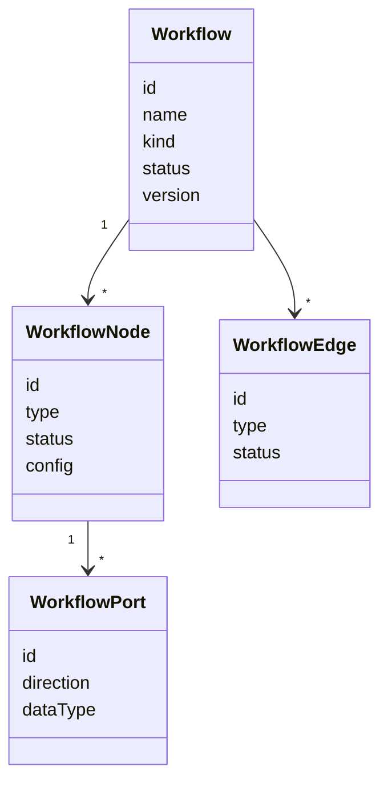

---
title: Workflow Specification - Part 02
status: draft
version: 1.0
tags:
  - core-concepts
  - workflow
  - object-model
  - graph
related:
  - "[[Workflow-Part01]]"
  - "[[Runtime-Part01]]"
  - "[[Task-Part01]]"
---

# Workflow Specification (Part 02)

## Document Index

Part 01 - Purpose, Philosophy, and Core Model
Part 02 - Workflow Object Model and Graph Structure
Part 03 - Node Types and Node Contracts
Part 04 - Edge Types, Dependencies, and Data Flow
Part 05 - Workflow Lifecycle and State Machine
Part 06 - Execution Semantics and Scheduling
Part 07 - Dynamic Graphs, Worker Spawning, and Replanning
Part 08 - Artifacts, Memory, and Context Flow
Part 09 - Permissions, Safety, and Human Approval
Part 10 - UI, Canvas, and User Interaction
Part 11 - Events, Persistence, Versioning, and Replay
Part 12 - Implementation Checklist, Examples, and Future Expansion

# Purpose

This part defines the core data structures for Workflows, Nodes, Edges, ports, graph metadata, layout metadata, runtime metadata, and validation state.

# Workflow Object

```ts
type Workflow = {
  id: string;
  workspaceId: string;
  projectId?: string;
  sessionId?: string;
  executionId?: string;
  name: string;
  description?: string;
  kind: "manual" | "generated" | "runtime" | "template" | "replay";
  status:
    | "draft"
    | "validated"
    | "scheduled"
    | "running"
    | "paused"
    | "waiting_for_approval"
    | "completed"
    | "failed"
    | "cancelled"
    | "archived";
  nodes: WorkflowNode[];
  edges: WorkflowEdge[];
  variables: WorkflowVariable[];
  policies: WorkflowPolicyRef[];
  layout: WorkflowLayout;
  metadata: WorkflowMetadata;
  version: number;
  createdBy: "user" | "orchestrator" | "runtime" | "template" | "import";
  createdAt: string;
  updatedAt: string;
};
```

# Node Object

```ts
type WorkflowNode = {
  id: string;
  workflowId: string;
  type: WorkflowNodeType;
  title: string;
  description?: string;
  status: WorkflowNodeStatus;
  inputPorts: WorkflowPort[];
  outputPorts: WorkflowPort[];
  config: Record<string, unknown>;
  runtimeRef?: RuntimeObjectRef;
  permissions?: string[];
  dataRequirements?: DataRequirement[];
  outputContracts?: OutputContract[];
  layout: NodeLayout;
  metadata: NodeMetadata;
  createdBy: "user" | "orchestrator" | "runtime" | "worker" | "template";
  createdAt: string;
  updatedAt: string;
};
```

# Edge Object

```ts
type WorkflowEdge = {
  id: string;
  workflowId: string;
  type: WorkflowEdgeType;
  sourceNodeId: string;
  sourcePortId?: string;
  targetNodeId: string;
  targetPortId?: string;
  status: WorkflowEdgeStatus;
  condition?: WorkflowCondition;
  transform?: WorkflowTransform;
  dataContract?: DataContract;
  metadata: EdgeMetadata;
  createdBy: "user" | "orchestrator" | "runtime" | "worker" | "template";
  createdAt: string;
  updatedAt: string;
};
```

# Node Status

```text
draft
ready
queued
running
waiting
waiting_for_input
waiting_for_approval
blocked
completed
failed
cancelled
skipped
archived
```

# Edge Status

```text
inactive
ready
active
transferring
completed
blocked
failed
disabled
```

# Ports

Ports define what can enter or leave a node.

```ts
type WorkflowPort = {
  id: string;
  name: string;
  direction: "input" | "output";
  dataType:
    | "artifact"
    | "task"
    | "message"
    | "memory"
    | "event"
    | "boolean"
    | "number"
    | "string"
    | "json"
    | "file"
    | "stream"
    | "any";
  required: boolean;
  multiple: boolean;
  description?: string;
};
```

Ports make workflows safer because node compatibility can be validated before execution.

# Runtime Object References

Nodes may reference Runtime objects.

```ts
type RuntimeObjectRef = {
  kind:
    | "worker"
    | "orchestrator"
    | "task"
    | "artifact"
    | "memory"
    | "tool"
    | "session"
    | "execution";
  id: string;
};
```

The graph should not duplicate all runtime data. It should reference runtime objects and store graph-specific metadata separately.

# Layout Object

```ts
type WorkflowLayout = {
  engine: "manual" | "auto" | "hybrid";
  viewport: {
    x: number;
    y: number;
    zoom: number;
  };
  groups: WorkflowGroup[];
  lanes: WorkflowLane[];
};
```

Layout is important for usability, but layout must not define execution semantics.

# Node Layout

```ts
type NodeLayout = {
  x: number;
  y: number;
  width?: number;
  height?: number;
  collapsed?: boolean;
  displayMode?: "full" | "compact" | "chip";
  groupId?: string;
  laneId?: string;
};
```

# Graph Validation

Before execution, Workflows SHOULD be validated.

Validation should check:

- missing required inputs
- invalid edge connections
- incompatible port types
- circular dependencies where disallowed
- unreachable nodes
- missing permissions
- missing tool configuration
- missing provider or model configuration
- invalid node contracts
- unsafe automatic execution paths

# Graph Invariants

Eulinx SHOULD enforce these invariants:

```text
Every edge has a valid source node.
Every edge has a valid target node.
Every required node input is satisfied before execution.
Every executable node has an execution owner.
Every Worker node maps to zero or one active Worker.
Every active Worker maps to one visible or historical graph node.
Every Artifact node maps to a real Artifact object.
Every merge path includes verification or explicit approval.
```

# Mermaid Object Diagram



# AI Notes

Do not store every workflow detail as one untyped JSON blob.

Use structured domain objects so the Runtime can validate and execute Workflows safely.

React Flow can render the Workflow, but it should not be the only data model.

# Related Documents

- [[Workflow-Part01]]
- [[Workflow-Part03]]
- [[Workflow-Part04]]
- [[Runtime-Part01]]
- [[Task-Part01]]

