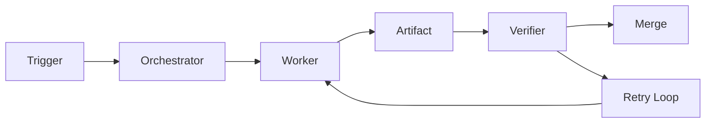

---
title: Workflow Specification - Part 03
status: draft
version: 1.0
tags:
  - core-concepts
  - workflow
  - nodes
related:
  - "[[Workflow-Part02]]"
  - "[[Worker-Part01]]"
  - "[[Tool-Part01]]"
  - "[[Artifact-Part01]]"
---

# Workflow Specification (Part 03)

## Document Index

Part 01 - Purpose, Philosophy, and Core Model
Part 02 - Workflow Object Model and Graph Structure
Part 03 - Node Types and Node Contracts
Part 04 - Edge Types, Dependencies, and Data Flow
Part 05 - Workflow Lifecycle and State Machine
Part 06 - Execution Semantics and Scheduling
Part 07 - Dynamic Graphs, Worker Spawning, and Replanning
Part 08 - Artifacts, Memory, and Context Flow
Part 09 - Permissions, Safety, and Human Approval
Part 10 - UI, Canvas, and User Interaction
Part 11 - Events, Persistence, Versioning, and Replay
Part 12 - Implementation Checklist, Examples, and Future Expansion

# Purpose

Nodes are the visible and executable units inside a Workflow graph.

A node may represent an actual runtime object, a planned future object, a logical control structure, or a historical object from Replay.

# Node Type List

Eulinx SHOULD support these node categories:

```text
Trigger Nodes
Orchestrator Nodes
Worker Nodes
Task Nodes
Tool Nodes
Artifact Nodes
Memory Nodes
Condition Nodes
Loop Nodes
Approval Nodes
Verification Nodes
Merge Nodes
Delay Nodes
Event Nodes
Group Nodes
Note Nodes
```

# Trigger Nodes

Trigger nodes start workflows.

Examples:

- manual run
- file changed
- schedule
- webhook
- Git event
- user prompt
- external API event
- another workflow completed

Trigger nodes SHOULD define:

- trigger source
- payload schema
- permission requirements
- debounce behavior
- replay behavior

# Orchestrator Nodes

An Orchestrator Node represents a planning or coordination unit.

Examples:

```text
Root Orchestrator
Phase Orchestrator
Task Orchestrator
Verification Orchestrator
```

Orchestrator Nodes may:

- create tasks
- create subgraphs
- spawn Worker nodes
- aggregate progress
- pause execution
- request approval
- request replanning

They SHOULD NOT directly write project files.

# Worker Nodes

Worker Nodes represent AI-powered terminal workers.

A Worker Node may be:

- planned but not started
- queued
- running
- minimized
- completed
- failed
- replayed from history

Worker Node configuration SHOULD include:

- assigned task
- CLI type
- provider/model profile
- working directory
- permission profile
- terminal display mode
- context package
- expected artifacts
- budget limits
- termination condition

# Task Nodes

Task Nodes represent units of work.

A Task Node may be assigned to:

- Worker
- Orchestrator
- Tool
- human
- workflow subgraph

Task Nodes are useful when the user wants to see work breakdown separately from Worker processes.

# Tool Nodes

Tool Nodes represent deterministic capabilities.

Examples:

- filesystem
- Git
- browser
- database
- HTTP
- MCP tool
- plugin tool
- test runner
- formatter

Tool Nodes MUST declare required permissions.

# Artifact Nodes

Artifact Nodes represent structured outputs.

Examples:

- plan
- patch
- code
- Markdown
- JSON
- test report
- screenshot
- log
- prompt

Artifact Nodes should make context sharing visible.

# Memory Nodes

Memory Nodes represent memory sources or memory writes.

Examples:

- workspace memory
- task memory
- vector memory
- knowledge base
- replay memory
- temporary memory

Memory Nodes help users understand where context is coming from.

# Condition Nodes

Condition Nodes route execution.

Examples:

```text
If tests pass -> merge
If tests fail -> retry
If approval denied -> stop
If budget exceeded -> summarize
```

Conditions MUST be deterministic unless explicitly marked AI-evaluated.

# Loop Nodes

Loop Nodes repeat work until a condition is met.

Examples:

- refine until score >= threshold
- retry until tests pass
- generate variants
- crawl pages until limit

Loop Nodes MUST have safety limits.

Safety limits include:

- max iterations
- max cost
- max runtime
- max spawned Workers
- max failures

# Approval Nodes

Approval Nodes pause execution for human input.

They are required for:

- high-risk actions
- critical permissions
- merge approvals
- external publishing
- Git push
- plugin installation

# Verification Nodes

Verification Nodes validate artifacts.

Examples:

- run tests
- run typecheck
- run linter
- inspect patch
- compare against task requirements
- ask judge model

Verification may be deterministic, AI-assisted, or human.

# Merge Nodes

Merge Nodes represent applying verified artifacts to the project.

Merge Nodes MUST go through the Merge Manager.

Merge Nodes MUST respect permissions and locks.

# Node Contract

Every executable node SHOULD define a contract:

```ts
type NodeContract = {
  inputs: WorkflowPort[];
  outputs: WorkflowPort[];
  requiredPermissions: string[];
  requiredRuntimeServices: string[];
  canRunInSimulation: boolean;
  canRunInParallel: boolean;
  requiresApproval: boolean;
  producesArtifacts: boolean;
  mutatesWorkspace: boolean;
};
```

# Mermaid Diagram



# AI Notes

Do not make every node an AI node.

The Workflow graph should represent all meaningful runtime objects: Workers, Tools, Artifacts, Memory, Conditions, Approval, and Merge.

This is what makes Eulinx more than a chat UI.

# Related Documents

- [[Workflow-Part02]]
- [[Workflow-Part04]]
- [[Worker-Part01]]
- [[Tool-Part01]]
- [[Artifact-Part01]]

