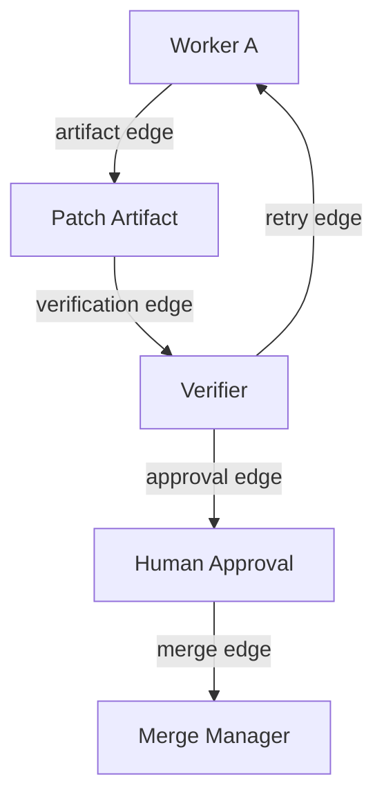

---
title: Workflow Specification - Part 04
status: draft
version: 1.0
tags:
  - core-concepts
  - workflow
  - edges
  - data-flow
related:
  - "[[Workflow-Part03]]"
  - "[[Artifact-Part02]]"
  - "[[Memory-Part01]]"
---

# Workflow Specification (Part 04)

## Document Index

Part 01 - Purpose, Philosophy, and Core Model
Part 02 - Workflow Object Model and Graph Structure
Part 03 - Node Types and Node Contracts
Part 04 - Edge Types, Dependencies, and Data Flow
Part 05 - Workflow Lifecycle and State Machine
Part 06 - Execution Semantics and Scheduling
Part 07 - Dynamic Graphs, Worker Spawning, and Replanning
Part 08 - Artifacts, Memory, and Context Flow
Part 09 - Permissions, Safety, and Human Approval
Part 10 - UI, Canvas, and User Interaction
Part 11 - Events, Persistence, Versioning, and Replay
Part 12 - Implementation Checklist, Examples, and Future Expansion

# Purpose

Edges describe relationships between nodes.

An edge is not just a visual line. It may define execution order, artifact movement, dependency relationships, communication channels, approval requirements, or context flow.

# Edge Types

Eulinx SHOULD support these edge types:

```text
control
data
artifact
dependency
communication
spawn
approval
verification
merge
memory
error
retry
visual
```

# Control Edges

Control edges define execution order.

Example:

```text
Plan -> Build -> Test -> Merge
```

Control edges SHOULD be used when downstream execution depends on upstream completion.

# Data Edges

Data edges pass structured data.

Examples:

- JSON payload
- user input
- extracted web data
- configuration object
- test result summary

Data edges SHOULD define a schema when possible.

# Artifact Edges

Artifact edges pass Artifacts between nodes.

Example:

```text
Research Worker -> Research Summary Artifact -> Builder Worker
```

Artifact edges are preferred over raw chat transcript edges.

# Dependency Edges

Dependency edges mean one node depends on another being complete, but not necessarily on its data.

Example:

```text
Frontend Task depends on Design Token Task.
```

# Communication Edges

Communication edges represent allowed message channels between Workers or Orchestrators.

Workers SHOULD NOT communicate arbitrarily. Communication should be visible and scoped.

Example:

```text
Backend Worker may send API contract artifact to Frontend Worker.
```

# Spawn Edges

Spawn edges show parent-child creation.

Example:

```text
Phase Orchestrator -> spawned -> Login Worker
```

Spawn edges are important for understanding dynamic graph growth.

# Approval Edges

Approval edges route execution through a human decision.

Example:

```text
Patch Artifact -> Human Approval -> Merge
```

# Verification Edges

Verification edges connect artifacts to verification nodes.

Example:

```text
Code Patch -> Typecheck -> Test Runner -> Judge -> Merge
```

# Retry Edges

Retry edges represent loop-back behavior after failure.

Retry edges MUST include safety limits.

Example:

```text
Tests Failed -> Fix Worker -> Tests
```

# Edge Conditions

Edges may have conditions:

```ts
type WorkflowCondition = {
  kind: "always" | "expression" | "event" | "status" | "approval" | "ai_judgment";
  expression?: string;
  expectedStatus?: string;
  maxEvaluations?: number;
};
```

AI-evaluated conditions MUST be marked clearly and SHOULD be followed by deterministic verification where risk is high.

# Edge Data Contracts

```ts
type DataContract = {
  dataType: string;
  schema?: Record<string, unknown>;
  requiredFields?: string[];
  maxSizeBytes?: number;
  redactionRules?: string[];
};
```

Data contracts help prevent nodes from receiving unusable or unsafe inputs.

# Edge Validation Rules

Eulinx SHOULD validate:

- source node exists
- target node exists
- source output port exists
- target input port exists
- port types are compatible
- edge type is allowed for node types
- condition is valid
- retry edges have limits
- approval edges pause execution
- merge edges require merge permissions

# Mermaid Diagram



# AI Notes

Do not treat graph edges as decoration.

Edges are part of execution semantics. If an edge carries data, dependency, approval, or retry behavior, it must be persisted and validated.

For AI-generated graphs, edge validation is mandatory.

# Related Documents

- [[Workflow-Part03]]
- [[Workflow-Part05]]
- [[Artifact-Part02]]
- [[Memory-Part01]]
- [[Execution-Part03]]

