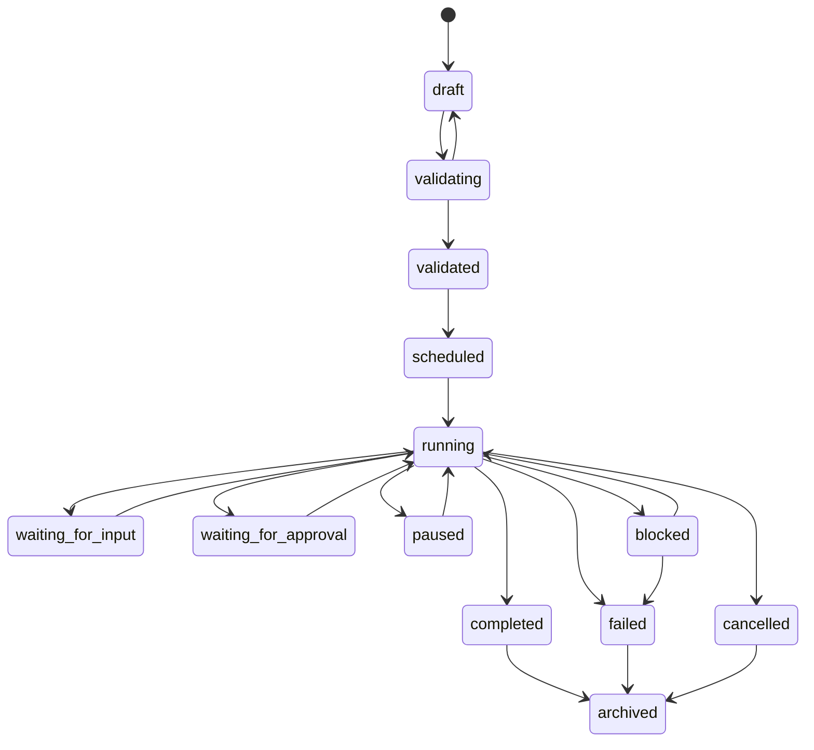

# Workflow Specification (Part 05)

## Document Index

Part 01 - Purpose, Philosophy, and Core Model
Part 02 - Workflow Object Model and Graph Structure
Part 03 - Node Types and Node Contracts
Part 04 - Edge Types, Dependencies, and Data Flow
Part 05 - Workflow Lifecycle and State Machine
Part 06 - Execution Semantics and Scheduling
Part 07 - Dynamic Graphs, Worker Spawning, and Replanning
Part 08 - Artifacts, Memory, and Context Flow
Part 09 - Permissions, Safety, and Human Approval
Part 10 - UI, Canvas, and User Interaction
Part 11 - Events, Persistence, Versioning, and Replay
Part 12 - Implementation Checklist, Examples, and Future Expansion

# Purpose

A Workflow has a lifecycle independent from any single Worker or Task.

A Workflow can be drafted, validated, executed, paused, modified, replayed, archived, or reused.

# Workflow States

```text
draft
validating
validated
scheduled
running
paused
waiting_for_input
waiting_for_approval
blocked
completed
failed
cancelled
archived
template
replay
```

# State Definitions

## Draft

The Workflow exists but is not ready to run.

Draft Workflows may have incomplete nodes, missing permissions, invalid edges, or missing configuration.

## Validating

The Runtime is checking graph correctness, permissions, node contracts, edge compatibility, and required resources.

## Validated

The Workflow is structurally valid and may be scheduled.

Validated does not mean the user approved every high-risk action. It only means the graph is coherent.

## Scheduled

The Scheduler has accepted the Workflow but execution has not started.

## Running

One or more nodes are actively executing.

## Paused

Execution is intentionally stopped but can resume.

Reasons:

- user paused
- Runtime paused
- budget pause
- policy change
- safety review

## Waiting for Input

The Workflow needs user input or external input to continue.

## Waiting for Approval

The Workflow is paused because a permission or approval gate requires human decision.

## Blocked

The Workflow cannot continue without intervention.

Examples:

- dependency failed
- required tool unavailable
- merge conflict
- missing provider credential
- permission denied

## Completed

All required terminal conditions are satisfied.

## Failed

The Workflow cannot complete successfully under current rules.

## Cancelled

The user or Runtime intentionally stopped execution.

## Archived

The Workflow is retained for history but not active.

## Template

The Workflow is a reusable pattern, not an active execution.

## Replay

The Workflow is reconstructed from history for inspection.

# State Machine



# Lifecycle Rules

Workflow transitions MUST be explicit.

The Runtime MUST record state changes as events.

The Workflow MUST NOT move from `draft` directly to `running`.

The Workflow MUST NOT move from `failed` back to `running` without a recovery or retry event.

The Workflow MAY move from `running` to `waiting_for_approval` multiple times.

The Workflow MAY be modified while running only through validated graph mutation operations.

# Node Lifecycle Within Workflow

Nodes have their own lifecycle.

Workflow status is aggregated from node status.

Example:

```text
If any required node is running -> workflow running
If all required nodes complete -> workflow completed
If required node fails and no retry path exists -> workflow failed
If required node waits for approval -> workflow waiting_for_approval
```

# Terminal Conditions

A Workflow should define terminal conditions.

Examples:

```text
all required nodes completed
all merge nodes completed
final approval granted
artifact delivered
deadline reached
budget exhausted
user cancelled
```

# Cancellation

Cancellation should:

- stop scheduling new nodes
- pause or terminate active Workers depending on policy
- preserve logs
- preserve artifacts
- release locks
- revoke temporary grants
- emit workflow.cancelled
- record audit state

Cancellation MUST NOT delete history.

# Pause and Resume

Pausing should preserve enough state to resume safely.

Resume should revalidate:

- permissions
- tool availability
- locks
- provider availability
- active artifacts
- graph version

# AI Notes

Do not implement Workflow lifecycle as a single boolean like `isRunning`.

Workflow state must be expressive enough for a user to understand why the graph is not moving.

Paused, waiting for input, waiting for approval, and blocked are different states.

# Related Documents

- [[Workflow-Part06]]
- [[Execution-Part02]]
- [[Session-Part01]]
- [[Permission-Part04]]

