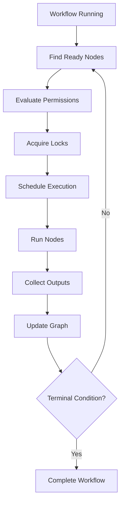

---
title: Workflow Specification - Part 06
status: draft
version: 1.0
tags:
  - core-concepts
  - workflow
  - scheduling
  - execution
related:
  - "[[Workflow-Part05]]"
  - "[[Execution-Part03]]"
  - "[[Runtime-Part02]]"
---

# Workflow Specification (Part 06)

## Document Index

Part 01 - Purpose, Philosophy, and Core Model
Part 02 - Workflow Object Model and Graph Structure
Part 03 - Node Types and Node Contracts
Part 04 - Edge Types, Dependencies, and Data Flow
Part 05 - Workflow Lifecycle and State Machine
Part 06 - Execution Semantics and Scheduling
Part 07 - Dynamic Graphs, Worker Spawning, and Replanning
Part 08 - Artifacts, Memory, and Context Flow
Part 09 - Permissions, Safety, and Human Approval
Part 10 - UI, Canvas, and User Interaction
Part 11 - Events, Persistence, Versioning, and Replay
Part 12 - Implementation Checklist, Examples, and Future Expansion

# Purpose

Execution semantics define how the Runtime decides which Workflow nodes can run, when they can run, and what must happen before and after they run.

# Execution Principle

The Workflow graph describes possible execution.

The Scheduler decides actual execution.

This distinction matters because a graph may contain many nodes that are not ready, not approved, blocked by dependencies, or waiting for data.

# Scheduling Inputs

The Scheduler SHOULD consider:

- node status
- edge dependencies
- required inputs
- permission requirements
- available Workers
- available Tools
- active locks
- budgets
- priority
- retry limits
- graph version
- user pause state
- provider availability

# Ready Node

A node is ready when:

- all required input ports are satisfied
- all required dependency edges are complete
- required permissions can be evaluated
- required Tools are available
- required resources are not locked by another action
- node is not paused, cancelled, or blocked
- scheduling budget allows it

# Execution Modes

## Sequential

Nodes run one after another.

Useful for:

- destructive operations
- merge operations
- ordered setup tasks
- migrations

## Parallel

Independent nodes run at the same time.

Useful for:

- independent research tasks
- separate test suites
- phase work with non-overlapping files
- multiple reviewer Workers

## Conditional

The next node depends on condition output.

## Looping

Nodes repeat until a condition is met or a limit is reached.

## Event Driven

Nodes run when an event is emitted.

# Parallel Safety

Parallel execution is powerful but dangerous.

Before running nodes in parallel, Eulinx SHOULD check:

- file write overlap
- lock conflicts
- shared artifact conflicts
- shared terminal conflicts
- shared resource budgets
- dependency correctness
- merge ordering

Workers may run in parallel, but project mutations should still flow through Artifacts, verification, and Merge Manager.

# Node Execution Contract

Every executable node SHOULD define:

```ts
type NodeExecutionContract = {
  nodeId: string;
  requiredInputs: string[];
  expectedOutputs: string[];
  permissions: string[];
  canRunInParallel: boolean;
  requiresLock: boolean;
  retryPolicy?: RetryPolicy;
  timeoutMs?: number;
  budget?: ExecutionBudget;
};
```

# Workflow Execution Loop

```text
Load workflow
Validate graph
Find ready nodes
Check permissions
Acquire locks
Schedule nodes
Run nodes
Collect outputs
Update graph state
Emit events
Repeat until terminal condition
```

# Mermaid Diagram



# Failure During Execution

When a node fails, the Workflow should evaluate:

- is there a retry edge?
- is there an error edge?
- can another Worker fix it?
- should the Orchestrator replan?
- should the user approve recovery?
- should the Workflow fail?

# Scheduling Priorities

Nodes may have priority:

```text
critical
high
normal
low
background
```

Critical nodes should not automatically bypass permissions.

# AI Notes

Do not execute every ready-looking node immediately.

Readiness requires dependency, permission, lock, resource, and budget checks.

The graph is not the scheduler. The graph provides structure; the Runtime makes safe execution decisions.

# Related Documents

- [[Workflow-Part05]]
- [[Workflow-Part07]]
- [[Execution-Part03]]
- [[Runtime-Part02]]
- [[Permission-Part04]]

