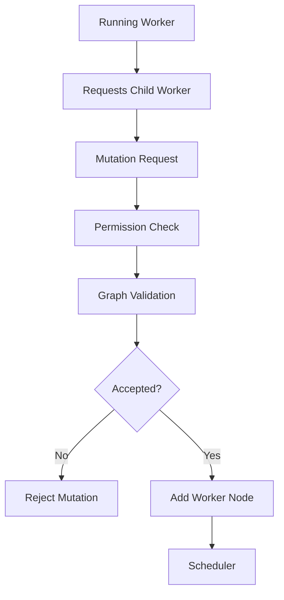

---
title: Workflow Specification - Part 07
status: draft
version: 1.0
tags:
  - core-concepts
  - workflow
  - dynamic-graph
  - replanning
related:
  - "[[Workflow-Part06]]"
  - "[[Worker-Part04]]"
  - "[[Orchestrator-Part02]]"
---

# Workflow Specification (Part 07)

## Document Index

Part 01 - Purpose, Philosophy, and Core Model
Part 02 - Workflow Object Model and Graph Structure
Part 03 - Node Types and Node Contracts
Part 04 - Edge Types, Dependencies, and Data Flow
Part 05 - Workflow Lifecycle and State Machine
Part 06 - Execution Semantics and Scheduling
Part 07 - Dynamic Graphs, Worker Spawning, and Replanning
Part 08 - Artifacts, Memory, and Context Flow
Part 09 - Permissions, Safety, and Human Approval
Part 10 - UI, Canvas, and User Interaction
Part 11 - Events, Persistence, Versioning, and Replay
Part 12 - Implementation Checklist, Examples, and Future Expansion

# Purpose

Dynamic graphs are one of Eulinx's defining ideas.

The Workflow should be able to grow while work is happening.

This allows:

- Workers to request help
- Orchestrators to split phases
- failed tasks to spawn repair tasks
- reviewers to request builders
- tests to create fix loops
- research to create new branches

# Dynamic Graph Principle

Dynamic graph mutation is allowed, but never unvalidated.

An AI may propose graph changes.

The Runtime validates and applies graph changes.

```text
AI proposes.
Runtime validates.
Policy authorizes.
Graph updates.
Scheduler reacts.
```

# Graph Mutation Types

Eulinx SHOULD support:

```text
add_node
remove_node
disable_node
update_node_config
add_edge
remove_edge
disable_edge
create_group
expand_subgraph
collapse_subgraph
spawn_worker_node
insert_approval_node
insert_verification_node
reroute_edge
```

# Mutation Request Object

```ts
type WorkflowMutationRequest = {
  id: string;
  workflowId: string;
  requesterType: "user" | "orchestrator" | "worker" | "runtime_service";
  requesterId: string;
  mutationType: string;
  payload: Record<string, unknown>;
  reason: string;
  riskLevel: "low" | "medium" | "high" | "critical";
  createdAt: string;
};
```

# Mutation Validation

Every graph mutation should be checked for:

- structural validity
- permission requirements
- budget impact
- spawn limits
- cycles
- dependency correctness
- missing ports
- security implications
- UI clarity
- replay compatibility

# Worker Spawning

Workers may request child Workers.

Example:

```text
Frontend Worker discovers CSS architecture is missing.
It requests child Worker:
  "Create design token plan and patch."
Runtime evaluates worker.spawn.child.
Graph adds Design Token Worker node.
Scheduler starts it when ready.
```

Spawned Worker nodes MUST include:

- parent id
- task description
- expected artifacts
- permission profile
- budget
- context package
- termination condition

# Orchestrator Expansion

Orchestrators may expand a high-level node into a subgraph.

Example:

```text
Authentication Phase
  expands into:
    Plan auth schema
    Implement backend auth
    Implement frontend login
    Write tests
    Verify security
```

Expansion should preserve traceability to the original parent node.

# Replanning

Replanning happens when the original graph is no longer sufficient.

Triggers:

- task failure
- missing dependency
- unexpected file conflict
- budget pressure
- user changes goal
- verification failure
- external tool unavailable
- Worker discovers hidden requirement

Replanning SHOULD create a new graph version.

# Graph Versioning During Mutation

Each accepted mutation should increment graph version.

Replay should be able to show:

```text
Workflow v1:
Initial plan

Workflow v2:
Added testing branch

Workflow v3:
Inserted approval before merge
```

# Safety Limits

Dynamic graph growth MUST have limits.

Recommended limits:

- max active nodes
- max Worker spawn depth
- max child Workers per Worker
- max graph mutations per minute
- max retry loops
- max generated approval prompts
- max cost increase without approval

# Mermaid Diagram



# AI Notes

Do not let Workers directly edit the graph database.

Do not let AI-generated graph mutations skip validation.

Do not treat dynamic graphs as optional polish. They are central to the "AI workers organize themselves" vision.

# Related Documents

- [[Workflow-Part06]]
- [[Workflow-Part08]]
- [[Worker-Part04]]
- [[Orchestrator-Part02]]
- [[Permission-Part05]]

