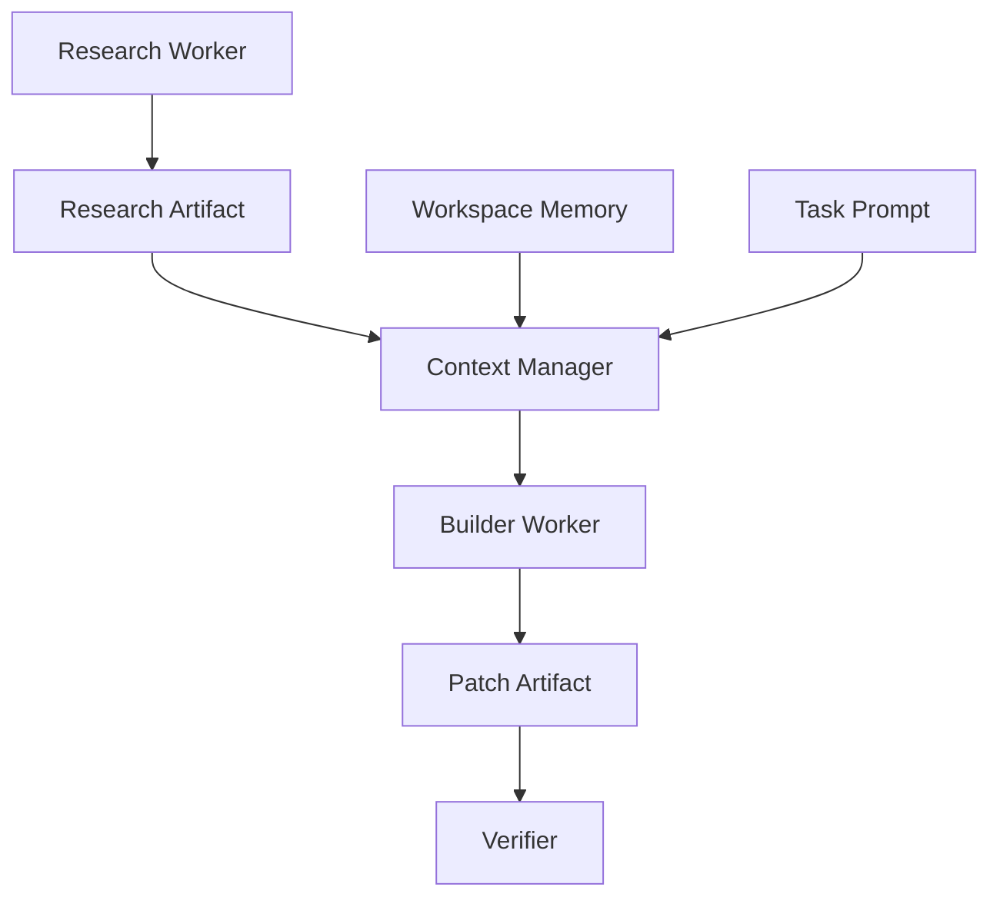

---
title: Workflow Specification - Part 08
status: draft
version: 1.0
tags:
  - core-concepts
  - workflow
  - artifacts
  - memory
  - context
related:
  - "[[Artifact-Part01]]"
  - "[[Memory-Part01]]"
  - "[[Prompt-Part01]]"
---

# Workflow Specification (Part 08)

## Document Index

Part 01 - Purpose, Philosophy, and Core Model
Part 02 - Workflow Object Model and Graph Structure
Part 03 - Node Types and Node Contracts
Part 04 - Edge Types, Dependencies, and Data Flow
Part 05 - Workflow Lifecycle and State Machine
Part 06 - Execution Semantics and Scheduling
Part 07 - Dynamic Graphs, Worker Spawning, and Replanning
Part 08 - Artifacts, Memory, and Context Flow
Part 09 - Permissions, Safety, and Human Approval
Part 10 - UI, Canvas, and User Interaction
Part 11 - Events, Persistence, Versioning, and Replay
Part 12 - Implementation Checklist, Examples, and Future Expansion

# Purpose

Workflow context flow defines how information moves between nodes without flooding every Worker with every conversation.

Eulinx should prefer structured artifacts, memory references, and summarized context packages over raw chat transcript sharing.

# Context Principle

Workers should receive the smallest useful context package.

They should not receive the entire project history unless the task requires it.

Workflow edges should make context movement visible.

# Context Package

```ts
type WorkflowContextPackage = {
  id: string;
  workflowId: string;
  nodeId: string;
  taskId?: string;
  workerId?: string;
  promptRefs: string[];
  artifactRefs: string[];
  memoryRefs: string[];
  fileRefs: string[];
  permissionRefs: string[];
  summary: string;
  tokenEstimate?: number;
  createdAt: string;
};
```

# Artifact Flow

Artifacts should be the primary unit of exchange between Workers.

Example:

```text
Research Worker produces API Research Summary.
Builder Worker consumes API Research Summary.
Verifier Worker consumes Builder Patch.
Merge Manager consumes Verified Patch.
```

This is better than:

```text
Send entire Research Worker terminal transcript to Builder Worker.
```

# Artifact Routing

Workflow edges should define which artifacts travel where.

```text
artifact_edge:
  from: worker_research.output.summary
  to: worker_builder.input.context
  artifact_type: markdown
```

# Memory Flow

Memory may be read or written by Workflow nodes.

Memory sources:

- Workspace Memory
- Project Memory
- Task Memory
- Worker Memory
- Temporary Memory
- Knowledge Base
- Vector Memory
- Replay Memory

Memory writes SHOULD be explicit graph events.

# Context Injection

Before a Worker starts, the Context Manager should assemble:

- task instructions
- relevant artifacts
- relevant memory
- tool permissions
- file references
- expected output contract
- constraints
- approval requirements
- termination condition

The Workflow defines what is connected. The Context Manager decides what exact text/data to inject.

# Context Edge Types

```text
artifact_context
memory_context
prompt_context
file_context
event_context
summary_context
```

# Preventing Context Pollution

Eulinx SHOULD avoid:

- sending unrelated phase details to every Worker
- giving frontend Workers backend secrets
- giving reviewers full write permissions
- including stale artifacts without version markers
- mixing failed plan versions with active plan versions

# Context Versioning

Every context package SHOULD record versions of included artifacts and memories.

Example:

```text
Builder Worker received:
- Auth Plan v3
- API Contract v2
- Workspace Summary v5
- Permission Profile v1
```

# Mermaid Diagram



# AI Notes

Do not solve Worker communication by dumping all chat logs into every prompt.

Use Artifacts and Memory references.

Make context flow visible in the graph so the user can understand why a Worker knew something.

# Related Documents

- [[Artifact-Part01]]
- [[Memory-Part01]]
- [[Prompt-Part01]]
- [[Workflow-Part09]]
- [[Worker-Part03]]

