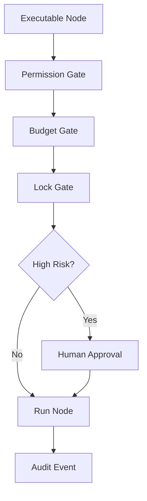

---
title: Workflow Specification - Part 09
status: draft
version: 1.0
tags:
  - core-concepts
  - workflow
  - permissions
  - safety
related:
  - "[[Permission-Part01]]"
  - "[[Permission-Part04]]"
  - "[[Execution-Part08]]"
---

# Workflow Specification (Part 09)

## Document Index

Part 01 - Purpose, Philosophy, and Core Model
Part 02 - Workflow Object Model and Graph Structure
Part 03 - Node Types and Node Contracts
Part 04 - Edge Types, Dependencies, and Data Flow
Part 05 - Workflow Lifecycle and State Machine
Part 06 - Execution Semantics and Scheduling
Part 07 - Dynamic Graphs, Worker Spawning, and Replanning
Part 08 - Artifacts, Memory, and Context Flow
Part 09 - Permissions, Safety, and Human Approval
Part 10 - UI, Canvas, and User Interaction
Part 11 - Events, Persistence, Versioning, and Replay
Part 12 - Implementation Checklist, Examples, and Future Expansion

# Purpose

Workflow safety defines how Eulinx prevents an execution graph from becoming dangerous, wasteful, confusing, or impossible to audit.

Workflows can coordinate terminals, tools, network calls, file writes, Worker spawning, and merges. That makes safety foundational.

# Permission Principle

Every executable node MUST declare required permissions.

Every high-risk edge MUST be visible.

Every unsafe action MUST pass through the Runtime and Permission Manager.

The graph may request power. It cannot grant power to itself.

# Workflow-Level Permissions

A Workflow may define broad constraints:

```text
network: disabled
filesystem writes: artifact only
worker spawning: max depth 3
git push: require human approval
merge: require verification
```

These constraints apply to all nodes unless a stricter node-level rule exists.

# Node-Level Permissions

Each node SHOULD declare permissions.

Example:

```yaml
node: Backend Builder Worker
permissions:
  - filesystem.read: "src/server/**"
  - filesystem.write: "artifact_patch_only"
  - terminal.spawn: "sandbox"
  - network.http: "deny"
```

# Edge-Level Safety

Edges can also carry risk.

Example:

```text
Worker output -> Merge Manager
```

This edge implies that Worker output may eventually modify project files. It should require verification and merge permissions.

# Human Approval Nodes

Approval nodes pause execution.

Approval nodes SHOULD include:

- requested action
- requester
- affected resources
- risk level
- reason
- proposed scope
- duration
- consequences

# Safety Gates

Eulinx SHOULD support safety gates:

```text
permission gate
approval gate
verification gate
budget gate
lock gate
merge gate
test gate
security gate
```

# Simulation Mode

Simulation mode runs a Workflow without performing dangerous actions.

Simulation may:

- plan graph
- estimate permissions
- estimate cost
- show files that would change
- show Workers that would spawn
- show approval prompts that would appear

Simulation MUST NOT:

- write project files
- push Git changes
- expose secrets
- call destructive tools

# YOLO Workflows

YOLO mode may reduce approval prompts, but it must not remove hard safety boundaries.

In Workflows, YOLO mode SHOULD be visually obvious.

YOLO mode MUST still obey:

- hard denials
- Workspace boundaries
- secret protection
- budget limits
- audit logs
- merge rules

# Dangerous Graph Patterns

Eulinx SHOULD detect dangerous patterns:

- unbounded loops
- uncontrolled Worker spawning
- merge without verification
- network upload of project files
- secret access followed by network request
- many parallel file writers
- Git push after AI-generated changes without approval
- plugin install inside auto-run workflow

# Mermaid Diagram



# AI Notes

Do not treat workflow safety as UI warnings.

Safety must be enforced by the Runtime.

AI-generated workflows should be treated as untrusted until validated.

# Related Documents

- [[Permission-Part01]]
- [[Permission-Part04]]
- [[Execution-Part08]]
- [[Workflow-Part10]]

