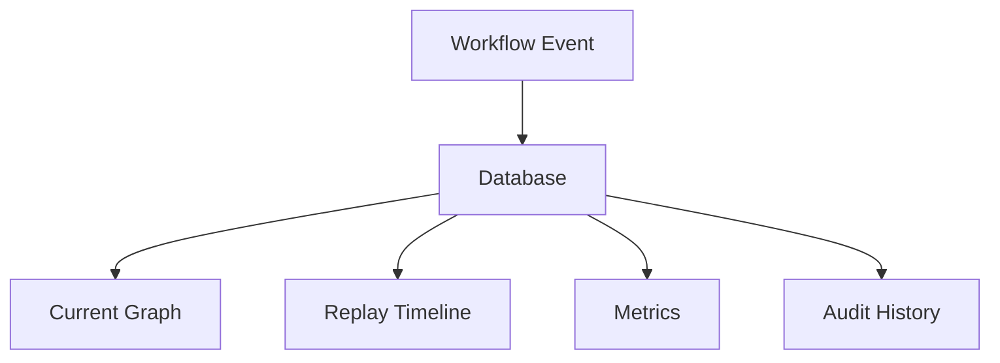

---
title: Workflow Specification - Part 11
status: draft
version: 1.0
tags:
  - core-concepts
  - workflow
  - events
  - persistence
  - replay
related:
  - "[[Execution-Part07]]"
  - "[[Runtime-Part04]]"
  - "[[Memory-Part03]]"
---

# Workflow Specification (Part 11)

## Document Index

Part 01 - Purpose, Philosophy, and Core Model
Part 02 - Workflow Object Model and Graph Structure
Part 03 - Node Types and Node Contracts
Part 04 - Edge Types, Dependencies, and Data Flow
Part 05 - Workflow Lifecycle and State Machine
Part 06 - Execution Semantics and Scheduling
Part 07 - Dynamic Graphs, Worker Spawning, and Replanning
Part 08 - Artifacts, Memory, and Context Flow
Part 09 - Permissions, Safety, and Human Approval
Part 10 - UI, Canvas, and User Interaction
Part 11 - Events, Persistence, Versioning, and Replay
Part 12 - Implementation Checklist, Examples, and Future Expansion

# Purpose

Workflows must be persistent and replayable.

The user should be able to inspect how a Workflow changed over time, why nodes were added, what actions happened, and how results were produced.

# Persistence Requirements

Eulinx SHOULD persist:

- workflow metadata
- nodes
- edges
- layout
- runtime state
- graph versions
- mutation history
- execution events
- approvals
- artifacts
- replay references

# Suggested Tables

```text
workflows
workflow_nodes
workflow_edges
workflow_versions
workflow_events
workflow_mutations
workflow_layouts
workflow_runs
```

# workflow_events

Events should include:

```text
workflow.created
workflow.validated
workflow.started
workflow.paused
workflow.resumed
workflow.completed
workflow.failed
workflow.cancelled
workflow.node.added
workflow.node.updated
workflow.node.started
workflow.node.completed
workflow.node.failed
workflow.edge.added
workflow.edge.activated
workflow.edge.completed
workflow.mutation.requested
workflow.mutation.accepted
workflow.mutation.rejected
workflow.replay.opened
```

# Versioning

Workflow versions are required because graphs may change while running.

Each version should record:

- graph snapshot or diff
- mutation reason
- requester
- timestamp
- validation result
- approval result if needed

# Replay

Replay reconstructs the workflow from events.

Replay should show:

- original graph
- graph mutations
- node execution
- edge activation
- Worker spawning
- Artifact creation
- approvals
- failures
- retries
- merges
- final result

# Replay Modes

```text
timeline
step_by_step
graph_animation
node_focus
artifact_focus
security_focus
```

# Event Sourcing Option

Eulinx MAY eventually use event sourcing for workflow history.

The early version can store snapshots plus events.

Recommended practical approach:

```text
Persist current graph for fast loading.
Persist events for replay and debugging.
Persist version snapshots for important graph changes.
```

# Mermaid Diagram



# AI Notes

Do not make replay an afterthought.

If events are not recorded during execution, replay cannot be added cleanly later.

At minimum, persist graph mutations, node state changes, approvals, artifact creation, and merge events.

# Related Documents

- [[Execution-Part07]]
- [[Runtime-Part04]]
- [[Workflow-Part12]]
- [[Permission-Part07]]

