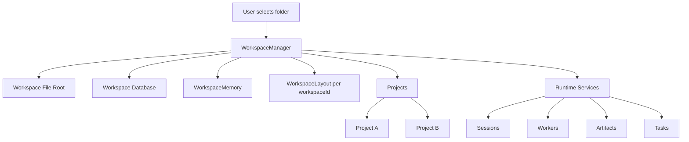
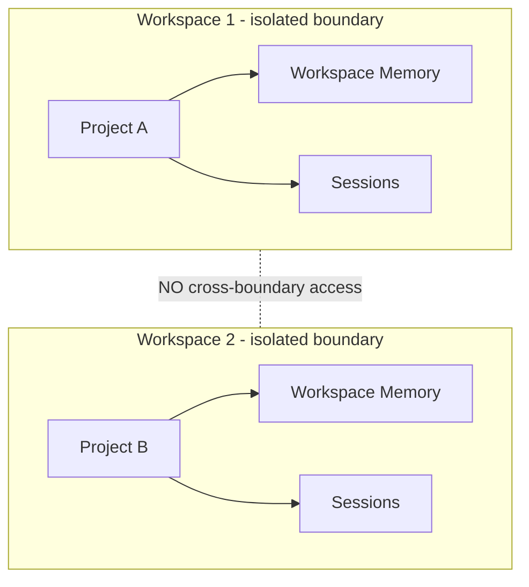

# Workspace Diagrams





```text
Workspace (top-level isolation boundary)
  |
  +-- File Root                (single local folder, all ops validated here)
  +-- Workspace Memory         (durable, scoped, never crosses boundary)
  +-- Permissions              (policies apply only inside this Workspace)
  +-- Agents + Terminal Sessions (Workers, Orchestrators, PTYs)
  +-- Runtime State            (Sessions, Tasks, Artifacts, History)
  +-- Settings                 (Workspace-level, not global)
  +-- Database                 (SQLite / LanceDB / Tantivy, bound to identity)
  |
  +-- Projects                 (units of work inside the Workspace)
        |
        +-- Project A
        +-- Project B
```

```text
Isolation boundaries (MUST NOT cross):
  Files      : one root per Workspace, validated on every op
  Memory     : Workspace memory not visible to other Workspaces
  Permissions: policies scoped to the Workspace
  Agents     : Workers/Orchestrators belong to one Workspace
  Sessions   : execution timelines scoped to one Workspace
  Database   : storage bound to Workspace identity
```

# Related Documents

- [[Workspace-Part01]]
- [[Workspace-Part02]]
- [[Workspace-Part03]]
- [[01-core-concepts/README]]
- [[WorkspaceManager-Part01]]
- [[WorkspaceMemory-Part01]]
- [[07-ui-ux/WorkspaceLayout/WorkspaceLayout-Part01]]
- [[Project-Part01]]
