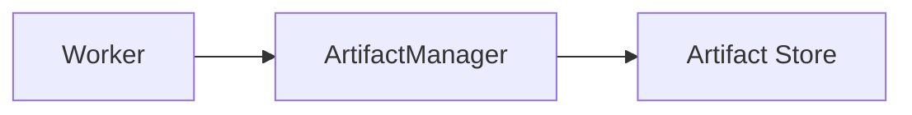
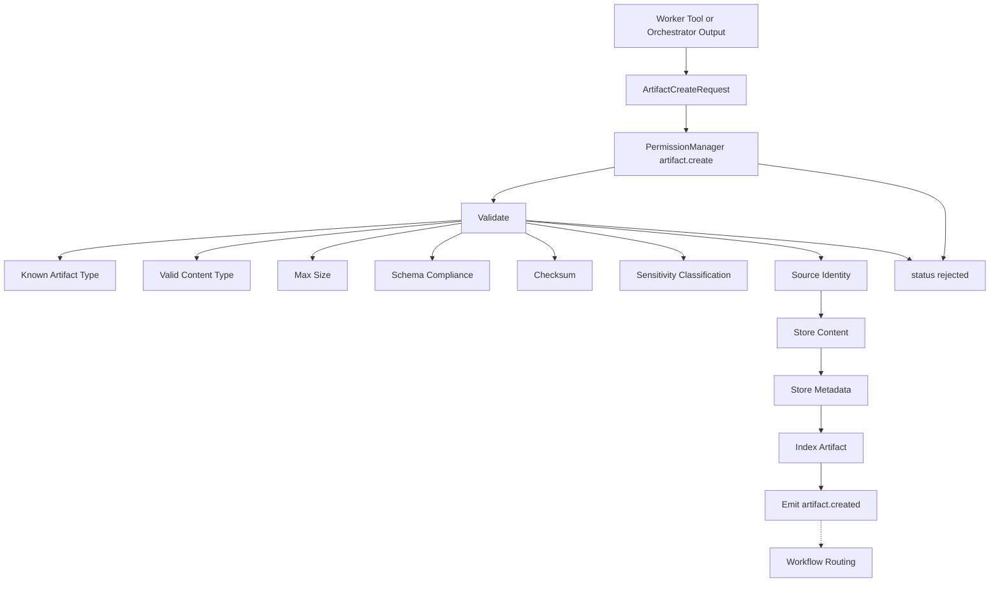
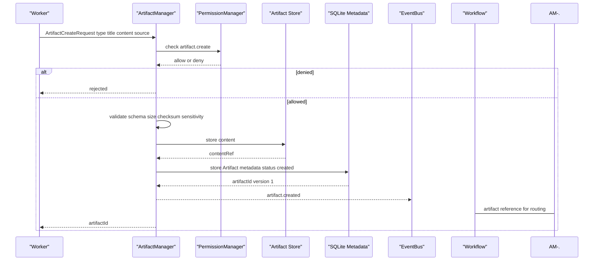
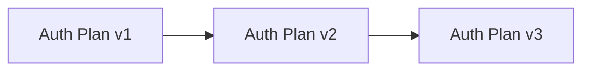
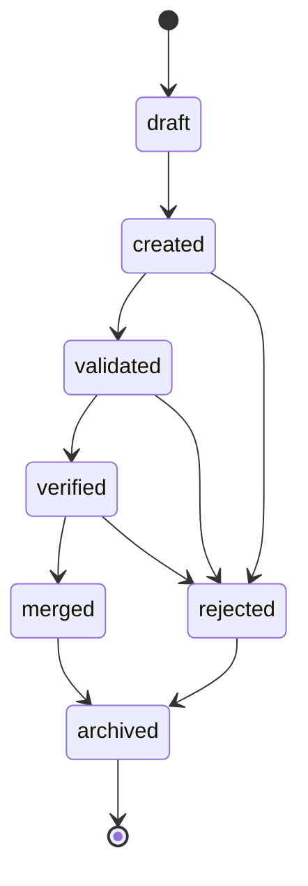
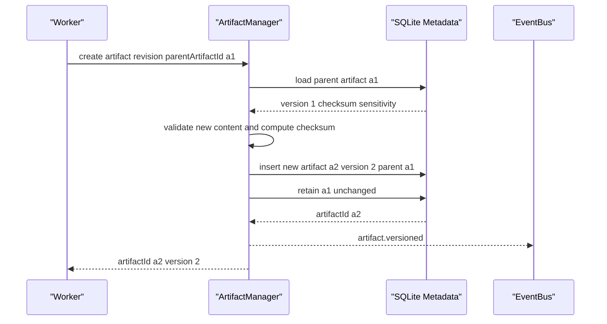
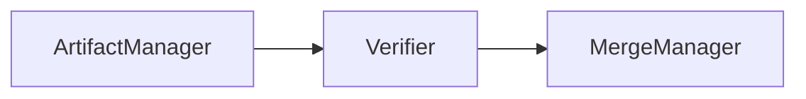
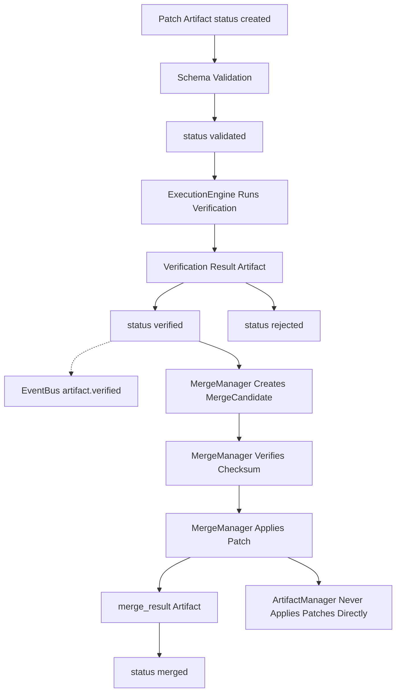
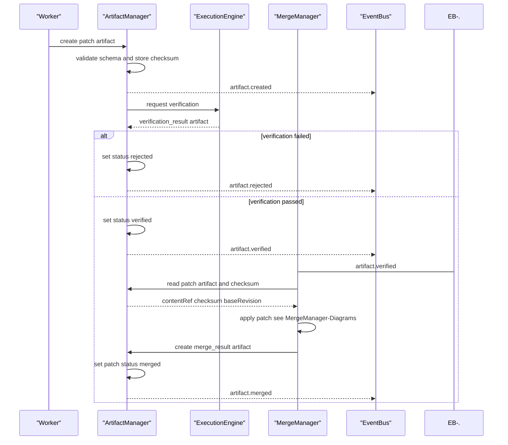

---
title: ArtifactManager Diagrams
status: draft
version: 1.0
tags:
  - runtime
  - artifact-manager
  - diagrams
  - architecture
related:
  - "[[ArtifactManager-Part01]]"
  - "[[ArtifactManager-Part02]]"
  - "[[ArtifactManager-Part03]]"
  - "[[MergeManager-Part01]]"
---

# ArtifactManager Diagrams

Each flow below is rendered four ways: high-level overview, detailed Mermaid, ASCII, and sequence.

## Artifact Creation Flow

### High-Level Overview



### Detailed Mermaid



### ASCII

```text
artifact create request
  |
  v
permission check (artifact.create) ---- denied ---> rejected
  |
  v
schema validation ---------------------- invalid --> rejected
  known type, content type, max size, schema,
  checksum, sensitivity, source identity
  |
  v
content storage
  sqlite://artifact_content/{id}      (small)
  file://workspace/.Eulinx/artifacts/{id} (large)
  blob://artifact-store/{id}
  |
  v
metadata storage (creator, worker, tool, task,
  workflow node, version, checksum, sensitivity,
  verification state, merge state)
  |
  v
event emission  -.->  EventBus: artifact.created
  |
  v
Workflow routing (downstream nodes get references, not raw content)
```

### Sequence



## Artifact Versioning Flow

### High-Level Overview



### Detailed Mermaid



### ASCII

```text
artifacts are immutable by default
an update creates a NEW version, it never overwrites

  Artifact id=a1 version=1 parentArtifactId=none   status=verified
        |
        v  update request
  Artifact id=a2 version=2 parentArtifactId=a1     status=created
        |
        v  update request
  Artifact id=a3 version=3 parentArtifactId=a2     status=created

status ladder:
  draft -> created -> validated -> verified -> merged -> archived
                          |            |
                          v            v
                       rejected     rejected

patch artifacts SHOULD be stored immutably.
patch artifacts SHOULD be immutable after validation.
artifact history MUST NOT be deleted silently.
```

### Sequence



## Artifact to Merge Handoff Flow

### High-Level Overview



### Detailed Mermaid



### ASCII

```text
THE SINGLE MOST IMPORTANT RULE IN Eulinx:
AI output MUST NOT directly mutate trusted state.

Worker produces patch Artifact
  |
  v
ArtifactManager validates schema         -> status validated
  |
  v
ExecutionEngine runs verification gates
  |
  v
verification_result artifact stored      -> status verified
  |                                          (or rejected)
  v
EventBus: artifact.verified
  |
  v
MergeManager creates MergeCandidate
  |
  v
MergeManager verifies checksum before applying
  |
  v
MergeManager applies patch to trusted workspace
  |
  v
merge_result artifact stored             -> status merged

ArtifactManager MUST NOT apply patches to project files.
ArtifactManager MUST NOT bypass MergeManager.
```

### Sequence



## Related Documents

- [[ArtifactManager-Part01]]
- [[ArtifactManager-Part02]]
- [[ArtifactManager-Part03]]
- [[ArtifactManager-Part04]]
- [[ArtifactManager-Part05]]
- [[MergeManager-Part01]]
- [[PermissionManager-Part01]]
- [[EventBus-Part01]]
