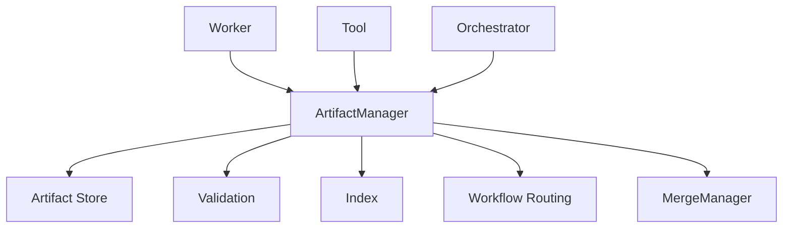

---
title: ArtifactManager Specification - Part 01
status: draft
version: 1.0
tags:
  - runtime
  - artifact-manager
  - artifacts
related:
  - "[[Artifact-Part01]]"
  - "[[Workflow-Part08]]"
  - "[[MergeManager-Part01]]"
---

# ArtifactManager Specification (Part 01)

## Document Index

Part 01 - Purpose, Philosophy, and Responsibilities
Part 02 - Artifact Types, Metadata, and Storage
Part 03 - Creation, Validation, Routing, and Versioning
Part 04 - Artifact Relationships, Indexing, and Search
Part 05 - Safety, Permissions, Retention, and Integrity
Part 06 - Implementation Checklist, Events, and Future Expansion

# Purpose

The ArtifactManager stores, validates, routes, versions, indexes, and exposes the structured outputs created by Workers, Tools, Orchestrators, and Runtime services.

Artifacts are one of Eulinx's central ideas.

Workers should produce artifacts instead of directly mutating the project whenever possible.

# Philosophy

Artifacts are the evidence of work.

They make AI execution:

- reviewable
- replayable
- mergeable
- verifiable
- shareable
- inspectable
- safer than direct edits

# Responsibilities

ArtifactManager MUST:

- create artifact records
- validate artifact shape
- store artifact content
- link artifacts to Workers, Tasks, Workflows, and Executions
- version artifacts
- route artifacts to downstream nodes
- expose artifacts to UI
- preserve artifact history
- protect sensitive artifacts
- emit artifact events

ArtifactManager MUST NOT:

- apply patches to project files directly
- bypass MergeManager
- bypass PermissionManager
- accept malformed high-risk artifacts
- delete artifact history silently

# ArtifactManager Object

```ts
type ArtifactManager = {
  id: string;
  workspaceId: string;
  state: "starting" | "ready" | "degraded" | "failed";
  storageRoot: string;
  supportedTypes: string[];
  updatedAt: string;
};
```

# Core Flow

```text
Worker produces output
  |
  v
ArtifactManager validates artifact
  |
  v
ArtifactManager stores artifact
  |
  v
EventBus emits artifact.created
  |
  v
Workflow routes artifact
```

# Mermaid Diagram



# AI Notes

Do not let Workers write directly into final project files when a patch artifact would be safer.

Artifacts are how Eulinx turns messy AI work into inspectable structured output.

# Related Documents

- [[ArtifactManager-Part02]]
- [[Artifact-Part01]]
- [[MergeManager-Part01]]

