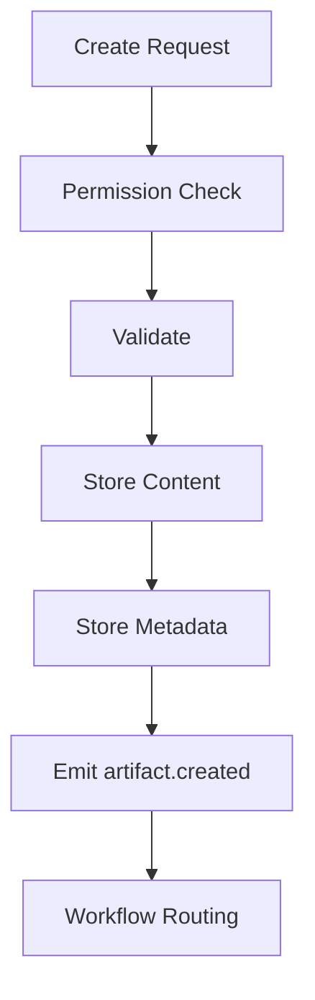

# ArtifactManager Specification (Part 03)

## Document Index

Part 01 - Purpose, Philosophy, and Responsibilities
Part 02 - Artifact Types, Metadata, and Storage
Part 03 - Creation, Validation, Routing, and Versioning
Part 04 - Artifact Relationships, Indexing, and Search
Part 05 - Safety, Permissions, Retention, and Integrity
Part 06 - Implementation Checklist, Events, and Future Expansion

# Creation Flow

```text
Artifact create request
  |
  v
Permission check
  |
  v
Schema validation
  |
  v
Content storage
  |
  v
Metadata storage
  |
  v
Event emission
```

# Artifact Create Request

```ts
type ArtifactCreateRequest = {
  workspaceId: string;
  type: string;
  title: string;
  content: string | Uint8Array;
  contentType: string;
  source: ArtifactSource;
  parentArtifactId?: string;
  metadata?: Record<string, unknown>;
};
```

# Validation

Validation SHOULD check:

- known artifact type
- valid content type
- max size
- schema compliance
- checksum
- sensitivity classification
- source identity
- permission to create

# Versioning

Artifacts SHOULD be immutable by default.

Updating an artifact should create a new version.

Example:

```text
Auth Plan v1
Auth Plan v2
Auth Plan v3
```

# Routing

ArtifactManager should notify Workflow or EventBus when a new Artifact is ready.

Downstream nodes should receive references, not raw large content.

# Mermaid Diagram



# AI Notes

Artifact versioning is critical.

Do not overwrite Worker outputs without preserving previous versions.

# Related Documents

- [[ArtifactManager-Part04]]
- [[Workflow-Part08]]
- [[Permission-Part01]]

