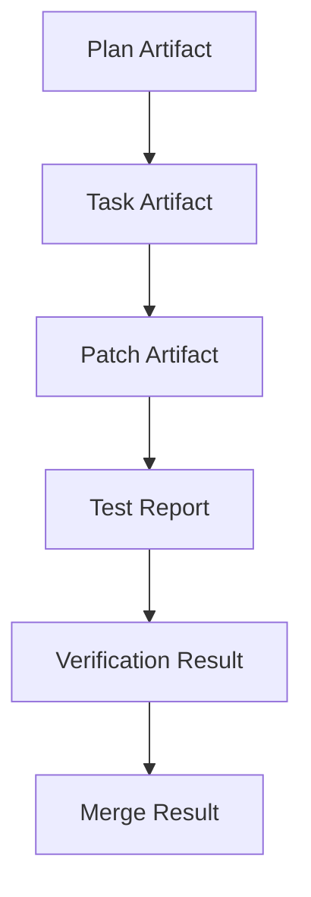

---
title: ArtifactManager Specification - Part 04
status: draft
version: 1.0
tags:
  - runtime
  - artifact-manager
  - search
  - relationships
related:
  - "[[ArtifactManager-Part03]]"
  - "[[MemoryManager-Part04]]"
---

# ArtifactManager Specification (Part 04)

## Document Index

Part 01 - Purpose, Philosophy, and Responsibilities
Part 02 - Artifact Types, Metadata, and Storage
Part 03 - Creation, Validation, Routing, and Versioning
Part 04 - Artifact Relationships, Indexing, and Search
Part 05 - Safety, Permissions, Retention, and Integrity
Part 06 - Implementation Checklist, Events, and Future Expansion

# Purpose

Artifacts need relationships so Eulinx can understand lineage.

# Artifact Relationships

Possible relationships:

```text
created_by
derived_from
supersedes
verifies
rejects
merges
depends_on
references
summarizes
```

# Relationship Object

```ts
type ArtifactRelationship = {
  id: string;
  sourceArtifactId: string;
  targetArtifactId: string;
  relationshipType: string;
  createdAt: string;
};
```

# Indexing

ArtifactManager SHOULD index:

- title
- type
- creator
- task
- workflow node
- content text
- status
- version
- sensitivity

# Search Modes

```text
by_id
by_type
by_task
by_worker
by_workflow
by_status
full_text
semantic
```

# Artifact Lineage

Lineage lets Eulinx answer:

```text
Which Worker created this patch?
Which plan produced this task?
Which test report verified this patch?
Which merge result applied it?
```

# Mermaid Diagram



# AI Notes

Do not store artifacts as disconnected files.

Lineage is what makes multi-worker execution understandable.

# Related Documents

- [[ArtifactManager-Part05]]
- [[MemoryManager-Part04]]
- [[Workflow-Part11]]

