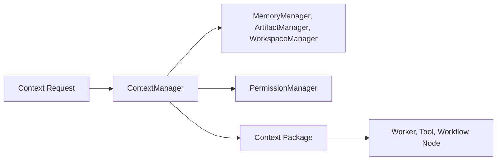
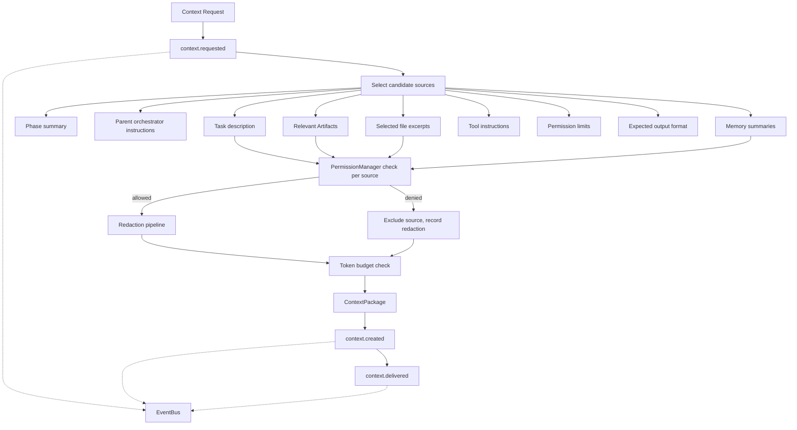
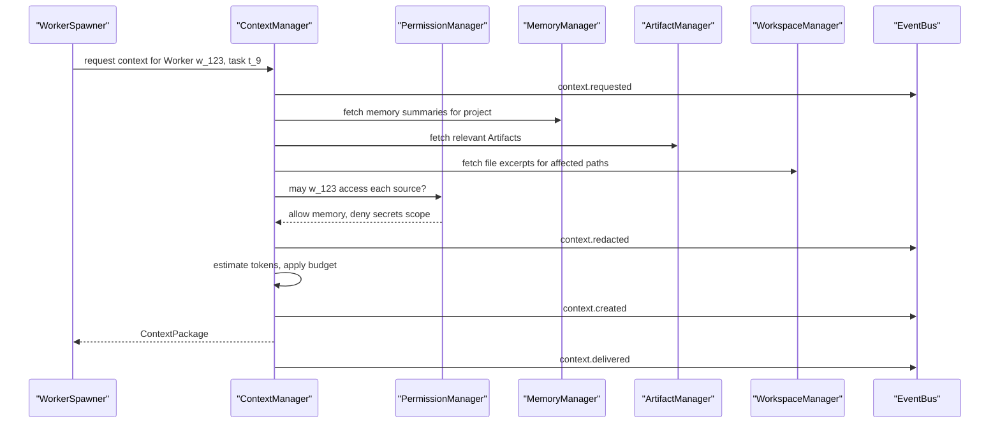
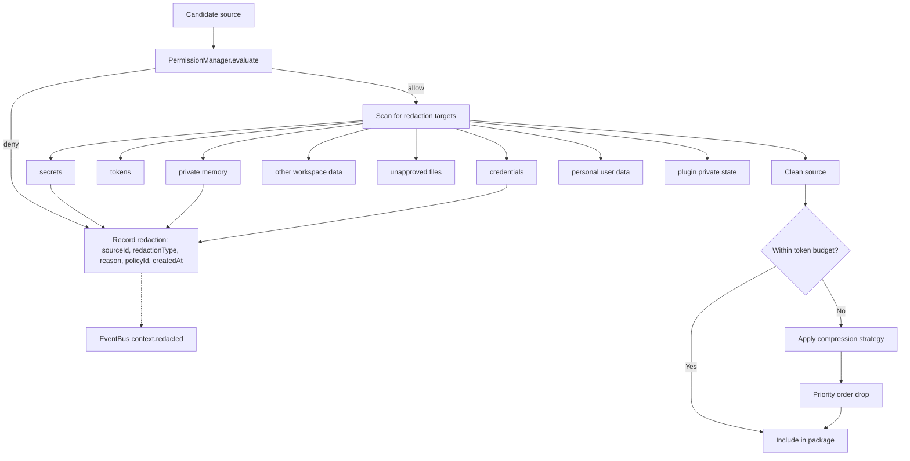
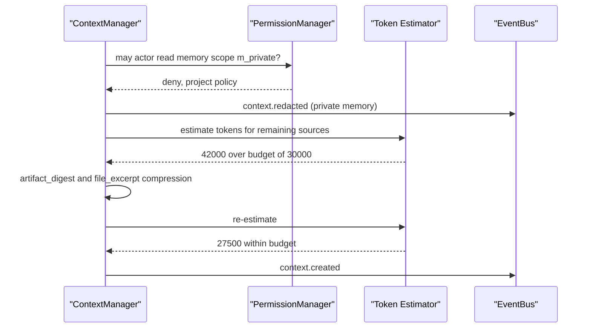
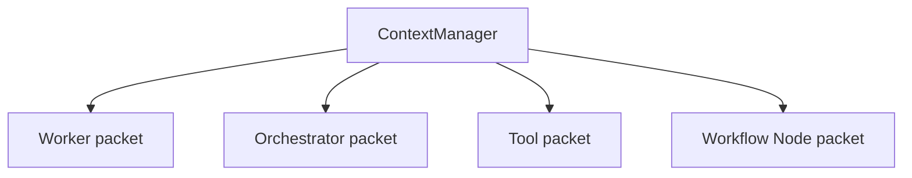
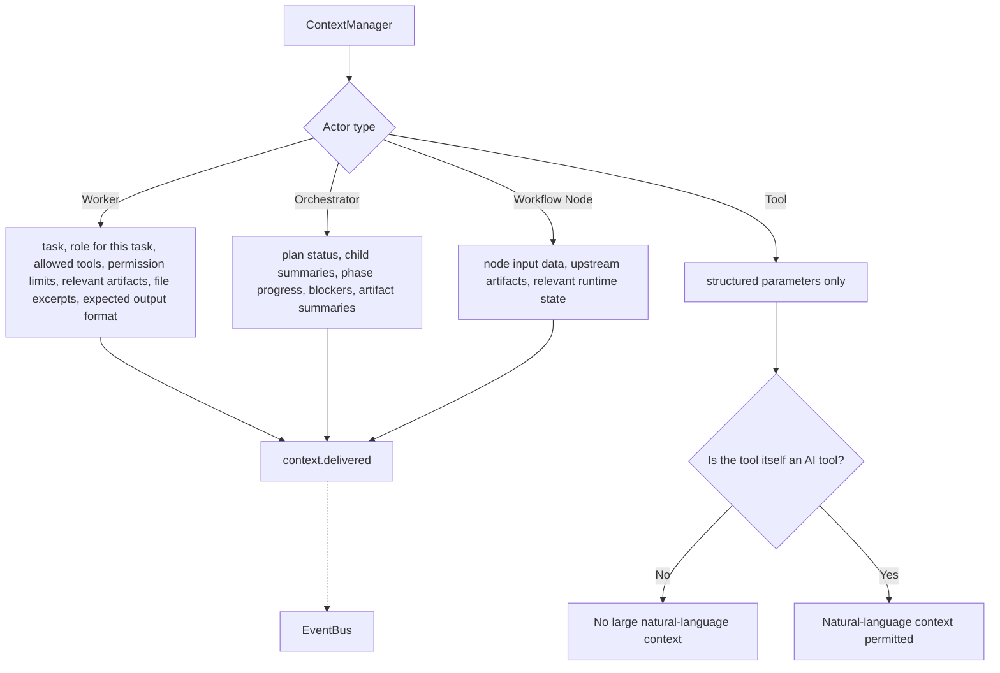
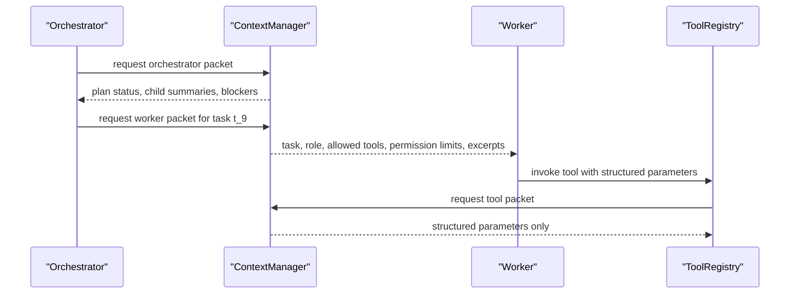

# ContextManager Diagrams

## Context Package Assembly

### High-Level Overview



### Detailed Mermaid



### ASCII

```text
ContextPackage
  id | workspaceId | projectId | actorId | taskId | purpose
  includedMemories | includedArtifacts | includedFiles
  includedInstructions | redactions | tokenEstimate | createdAt

Assembly order:
  1. select candidate sources
  2. ask PermissionManager about EVERY source
  3. run redaction pipeline
  4. estimate tokens and apply budget
  5. emit context.created, then context.delivered

Selection rule:
  Prefer structured Artifacts and summaries over raw transcript history.
  Need code   -> send the exact file or excerpt.
  Need intent -> send the Artifact summary.
  Do not send everything just in case.

Tables: context_packages, context_sources, context_redactions, context_usage
```

### Sequence



## Permissions, Redaction, and Budget

### High-Level Overview

```text
Candidate source -> authorized? -> redact -> fits budget? -> include
Anything unauthorized is excluded, never "probably safe".
```

### Detailed Mermaid



### ASCII

```text
Budget inputs:
  modelContextWindow | reservedOutputTokens | taskPriority
  workspaceBudget | sessionBudget | workerBudget

Compression strategies:
  extractive_summary | abstractive_summary | artifact_digest
  file_excerpt | symbol_excerpt | recent_events_only | dependency_context

Priority order when context must be reduced:
  1. Keep task instruction
  2. Keep permission limits
  3. Keep required artifacts
  4. Keep directly affected file excerpts
  5. Keep recent relevant events
  6. Drop unrelated transcript

Redaction record: sourceId, redactionType, reason, policyId, createdAt
```

### Sequence



## Injection Targets

### High-Level Overview



### Detailed Mermaid



### ASCII

```text
Worker         -> task, role, allowed tools, permission limits,
                  relevant artifacts, file excerpts, expected output format
Orchestrator   -> plan status, child summaries, phase progress,
                  blockers, artifact summaries
Tool           -> structured parameters only
Workflow Node  -> node input data, upstream artifacts, runtime state

Different actors need different context shapes.
Do not build a single giant context string for everything.
```

### Sequence



## Related Documents

- [[ContextManager-Part01]]
- [[ContextManager-Part02]]
- [[ContextManager-Part03]]
- [[ContextManager-Part04]]
- [[ContextManager-Part05]]
- [[ContextManager-Part06]]
- [[MemoryManager-Part01]]
- [[ArtifactManager-Part01]]
- [[PermissionManager-Part01]]
- [[ToolRegistry-Part01]]
- [[EventBus-Part01]]
- [[02-runtime/README]]
