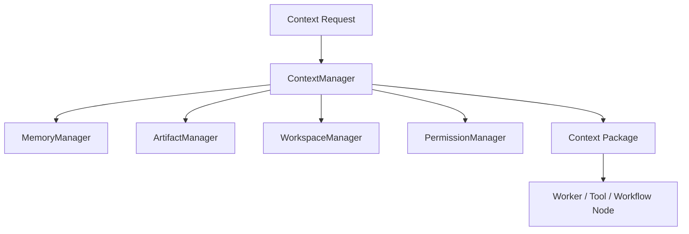

---
title: Context Manager Part 01 - Purpose and Architecture
status: draft
version: 1.0
tags:
  - runtime
  - context-manager
  - context
related:
  - "[[MemoryManager-Part01]]"
  - "[[Worker-Part01]]"
  - "[[Prompt-Part01]]"
---

# Context Manager Part 01 - Purpose and Architecture

## Document Index

```text
ContextManager-Part01 - Purpose and architecture
ContextManager-Part02 - Context packages and source selection
ContextManager-Part03 - Compression, summaries, and token budgets
ContextManager-Part04 - Context permissions and redaction
ContextManager-Part05 - Context injection for Workers, Tools, Workflows
ContextManager-Part06 - Database, events, tests, implementation checklist
```

## Purpose

ContextManager assembles the smallest useful context package for a Worker, Orchestrator, Tool, or Workflow node.

Eulinx must not blindly send the whole project, whole chat, or whole workspace to every AI terminal. That wastes tokens, confuses lower-cost models, and increases security risk. ContextManager decides what information is needed, what is allowed, and how it should be formatted.

## Core Rule

```text
Give each runtime actor enough context to do the task, but not so much that it loses focus or receives unauthorized information.
```

## Architecture



## AI Notes

Context is a product feature, not just prompt stuffing. Good context improves cheap models more than almost any other architecture choice.

