---
title: EventBus Diagrams
status: draft
version: 1.0
tags:
  - runtime
  - event-bus
  - diagrams
  - architecture
related:
  - "[[EventBus-Part01]]"
  - "[[EventBus-Part03]]"
  - "[[EventBus-Part04]]"
  - "[[EventBus-Part05]]"
---

# EventBus Diagrams

Every flow below is rendered four ways: overview, detailed mermaid, ASCII, and sequence.

## Publish and Fan Out

### Overview

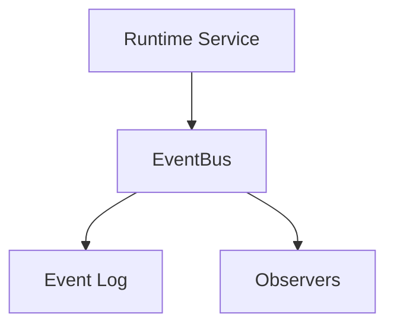

### Detailed

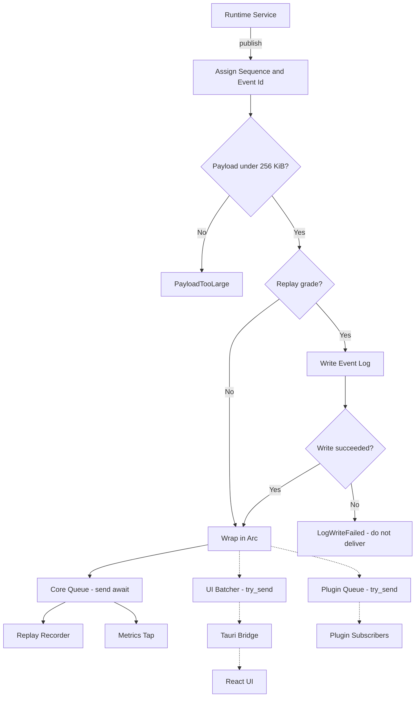

### ASCII

```text
Runtime Service
  |
  v
publish()
  |
  +-- 1. assign sequence + event id
  +-- 2. check payload size (256 KiB limit)
  +-- 3. if replay-grade: WRITE LOG (before delivery)
  |        |
  |        +-- write failed --> LogWriteFailed, NO delivery
  |
  +-- 4. wrap in Arc
  |
  +-- 5. core queue    send().await    guaranteed, may backpressure
  +-- 6. plugin queue  try_send()      lossy, NEVER blocks
  +-- 7. ui batcher    try_send()      coalesced, never blocks
  |
  v
return Ok(eventId, sequence)
```

### Sequence

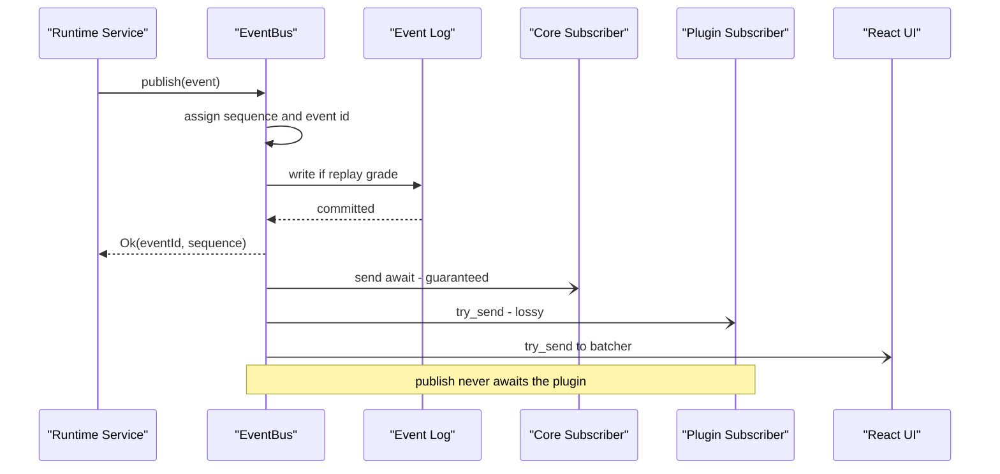

## Subscriber Classes and Guarantees

### Overview

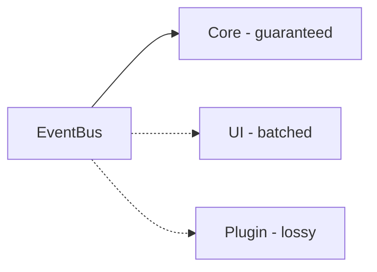

### Detailed

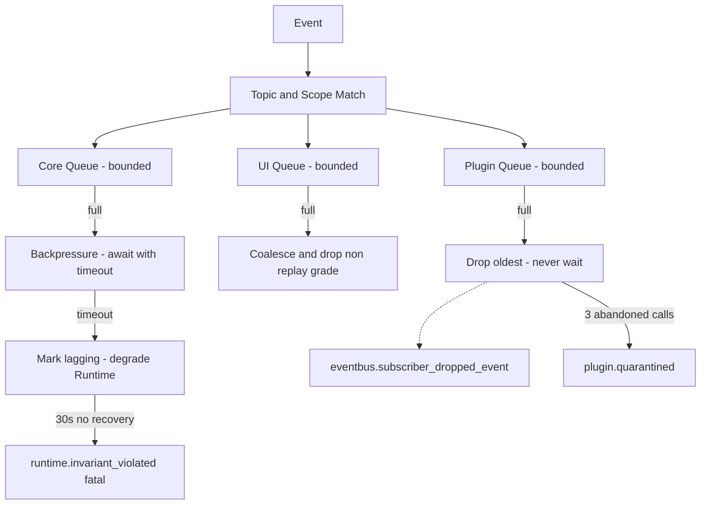

### ASCII

```text
Class    Replay-grade event   High-frequency event   Blocks publisher?
------   ------------------   --------------------   -----------------
core     never dropped        never dropped          yes, via backpressure
ui       never dropped        may drop, coalesced    no
plugin   may drop             may drop               no, ever

Channel usage is mechanical:
  core_tx    -> send().await    (trusted, bounded timeout)
  plugin_tx  -> try_send()      (untrusted, drop on Full)
  ui_tx      -> try_send()      (coalesce on Full)
```

### Sequence

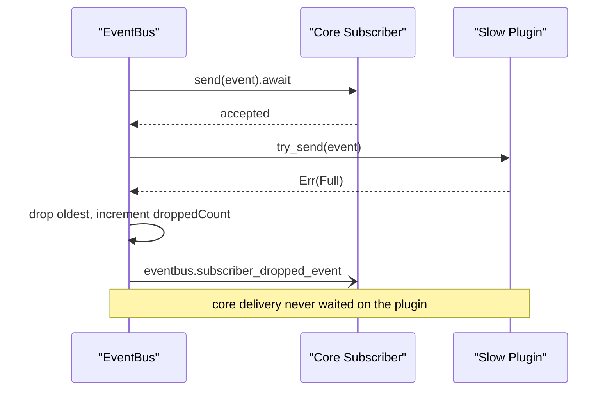

## Transport to the UI

### Overview

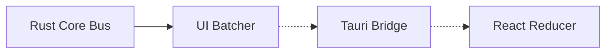

### Detailed

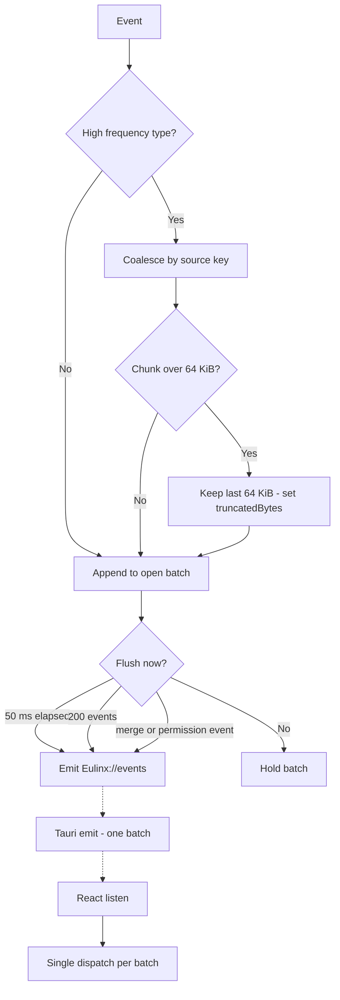

### ASCII

```text
Rust core bus
  |
  v
UI Batcher
  |
  +-- coalesce worker.output_streamed by (type, workerId, channel)
  |     -> append chunk strings, cap at 64 KiB
  +-- coalesce execution.progress_reported by executionId
  |     -> REPLACE, newest wins
  |
  +-- flush when: 50 ms elapsed
  |            OR 200 events buffered
  |            OR replay-grade event arrives (immediate)
  |
  v
Tauri emit("Eulinx://events", EventBatch)   <-- ONE emit per batch
  |
  v
React listen -> ONE dispatch per batch -> reducer
```

### Sequence

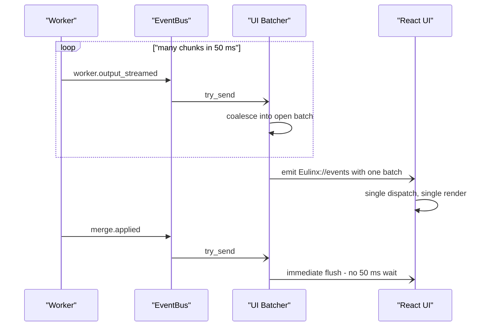

## Replay

### Overview

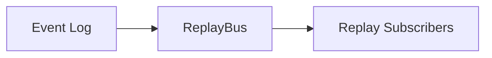

### Detailed

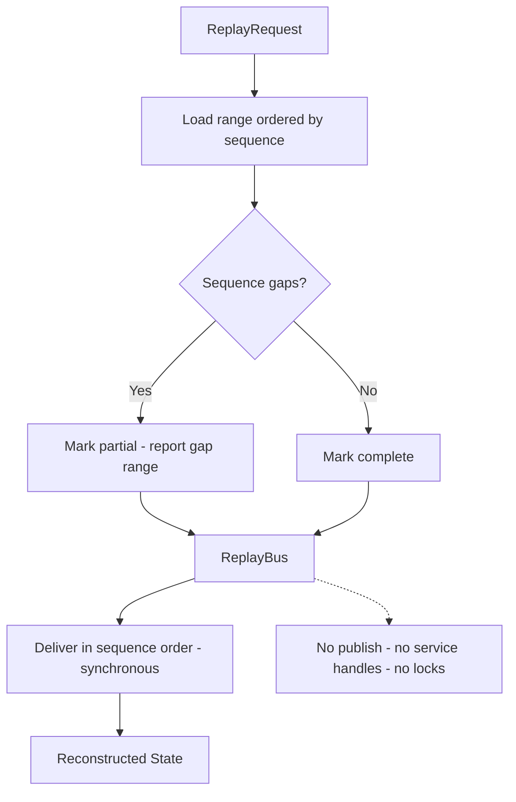

### ASCII

```text
ReplayRequest (workspaceId, fromSequence, toSequence)
  |
  v
SELECT * FROM event_log WHERE ... ORDER BY sequence ASC
  |
  +-- verify no sequence gaps
  |     gap found --> mark "partial", report range, DO NOT interpolate
  |
  v
ReplayBus
  |
  +-- has: events, cursor, replay subscribers
  +-- LACKS: publish(), log handle, service handles
  |
  v
Deliver in sequence order, synchronously, globally ordered
  |
  v
Reconstructed state = pure function of the event range

Replay MUST NOT: publish, spawn Workers, invoke Tools,
                 acquire locks, apply merges, write the log,
                 mutate any Project file.
```

### Sequence

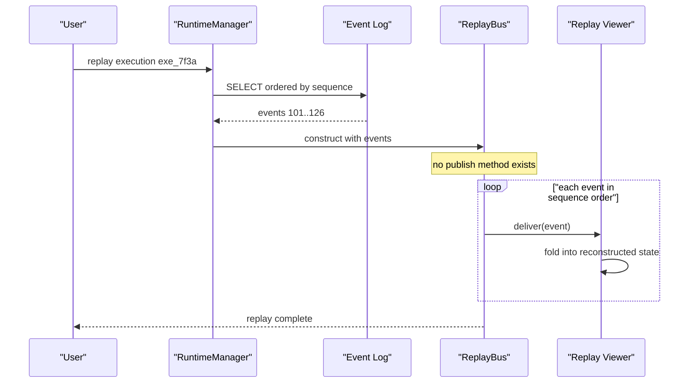

## Failure Handling

### Overview

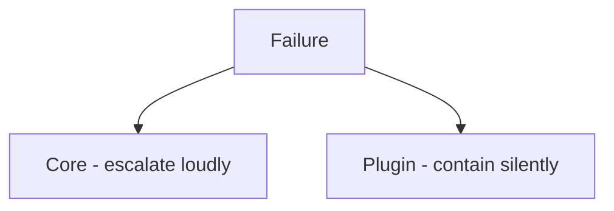

### Detailed

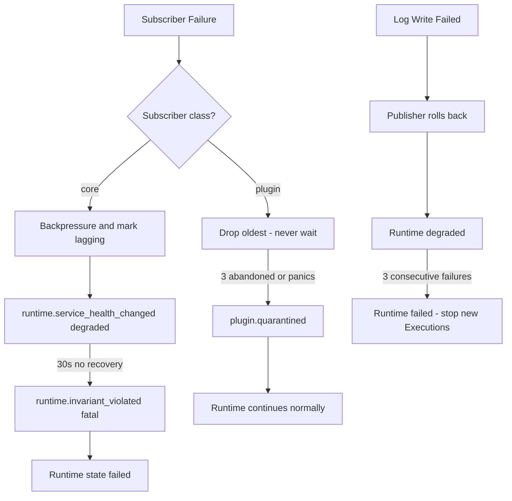

### ASCII

```text
Slow subscriber
  core   -> backpressure, mark lagging, degrade
            30s no recovery -> invariant_violated fatal -> Runtime failed
  ui     -> coalesce, drop non-replay-grade, set droppedSinceLastBatch
  plugin -> drop oldest immediately, 3 abandoned calls -> quarantine

Dropped event
  replay-grade + core   -> invariant violation, Runtime FAILED
  replay-grade + plugin -> permitted, log and continue
  drop events rate limited to 1 per subscription per second

Subscriber panic
  caught at the delivery boundary, ALWAYS
  publisher NEVER observes it
  core   x3 consecutive -> invariant_violated fatal
  plugin x3 consecutive -> quarantine, unsubscribe all
  counter resets on any successful delivery

Log write failure
  publisher MUST roll back its operation
  3 consecutive -> Runtime failed, no new Executions
  Eulinx stops rather than acting without an audit trail
```

### Sequence

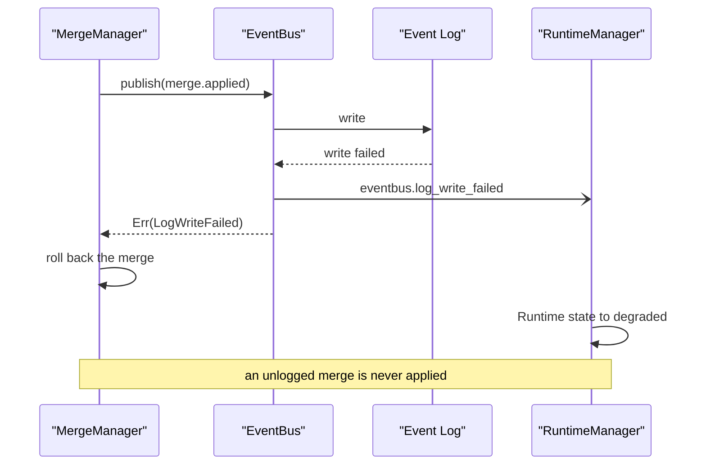

## Related Documents

- [[EventBus-Part01]]
- [[EventBus-Part02]]
- [[EventBus-Part03]]
- [[EventBus-Part04]]
- [[EventBus-Part05]]
- [[EventBus-Part06]]
- [[02-runtime/README]]
