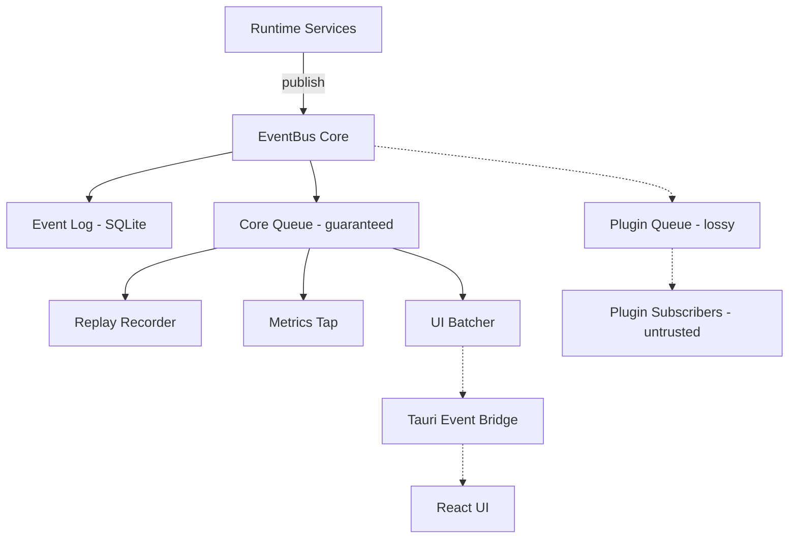

---
title: EventBus Specification - Part 01
status: draft
version: 1.0
tags:
  - runtime
  - event-bus
  - architecture
related:
  - "[[02-runtime/README]]"
  - "[[RuntimeManager-Part01]]"
  - "[[Runtime-Part01]]"
---

# EventBus Specification (Part 01)

## Document Index

Part 01 - Purpose, Philosophy, Object Model, and Invariants
Part 02 - The Typed Event Catalog
Part 03 - Publishers, Subscribers, Filters, and Delivery Guarantees
Part 04 - Transport, IPC, Serialization, and Throttling
Part 05 - Persistence, Event Log, Replay, Metrics, and Failure Handling
Part 06 - Implementation Checklist, Examples, and Future Expansion

# Purpose

The EventBus carries runtime events between Eulinx services and to every observer that needs to know what the Runtime is doing.

It is the single nervous system of the Runtime. When a Worker spawns, a lock is granted, an Artifact is verified, a merge is applied, or a permission is denied, that fact becomes an event on the EventBus.

The EventBus does not decide anything. It does not schedule, authorize, merge, or execute. It observes and distributes.

Every other runtime service is a publisher. The UI, the log writer, the Replay recorder, the metrics collector, and plugins are subscribers.

# Core Philosophy

The EventBus is deterministic infrastructure.

The same sequence of runtime actions MUST produce the same sequence of events, with the same payloads, in the same order, every time. If it does not, Replay is broken, and Replay is the feature that makes Eulinx auditable.

```text
Services publish facts.
The EventBus distributes facts.
Observers react to facts.
Nobody reasons on the bus.
```

An event is a statement about something that already happened. It is past tense. It is immutable. It MUST NOT be a request, a command, or a question.

`worker.spawned` is an event. `worker.spawn` is not - that is a command, and commands belong to the RuntimeManager IPC surface, not here.

The EventBus MUST NOT become a control channel. If a subscriber can change what the Runtime does by receiving an event, the boundary has been violated.

## The Untrusted Subscriber Rule

Plugins subscribe to the EventBus. Plugins are untrusted code.

A plugin MUST NOT be able to block, stall, slow, or crash core delivery. A slow plugin subscriber is a plugin problem, never a Runtime problem.

This single rule drives most of the EventBus design: core subscribers and plugin subscribers live on different delivery paths with different guarantees. Part 03 defines those paths. Part 05 defines what happens when a plugin misbehaves.

# Definition

The EventBus is a deterministic runtime service that owns:

- event type definitions
- event publication
- subscription registration
- topic matching and filtering
- delivery ordering
- delivery guarantees per subscriber class
- backpressure policy
- the Tauri bridge to the React UI
- high-frequency event batching and throttling
- the persistent event log
- replay-grade event history retention
- metrics taps
- subscriber failure isolation

# Responsibilities

The EventBus MUST:

- assign every event a monotonic sequence number
- assign every event a stable event id
- preserve per-source ordering of events
- deliver every core event to every matching core subscriber
- persist every replay-grade event to the event log before acknowledging publication
- isolate subscriber failures from publishers
- isolate plugin subscribers from core delivery
- drop plugin events rather than stall core delivery
- emit `eventbus.subscriber_dropped_event` when a drop occurs
- throttle high-frequency events on the UI transport
- serialize payloads deterministically
- retain enough history for Replay
- expose bus health and lag metrics

The EventBus SHOULD:

- batch UI-bound events on a fixed interval
- coalesce repeated progress events for the same subject
- provide a typed subscription API per event family
- provide backpressure signals to publishers before dropping
- support subscriber-side filtering to reduce delivery cost

The EventBus MUST NOT:

- allow a subscriber to mutate an event payload seen by another subscriber
- allow a subscriber to veto, delay, or cancel a runtime action
- allow a plugin subscriber to block core delivery
- reorder events from the same source
- drop a replay-grade event
- invoke Tools, spawn Workers, or touch the filesystem
- contain AI reasoning
- deliver events across Workspace boundaries without an explicit subscription scope

# EventBus Object Model

```ts
type EventBus = {
  id: string;
  state: EventBusState;
  sequenceCounter: number;
  subscribers: Map<SubscriptionId, Subscription>;
  coreQueue: EventQueue;
  pluginQueue: EventQueue;
  uiBatcher: UiBatcher;
  log: EventLogHandle;
  metrics: EventBusMetrics;
  config: EventBusConfig;
  startedAt?: string;
  updatedAt: string;
};

type EulinxEvent<TType extends string = string, TPayload = unknown> = {
  eventId: string;
  sequence: number;
  type: TType;
  payload: TPayload;
  source: EventSource;
  workspaceId: string;
  sessionId?: string;
  executionId?: string;
  correlationId?: string;
  causationId?: string;
  replayGrade: boolean;
  emittedAt: string;
};

type EventSource = {
  service: RuntimeServiceName;
  instanceId?: string;
};

type EventBusConfig = {
  coreQueueCapacity: number;
  pluginQueueCapacity: number;
  uiBatchIntervalMs: number;
  uiBatchMaxSize: number;
  slowSubscriberTimeoutMs: number;
  logRetentionDays: number;
  logMaxBytes: number;
};

type EventBusMetrics = {
  published: number;
  delivered: number;
  dropped: number;
  coreQueueDepth: number;
  pluginQueueDepth: number;
  slowSubscribers: number;
  maxLagMs: number;
};
```

# EventBus States

```text
uninitialized
starting
ready
running
degraded
draining
stopped
failed
```

`degraded` means the plugin queue is shedding load or a subscriber has been quarantined. Core delivery MUST still be intact in `degraded`. If core delivery is not intact, the state is `failed`.

`draining` means publication is closed but queued events are still being delivered and flushed to the log. Shutdown MUST pass through `draining`.

# Invariants

The EventBus MUST enforce:

```text
Every event has a unique event id.
Every event has a monotonic sequence number.
Sequence numbers never repeat and never go backward.
Events from the same source are delivered in publication order.
Every replay-grade event is durably logged before publication is acknowledged.
A replay-grade event is never dropped.
A plugin subscriber never blocks core delivery.
A subscriber panic never propagates to the publisher.
An event payload is immutable after publication.
No event crosses a Workspace boundary without an explicit scope.
Publishing an event never mutates trusted state.
Every dropped event is itself reported as an event.
```

# Mermaid Diagram



# AI Notes

Do not implement the EventBus as a single unbounded channel that every subscriber reads from. One slow plugin on a shared channel stalls the entire Runtime. Core and plugin delivery are separate paths on purpose.

Do not make publication async in a way that lets the log write be skipped. A replay-grade event MUST be in the log before `publish` returns. If you cannot write the log, publication fails, and that failure is real - do not swallow it.

Do not add a return value to event handlers. The moment a handler can return "no, do not do that", the EventBus has become a permission system, and Eulinx already has one - the PermissionManager.

Do not let events carry references to live objects. Payloads are plain serializable data. If a payload holds an `Arc<Mutex<Worker>>`, ordering and determinism are already gone.

Do not emit events from inside a lock held by the LockManager. Publish after the lock is released, or the bus and the lock graph will deadlock under load.

# Related Documents

- [[02-runtime/README]]
- [[EventBus-Part02]]
- [[EventBus-Diagrams]]
- [[RuntimeManager-Part01]]
- [[Runtime-Part01]]
