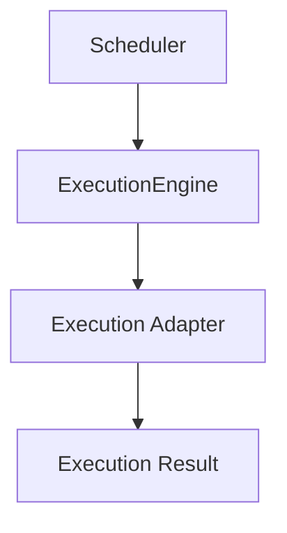
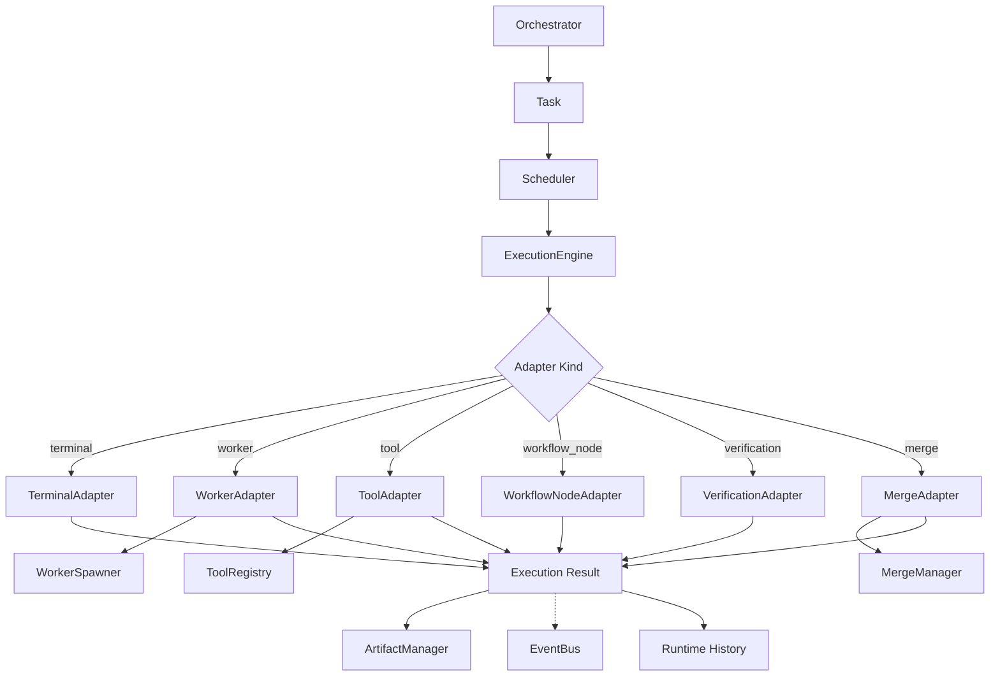
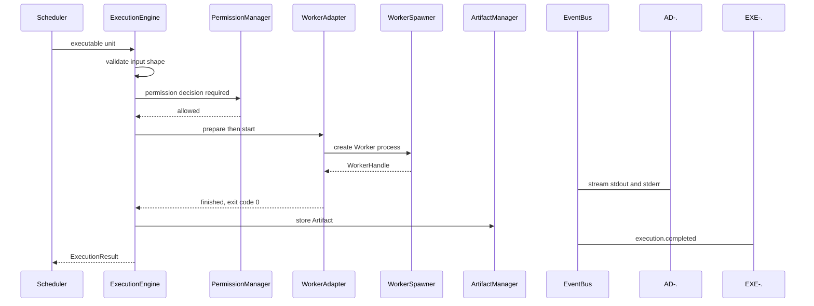
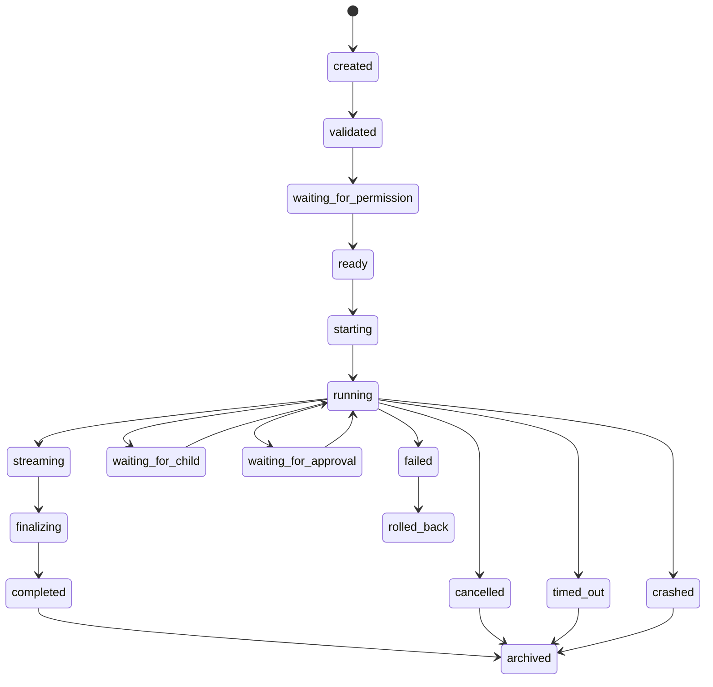
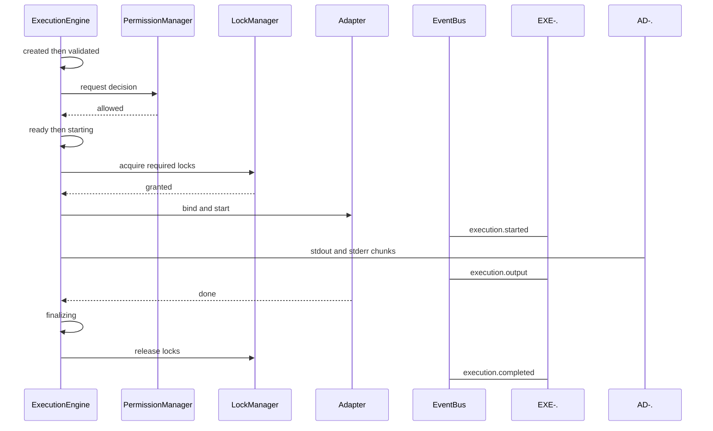
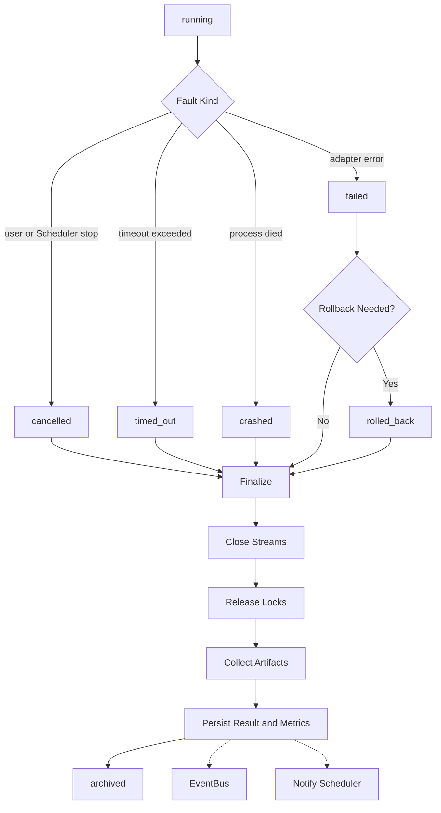
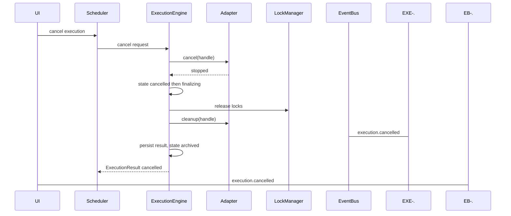

# ExecutionEngine Diagrams

Every flow below is rendered four ways: overview, detailed mermaid, ASCII, and sequence.

## Dispatch and Adapter Flow

### Overview



### Detailed



### ASCII

```text
[Scheduler]
    |
    v
[ExecutionEngine]
    |
    +-- TerminalAdapter        +-- VerificationAdapter
    +-- WorkerAdapter          +-- MergeAdapter
    +-- ToolAdapter            +-- MemoryAdapter
    +-- WorkflowNodeAdapter    +-- ArtifactAdapter
    |
    v
[Result + Events + Logs + Artifacts]

Adapter interface:
  kind
  validate(input)
  prepare(unit)
  start(prepared)
  stream(handle)
  cancel(handle)
  finalize(handle)
  cleanup(handle)

The engine owns the generic lifecycle. Adapters own concrete mechanics.
The WorkerAdapter MUST NOT spawn unregistered Workers directly.
```

### Sequence



## Execution Lifecycle Flow

### Overview

```text
created -> validated -> ready -> running -> finalizing -> completed -> archived
```

### Detailed



### ASCII

```text
created                waiting_for_approval
validated              finalizing
waiting_for_permission completed
ready                  failed
starting               cancelled
running                timed_out
streaming              crashed
waiting_for_child      rolled_back
                       archived

Transition rules:
  created MAY transition to validated
  running MAY transition to cancelled
  completed MUST NOT transition back to running
  archived MUST be terminal
  Invalid transitions MUST be rejected
  Every transition MUST emit an event and persist enough
    information to reconstruct the lifecycle during Replay
```

### Sequence



## Failure and Cancellation Flow

### Overview

```text
fault detected -> cancel adapter -> release resources -> record result
```

### Detailed



### ASCII

```text
Finalization MUST, on every terminal path:
  close streams
  release locks
  collect artifacts
  write metrics
  persist final result
  emit completion event
  notify Scheduler
  notify owning Task or Workflow node

The ExecutionEngine MUST NOT:
  allow untracked execution
  run work without Workspace scope
  run work without a permission decision
  silently retry unsafe operations
  bypass approval gates
  mutate project files outside approved channels
  hide terminal or tool output from observability

Artifacts are stored, not applied. Only MergeManager applies them.
```

### Sequence



## Related Documents

- [[ExecutionEngine-Part01]]
- [[ExecutionEngine-Part02]]
- [[ExecutionEngine-Part03]]
- [[ExecutionEngine-Part04]]
- [[ExecutionEngine-Part06]]
- [[RuntimeManager-Part01]]
- [[Scheduler-Part01]]
- [[WorkerSpawner-Part01]]
- [[Artifact-Part01]]
- [[02-runtime/README]]
