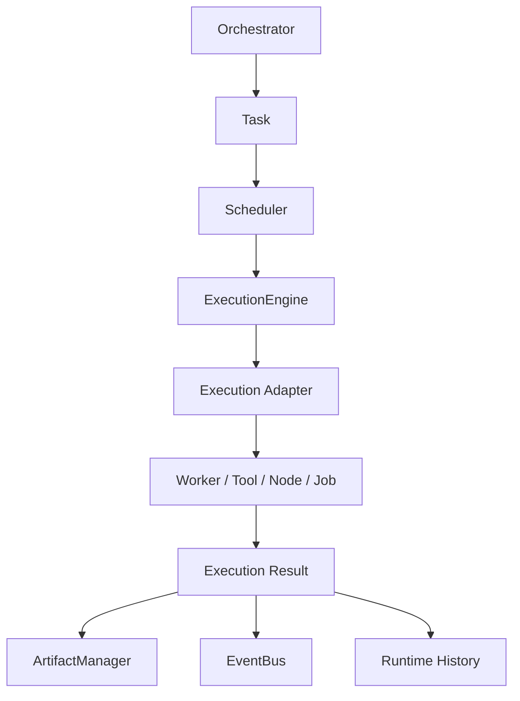

---
title: ExecutionEngine Specification - Part 01
status: draft
version: 1.0
tags:
  - runtime
  - execution-engine
  - execution
related:
  - "[[02-runtime/README]]"
  - "[[RuntimeManager-Part01]]"
  - "[[Scheduler-Part01]]"
  - "[[Execution-Part01]]"
  - "[[Worker-Part01]]"
---

# ExecutionEngine Specification (Part 01)

## Document Index

Part 01 - Purpose, Philosophy, and Boundaries
Part 02 - Execution Unit Model and Runtime Contracts
Part 03 - Execution Lifecycle and State Machine
Part 04 - Dispatch, Adapters, and Worker Binding
Part 05 - Streaming, Events, Logs, and Observability
Part 06 - Failure Handling, Cancellation, and Recovery
Part 07 - Security, Permissions, Sandboxes, and Resource Limits
Part 08 - Persistence, UI, Examples, and Implementation Checklist

# Purpose

The ExecutionEngine is the deterministic runtime service that actually runs approved work.

The [[Scheduler]] decides what is ready. The ExecutionEngine performs the work through the correct adapter, supervises the running operation, captures output, emits events, and returns a structured result.

The ExecutionEngine does not decide project strategy. It does not invent plans. It does not choose which task is important. It is the execution layer under the orchestration layer.

```text
Orchestrator creates intent
Task describes work
Scheduler selects runnable work
ExecutionEngine runs the selected work
ArtifactManager stores output
EventBus reports progress
```

# Core Philosophy

Execution in Eulinx must be boring, inspectable, and reversible whenever possible.

Workers may be AI CLIs. Tools may call external systems. Workflows may branch dynamically. That means execution can become messy very quickly. The ExecutionEngine exists to put a strict envelope around that mess.

Every execution MUST have:

- a clear input
- an owner
- a permission decision
- a workspace boundary
- a lifecycle state
- an event stream
- logs
- a result
- a durable history record

# Definition

The ExecutionEngine is a runtime service responsible for transforming an approved executable request into a supervised runtime operation.

It may execute:

- Worker tasks
- terminal commands
- Tool invocations
- workflow nodes
- verification jobs
- merge jobs
- memory indexing jobs
- artifact processing jobs
- replay reconstruction jobs
- runtime maintenance jobs

# What The ExecutionEngine Is Not

The ExecutionEngine is not the [[Scheduler]]. It does not decide queue order.

The ExecutionEngine is not the [[PermissionManager]]. It does not create policy; it enforces decisions returned by the permission layer.

The ExecutionEngine is not the [[WorkerSpawner]]. It does not design Worker identity or hierarchy, although it may ask WorkerSpawner to create a process.

The ExecutionEngine is not the [[MergeManager]]. It must not directly apply code changes to the project workspace unless the request is explicitly a merge operation delegated to MergeManager.

# Primary Responsibilities

The ExecutionEngine MUST:

- accept executable units only from trusted runtime services
- validate execution input shape
- bind execution to Workspace, Project, Session, Task, and owner identity
- enforce permission decisions before starting work
- select the correct execution adapter
- start and supervise execution
- stream output to the [[EventBus]]
- capture logs and telemetry
- support cancellation
- detect completion, failure, timeout, and crash states
- produce structured execution results
- hand outputs to the correct downstream manager
- persist execution history

The ExecutionEngine MUST NOT:

- allow untracked execution
- run work without Workspace scope
- run work without a permission decision
- silently retry unsafe operations
- bypass approval gates
- mutate project files outside approved channels
- hide terminal or tool output from observability

# Runtime Position



# ASCII Overview

```text
[Scheduler]
    |
    v
[ExecutionEngine]
    |
    +-- terminal adapter
    +-- worker adapter
    +-- tool adapter
    +-- workflow-node adapter
    +-- verification adapter
    +-- merge adapter
    |
    v
[Result + Events + Logs + Artifacts]
```

# AI Notes

When implementing Eulinx, do not put business planning inside the ExecutionEngine.

If code asks "what should we do next?", it belongs in orchestration or scheduling.

If code asks "how do we run this approved thing safely?", it belongs in the ExecutionEngine.

# Related Documents

- [[RuntimeManager-Part01]]
- [[Scheduler-Part01]]
- [[Execution-Part01]]
- [[WorkerSpawner-Part01]]
- [[Permission-Part01]]
- [[Artifact-Part01]]

