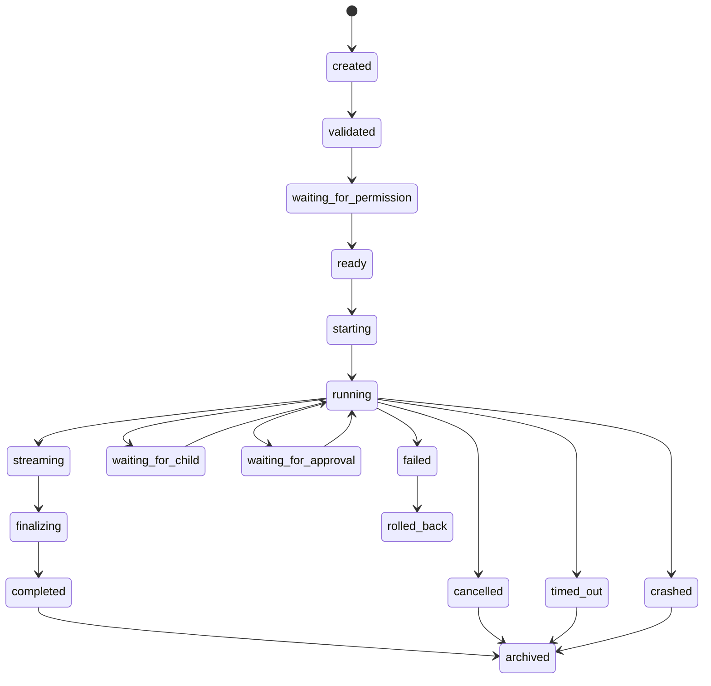

# ExecutionEngine Specification (Part 03)

## Execution Lifecycle

Every execution MUST move through a defined lifecycle.

The lifecycle exists so UI, replay, debugging, scheduling, cancellation, and recovery all describe execution the same way.

## States

```text
created
validated
waiting_for_permission
ready
starting
running
streaming
waiting_for_child
waiting_for_approval
finalizing
completed
failed
cancelled
timed_out
crashed
rolled_back
archived
```

## State Machine



## Lifecycle Requirements

The ExecutionEngine MUST emit an event for every lifecycle transition.

The ExecutionEngine MUST persist enough information to reconstruct the lifecycle later during replay.

Invalid transitions MUST be rejected.

Examples:

- `created` MAY transition to `validated`
- `running` MAY transition to `cancelled`
- `completed` MUST NOT transition back to `running`
- `archived` MUST be terminal

## Validation Phase

Validation checks:

- required fields exist
- Workspace exists
- Project exists
- owner exists
- adapter kind is supported
- permission decision exists or can be requested
- resource limits are present
- input shape matches adapter requirements

## Starting Phase

Starting prepares runtime resources:

- allocate execution record
- create log stream
- reserve resources
- acquire locks if required
- prepare sandbox if required
- bind adapter
- emit `execution.started`

## Running Phase

Running supervises active work:

- stream stdout and stderr
- receive tool output
- watch child operations
- monitor timeouts
- track resource usage
- detect fatal errors
- receive cancellation requests

## Finalizing Phase

Finalization MUST:

- close streams
- release locks
- collect artifacts
- write metrics
- persist final result
- emit completion event
- notify Scheduler
- notify owning Task or Workflow node

## AI Notes

Do not treat execution state as a loose string in random components. Use a central enum or discriminated union.

UI should never infer execution status from log text. It should use lifecycle events and persisted state.

