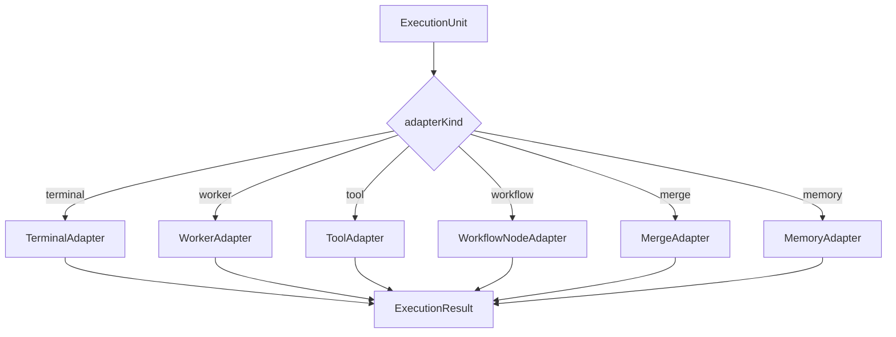

---
title: ExecutionEngine Specification - Part 04
status: draft
version: 1.0
tags:
  - runtime
  - execution-engine
  - adapters
related:
  - "[[ExecutionEngine-Part01]]"
  - "[[WorkerSpawner-Part01]]"
  - "[[Tool-Part01]]"
---

# ExecutionEngine Specification (Part 04)

## Dispatch and Adapter Architecture

The ExecutionEngine should be adapter-driven.

The engine owns the generic lifecycle. Adapters own concrete execution mechanics.

```text
ExecutionEngine
    |
    +-- TerminalAdapter
    +-- WorkerAdapter
    +-- ToolAdapter
    +-- WorkflowNodeAdapter
    +-- VerificationAdapter
    +-- MergeAdapter
    +-- MemoryAdapter
    +-- ArtifactAdapter
```

## Adapter Interface

Each adapter SHOULD implement:

```text
ExecutionAdapter
kind
validate(input)
prepare(unit)
start(prepared)
stream(handle)
cancel(handle)
finalize(handle)
cleanup(handle)
```

## Terminal Adapter

The TerminalAdapter runs terminal processes through Eulinx's PTY layer.

It MUST:

- bind process to Workspace sandbox
- apply environment variables
- stream stdout and stderr
- support resize when attached to UI
- report exit code
- support cancellation
- never run outside permission scope

## Worker Adapter

The WorkerAdapter runs AI CLI Worker sessions.

It SHOULD coordinate with [[WorkerSpawner]] for:

- Worker identity
- terminal creation
- prompt injection
- context injection
- parent child binding
- Worker status updates
- Worker output capture

The WorkerAdapter MUST NOT spawn unregistered Workers directly.

## Tool Adapter

The ToolAdapter invokes tools from the [[ToolRegistry]].

It MUST:

- validate tool schema
- enforce tool permissions
- capture structured output
- map errors into ExecutionResult
- emit tool invocation events

## Workflow Node Adapter

The WorkflowNodeAdapter executes deterministic workflow nodes.

Examples:

- condition node
- loop node
- delay node
- router node
- artifact transform node
- human approval node

AI-heavy nodes SHOULD usually become Worker or Tool execution units.

## Dispatch Diagram



## Adapter Failure Rules

If an adapter fails during validation, the execution MUST become `failed` without starting external work.

If an adapter fails after external work begins, the ExecutionEngine MUST run cleanup.

If cleanup fails, the engine MUST emit a critical runtime event.

## AI Notes

Do not put adapter-specific branches everywhere in the codebase.

Add one adapter boundary and keep all concrete execution differences behind that boundary.

