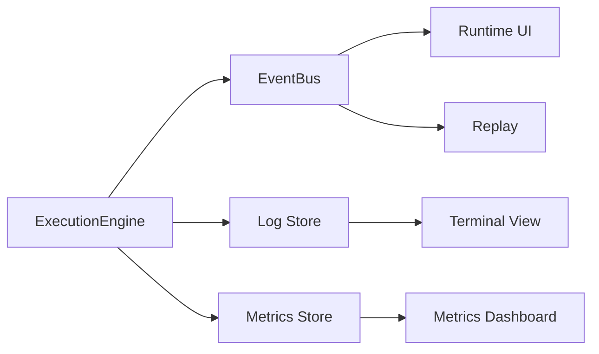

---
title: ExecutionEngine Specification - Part 05
status: draft
version: 1.0
tags:
  - runtime
  - execution-engine
  - observability
related:
  - "[[EventBus-Part01]]"
  - "[[ExecutionEngine-Part01]]"
---

# ExecutionEngine Specification (Part 05)

## Streaming, Events, Logs, and Observability

Execution must be visible while it is happening.

Eulinx users may run many AI terminal Workers at once. Without clear streaming and event records, the runtime becomes impossible to trust.

## Output Streams

The ExecutionEngine SHOULD capture:

- stdout
- stderr
- structured tool events
- AI CLI messages
- status updates
- progress updates
- generated artifacts
- approval requests
- error reports

Streams MUST be associated with execution id, Worker id when present, Task id, Session id, and Workspace id.

## Event Types

The ExecutionEngine SHOULD emit:

```text
execution.created
execution.validated
execution.permission_waiting
execution.ready
execution.started
execution.output
execution.progress
execution.artifact_detected
execution.approval_requested
execution.child_started
execution.child_finished
execution.finalizing
execution.completed
execution.failed
execution.cancelled
execution.timed_out
execution.crashed
execution.cleanup_failed
```

## Log Model

Execution logs should be append-only.

Logs MUST NOT be treated as the source of truth for state. State comes from execution records and events. Logs are for inspection and debugging.

```text
ExecutionLogEntry
id
executionId
stream
level
message
structuredPayload optional
timestamp
sequence
```

## Observability Diagram



## Metrics

The ExecutionEngine SHOULD track:

- start latency
- execution duration
- output volume
- artifact count
- retry count
- cancellation count
- timeout count
- adapter error count
- resource usage
- permission wait time
- approval wait time

## UI Behavior

The UI SHOULD show:

- current execution state
- live output
- last significant event
- progress if available
- owner Worker or Task
- start time and duration
- controls for cancel, pause, inspect, open logs

## AI Notes

Do not parse terminal output to decide whether execution is complete unless the adapter explicitly defines that behavior.

Completion must come from process exit, tool return, adapter result, or runtime state transition.

