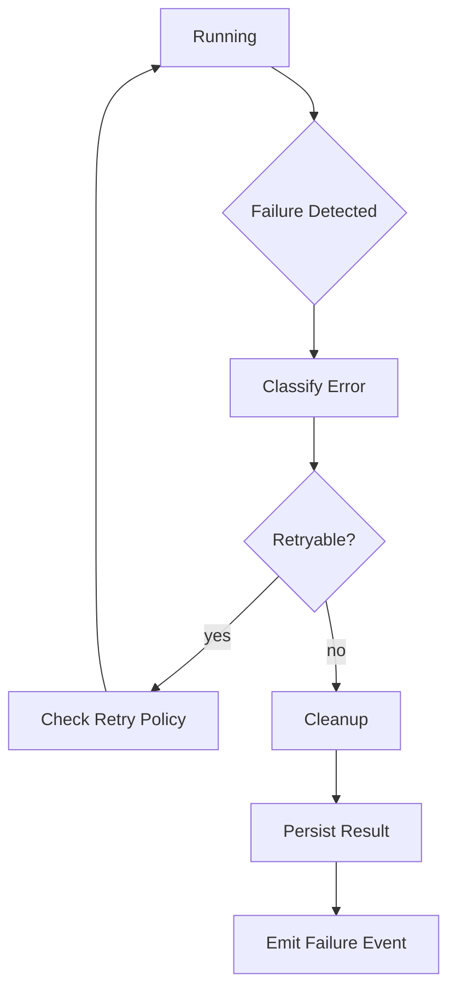

---
title: ExecutionEngine Specification - Part 06
status: draft
version: 1.0
tags:
  - runtime
  - execution-engine
  - failure
related:
  - "[[ExecutionEngine-Part01]]"
  - "[[Scheduler-Part06]]"
---

# ExecutionEngine Specification (Part 06)

## Failure Handling, Cancellation, and Recovery

Execution failure is normal. Eulinx must expect it.

AI CLIs can fail. Tools can timeout. Terminals can crash. External APIs can rate limit. Users can cancel. Permissions can change while work is running.

The ExecutionEngine turns those conditions into predictable runtime states.

## Failure Categories

```text
validation_failure
permission_denied
approval_rejected
adapter_failure
process_exit_nonzero
timeout
user_cancelled
runtime_cancelled
workspace_unavailable
resource_limit_exceeded
tool_error
network_error
crash
unknown
```

## Error Object

```text
ExecutionError
code
category
message
details
recoverable
retryable
requiresHuman
source
timestamp
```

## Retry Rules

Retries MUST be controlled by retry policy.

The ExecutionEngine MUST NOT automatically retry operations that may duplicate destructive side effects unless the operation is marked idempotent or the adapter provides safe retry semantics.

Safe retry examples:

- memory indexing
- read-only file inspection
- API request marked idempotent
- verifier pass

Unsafe retry examples:

- publishing
- deleting files
- pushing Git changes
- charging a payment
- running an unknown shell command

## Cancellation

Cancellation may come from:

- user
- parent Worker
- Orchestrator
- Scheduler
- RuntimeManager emergency stop
- Workspace shutdown
- budget exhaustion
- permission revocation

Cancellation MUST:

- emit event
- notify adapter
- stop child execution if policy requires
- release locks
- close streams
- persist cancellation reason

## Recovery

Recovery SHOULD prefer preserving evidence over hiding failure.

After failure, the engine SHOULD keep:

- logs
- partial artifacts
- error details
- resource usage
- last event
- adapter state
- child execution state

## Failure Flow



## AI Notes

Do not swallow errors and return success because a command produced some output.

Execution success means the adapter finished according to its contract and the final state is `completed`.

