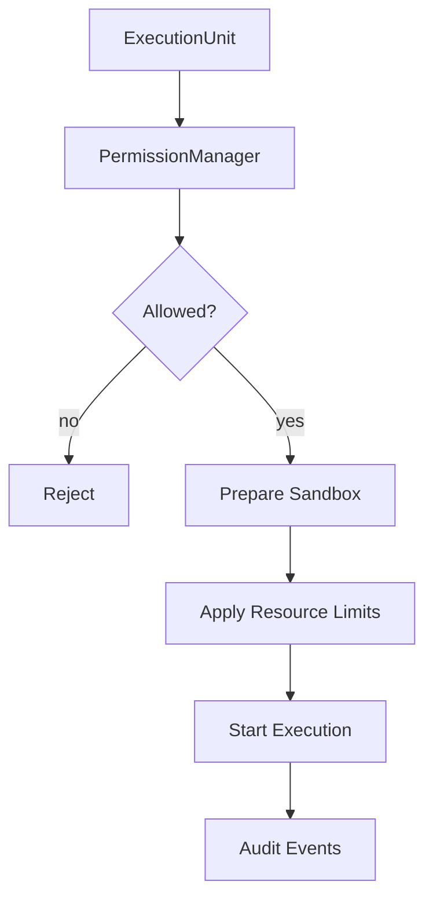

# ExecutionEngine Specification (Part 07)

## Security, Permissions, Sandboxes, and Resource Limits

The ExecutionEngine is a high-risk service because it runs real operations.

It may start terminals, invoke AI CLIs, call tools, access files, run workflow nodes, and trigger merges. Therefore it MUST be strict about authorization and isolation.

## Permission Enforcement

Before starting execution, the engine MUST have a permission decision from [[PermissionManager]].

The decision MUST include:

- allowed or denied
- policy id
- decision reason
- scope
- expiry if temporary
- approval id if human approval was required

The engine MUST reject stale permission decisions.

## Workspace Boundary

Every execution MUST be bound to exactly one Workspace.

The engine MUST NOT allow execution input to reference another Workspace unless the request is an explicit cross-workspace import/export operation approved by policy.

## Sandbox Requirements

Sandboxing SHOULD isolate:

- working directory
- environment variables
- temporary files
- generated artifacts
- tool credentials
- logs
- write paths

Workers SHOULD produce patch artifacts rather than writing directly to project files whenever the task involves code changes.

## Resource Limits

Execution units SHOULD include limits for:

- wall-clock timeout
- idle timeout
- maximum output size
- maximum artifact size
- maximum child executions
- maximum retry count
- maximum concurrent processes
- token or cost budget when AI is involved

## YOLO Mode

YOLO mode MAY reduce approval friction, but it MUST NOT remove runtime tracking.

Even in YOLO mode:

- execution must be logged
- permissions must be evaluated
- dangerous operations must be attributable
- Workspace boundaries must remain enforced
- irreversible operations may still require policy-level approval

## Security Diagram

## AI Notes

Do not implement permission checks only in the UI. UI checks are convenience. Runtime checks are authority.

Every path into ExecutionEngine must enforce permissions, including internal calls and plugin-triggered calls.

