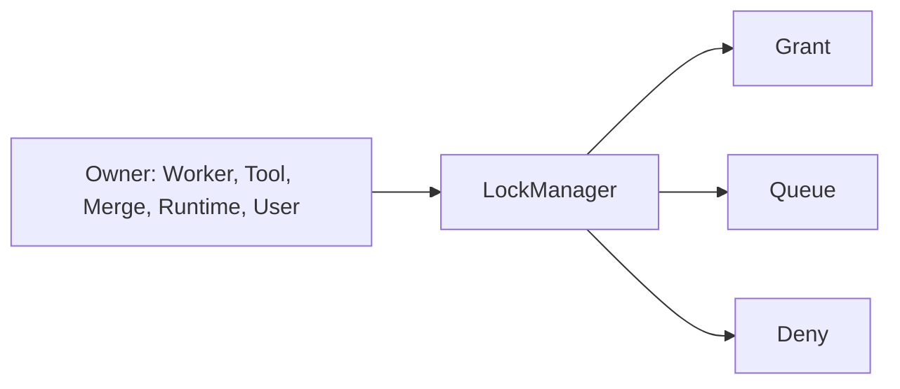
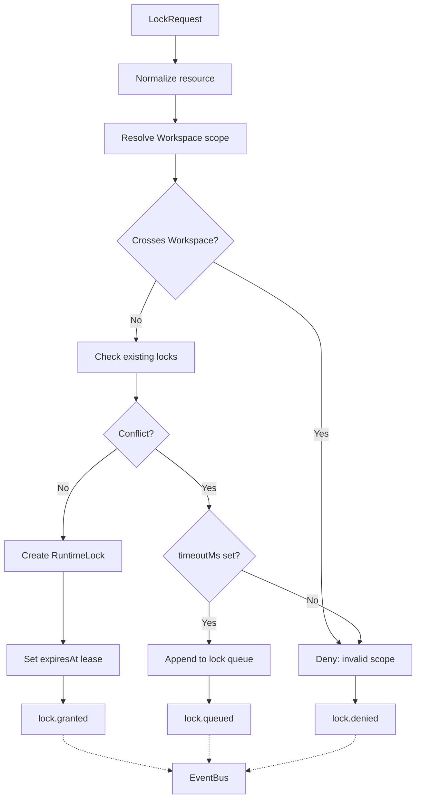
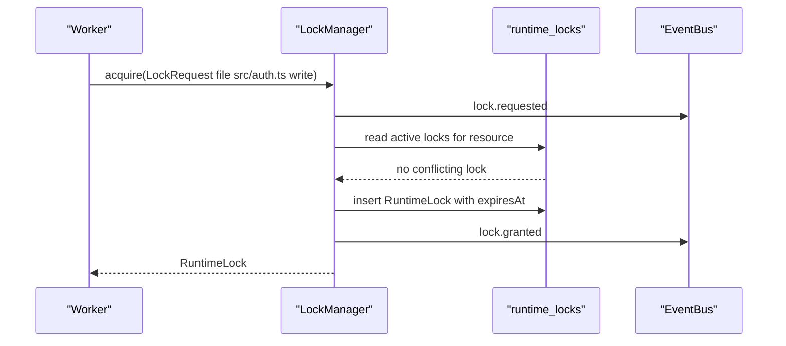
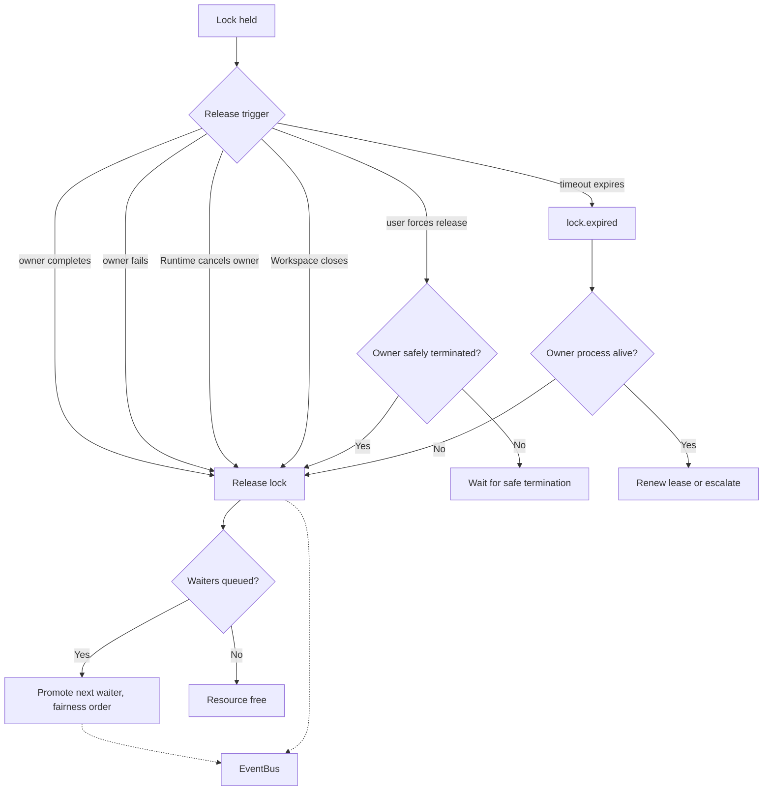
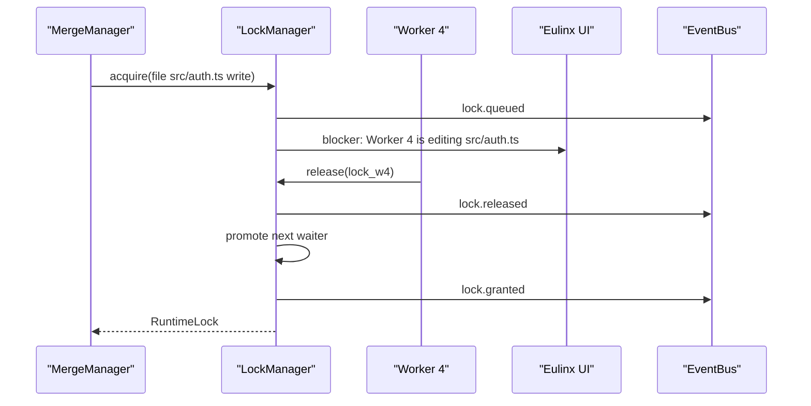
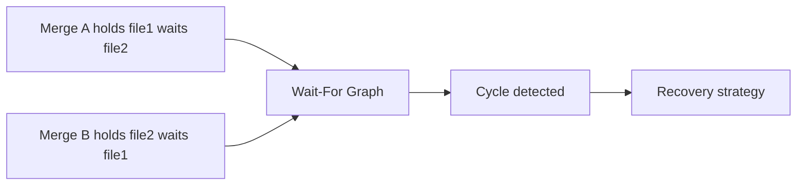
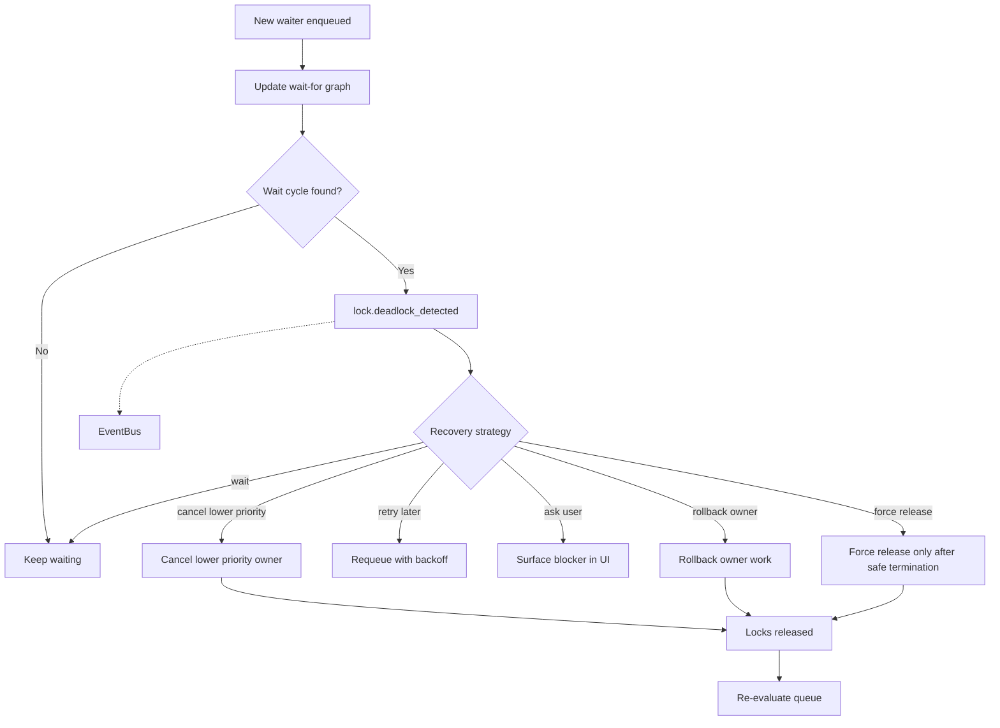
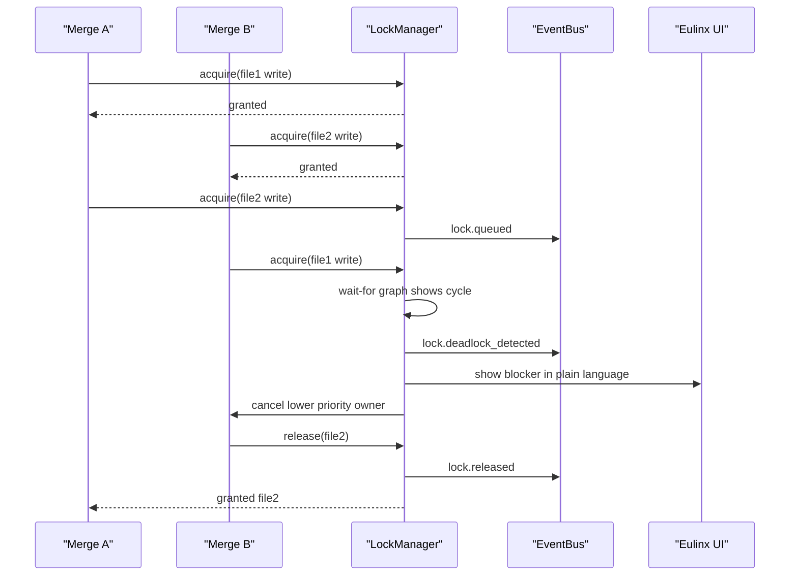

---
title: LockManager Diagrams
status: draft
version: 1.0
tags:
  - runtime
  - lock-manager
  - concurrency
  - diagrams
related:
  - "[[02-runtime/README]]"
  - "[[LockManager-Part01]]"
  - "[[MergeManager-Part01]]"
  - "[[Scheduler-Part05]]"
---

# LockManager Diagrams

## Lock Acquisition

### High-Level Overview



### Detailed Mermaid



### ASCII

```text
LockRequest { workspaceId, resourceType, resourceId, mode,
              ownerType, ownerId, timeoutMs, reason }
  |
  v
Normalize resource  ->  Resolve scope  ->  Check existing locks
  |
  v
Conflict?
  |-- no  --> Grant RuntimeLock --> set lease --> lock.granted
  |-- yes --> timeout set?
                |-- yes --> Queue waiter --> lock.queued
                |-- no  --> Deny        --> lock.denied
```

### Sequence



## Queue, Release, and Expiry

### High-Level Overview

```text
Holder works -> Holder finishes -> Lock released -> Next waiter promoted
Holder stalls -> Lease expires  -> Recovery check -> Release or escalate
```

### Detailed Mermaid



### ASCII

```text
Release triggers:  owner completes | owner fails | timeout expires
                   Runtime cancels owner | user forces release | Workspace closes
  |
  v
lock.released --> queue empty? -- yes --> resource free
                              -- no  --> promote next waiter (FIFO, recovery may jump)
                                          --> lock.granted

Expiry is not proof the owner stopped.
Check owner liveness before reclaiming.
```

### Sequence



## Deadlock Detection and Recovery

### High-Level Overview



### Detailed Mermaid



### ASCII

```text
Deadlock:
  Merge A holds file1, waits for file2.
  Merge B holds file2, waits for file1.

Prevention:
  stable lock ordering | batch acquisition | timeouts
  no nested lock requests | wait-cycle detection

Conflict kinds:
  file | symbol | terminal ownership | merge | workflow graph mutation

Recovery:
  wait -> cancel lower priority -> retry later -> ask user
       -> rollback owner -> force release only after safe termination
```

### Sequence



## Related Documents

- [[LockManager-Part01]]
- [[LockManager-Part02]]
- [[LockManager-Part03]]
- [[LockManager-Part04]]
- [[LockManager-Part05]]
- [[LockManager-Part06]]
- [[MergeManager-Part01]]
- [[Scheduler-Part05]]
- [[PermissionManager-Part01]]
- [[02-runtime/README]]
